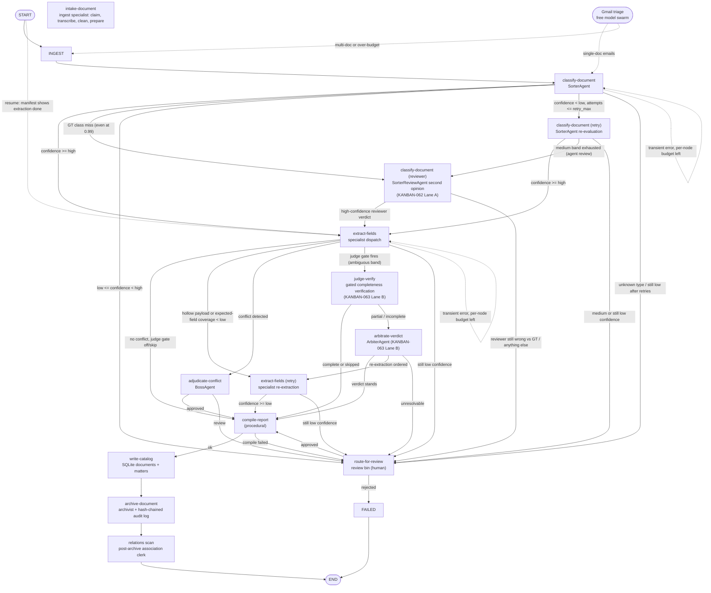
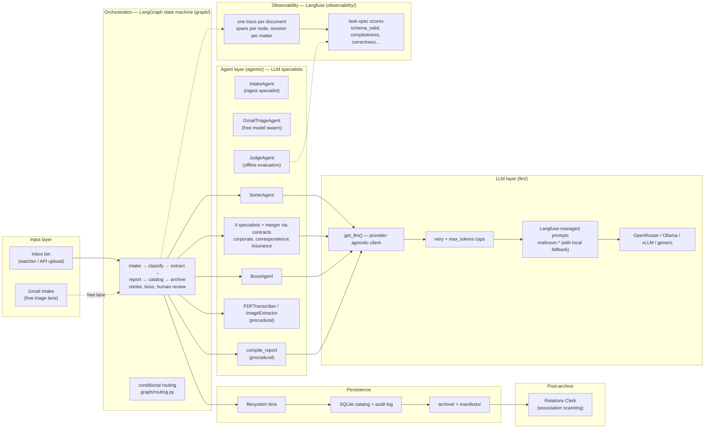

# Architecture

## Overview

Mailroom is a multi-agent legal document processing pipeline built on LangGraph. It ingests legal documents, classifies them, routes them to specialist agents for structured extraction, compiles matter records, and archives everything with a full audit trail.

## Architectural Diagram

### LangGraph state machine



### Hierarchical organization



## Core Components

### Watcher (`pipeline/watcher.py`)
- Uses `watchdog` to monitor `/pipeline/inbox/` for new files
- Debounces file events to avoid double-processing
- Claims files via atomic `shutil.move` (via `pipeline/bins.py:claim_file`) into `/pipeline/processing/<worker_id>/`
- Spawns a LangGraph run per document in a daemon thread

### LangGraph Engine (`graph/build_graph.py`)
- One graph execution per document
- **13 nodes** forming a directed state machine: `intake` (ingest specialist),
  `classify`, `retry_classify`, `review_classify` (agent second opinion on
  exhausted medium-band classifications — KANBAN-062 Lane A), `extract`,
  `retry_extract`, `judge_verify` + `arbiter` (gated completeness
  verification + arbitration — KANBAN-063 Lane B), `human_review`,
  `boss_escalation`, `compile_report`, `catalog_write`, `archive`
- Two auxiliary flows operate **outside** the graph: the Gmail triage lane
  (free model swarm for single-document emails) and the relations clerk
  (post-archive association scanning)
- MemorySaver by default, held on a **process-level compiled graph** so
  `interrupt()` HITL can `Command(resume=...)` in the same process (the API
  embeds the watcher). The filesystem review bin remains the durable park
  across process restart; `resume_from_review` falls back to a fresh extract
  invoke when the checkpoint is gone. Opt into on-disk `SqliteSaver`
  (`data/checkpoints.db`) via `MAILROOM_CHECKPOINTER=sqlite`.

### LLM Client (`llm/client.py`, `llm/providers.py`, `llm/retry.py`, `llm/prompts.py`)
- Thin OpenAI-compatible wrapper
- Provider-agnostic: OpenRouter, Ollama, vLLM, or any OpenAI-compatible endpoint
- Per-agent model selection from `config/taxonomy.yaml`
- Global provider override via `DEFAULT_PROVIDER` env var
- Every chat completion goes through `retry_chat_completion` (`llm/retry.py`): transient failures (connection errors, timeouts, 429, 5xx) are retried with exponential backoff + jitter from the `llm_retry:` config; 4xx client errors are never retried
- Output generation is capped per agent by `max_tokens` in `taxonomy.yaml` (bounds runaway reasoning-token output)
- Agent system prompts are **Langfuse-managed** (`llm/prompts.py`, `mailroom-<agent_name>`), fetched at runtime with the identical template shipped in code as fallback; `scripts/sync_prompts.py` pushes templates up
- Structured calls (`_call_structured`) always send `response_format={"type": "json_object"}` and guarantee the literal token `json` in the messages — some providers (Qwen via Alibaba) reject requests without it

### SQLite (`storage/db.py`, `storage/catalog.py`, `storage/audit_log.py`)
- SQLite (via SQLAlchemy 2.0 async + aiosqlite) by default — a single file, no server required
- Shared by the document/matter catalog and the audit log
- Three tables: `matters`, `documents`, `audit_log` (`documents` carries extracted data, trace id, and a `scores` JSON column)
- `DATABASE_URL` env var can switch to Postgres

### Observability (`observability/`)
- Four interchangeable tracing backends: **Langfuse**, **Braintrust**, the local cost-free **Arize Phoenix**, and `none`
- Selected via `OBSERVABILITY_PROVIDER` env (`auto` | `langfuse` | `braintrust` | `phoenix` | `none`); `auto` = Langfuse if key → Braintrust if key → local Phoenix → `none` (aligned with llm-entity-extraction's resolution chain — tracing never silently turns off)
- Every LLM call is auto-traced: `llm/client.py:get_llm` wraps the OpenAI client (`langfuse.openai` patch or `braintrust.wrap_openai`), capturing prompt, response, tokens, latency
- One trace per document (`pipeline_trace`, root type **chain**), typed child observations via `traced_node` / `observation()` (agent / evaluator / retriever / span / generation — never a generic span when a more specific type fits), `session_id = matter_id` (or a run-scoped session for pilot runs), deterministic trace ids seeded from filenames, optional `MAILROOM_TRACE_USER_ID`
- **Batching**: the Langfuse SDK queues events and a background exporter sends them (`LANGFUSE_FLUSH_AT` / `LANGFUSE_FLUSH_INTERVAL`, SDK defaults 512 / 5s). Long-running services rely on that exporter; short-lived scripts (`run_pilot.py`, `run_hf_pilot.py`, LegalBench, quality judges) call `ensure_process_tracing()` so atexit runs `flush()` then `shutdown()`. Every `run_pipeline` also flushes in `finally`. Do not set `LANGFUSE_FLUSH_AT=1` globally.
- **Scores** (`observability/scores.py`): every run emits self-evident scores (`parse_error`, `schema_valid`, `stage_completed`, `success_rate` first-pass STP, confidences); pilot runs add ground-truth scores (class/stage correctness, calibration error, `expected_field_presence`); score configs auto-created via `ensure_score_configs()`
- **Run-log mirroring** (`scripts/sync_langfuse_logs.py`): fetch traces (with observations + scores) into `data/langfuse_logs/<run>/` for offline analysis
- Graceful noop fallback when no backend/keys are configured — pipeline runs unchanged

### Filesystem Bins (`pipeline/bins.py`)
- Human-legible pipeline state: `ls` any directory to see what's happening
- Atomic rename for claim safety (no external locking needed)
- Archive organized by `matter_id/doc_type/`

## Data Flow

### 1. Ingest
Document lands in `/pipeline/inbox/`. Watcher detects it, claims it atomically to `/pipeline/processing/<worker_id>/`. Manifest is created with `PipelineStage.PROCESSING`. PDFs are transcribed by `PDFTranscriber` — text-based PDFs directly (no LLM), scanned/garbled PDFs via an LLM markdown pass (`pipeline.pdf_direct_chars_per_page` controls the threshold). When the input agents' models are vision-capable (`vision:` config in `taxonomy.yaml` — Qwen etc.), PDFs are also rendered page-by-page to image data-URIs (`llm/vision.py`) and sent to the sorter/specialist prompts as multimodal `image_url` content, capped by `vision.max_pages`; if the pipeline is vision-capable the expensive LLM transcription pass is skipped for scanned PDFs (the page images carry the content) while `doc_text` is still stored for text-only paths/audit.

### 2. Classify (Sorter)
LLM call: reads document text, determines `doc_type` and confidence.
Live extractable classes are `contract`, `merger_agreement`, `corporate_record`,
`correspondence`, `insurance_claim`. `compliance_filing` is retired (zero Hub
rows). `merger_agreement`
is the MAUD class (agreement and plan of merger); `contract` is the CUAD
commercial-contract class — they are not interchangeable. The sorter schema
also allows the
routing token `unknown` (not a taxonomy class, not a specialist) for court
opinions, due-diligence memos, and anything that does not fit a live class.
`unknown` / retired / hallucinated labels are preserved — they are never
remapped onto correspondence — and `after_classify` parks them for human
review regardless of confidence. Parse-error is the only remaining
correspondence default, and it is explicitly low-confidence (0.3) so the
retry budget still fires.

### 3. Confidence Check
Conditional edge routing (`graph/routing.py`, thresholds from `confidence:` in `taxonomy.yaml`):
- **Unknown / retired / empty `doc_type`**: human review immediately (never extract)
- **Confidence >= `high` (0.97 global; per-class `by_class` overrides — e.g. contract/merger/insurance 0.98, correspondence 0.95)** on a live class: straight to extraction
- **`low` (0.88 global) <= Confidence < `high`**: one `retry_classify`, then Lane A (`review_classify`) if still medium
- **Confidence < `low`**: retry (`retry_classify`) while `attempts <= retry_max`, then human review
- **Lane A reviewer** may also emit `unknown`; `after_review_classify` only extracts a live taxonomy class at high confidence

### 4. Extract (Specialist)
Dynamic dispatch to the matching specialist for a **live taxonomy class**.
Graph construction asserts dispatch keys == taxonomy keys; an unmapped
`specialist:` name fails fast. A non-taxonomy type that nevertheless reaches
extract (defense in depth) returns `{_unsupported: True}` and
`after_extraction` parks it for human review **without** `retry_extract`.

### 5. Extraction Confidence Check
Same three-way branch as classification, plus:
- **Unsupported / non-taxonomy type**: human review, no retry
- **Conflict with existing matter data**: route to Boss escalation
- **Schema invalid**: retry once, then human review
- **Low confidence**: retry → still low → human review
- **High confidence**: proceed to report compilation

### 6. Compile Report (Reporter)
LLM call: compiles all extracted data into a clean matter-record summary.

### 7. Catalog Write
Writes document and matter records to the database (best-effort — pipeline continues on failure).

### 8. Archive (Archivist)
- Moves file to `/archive/<matter_id>/<doc_type>/`
- Writes manifest sidecar JSON
- Writes hash-chained audit log entry
- Marks manifest `PipelineStage.ARCHIVED`

## State Machine Nodes

| Node | Agent | Purpose |
|---|---|---|
| `intake` | Intake agent — the ingest specialist (clerk + LLM-assisted) | Read file, deterministic `normalize-intake`, gated LLM triage/clean/prepare, create manifest, move to processing |
| `classify` | Sorter | Determine doc_type + confidence |
| `retry_classify` | Sorter | Re-classify with alternate prompt |
| `review_classify` | Sorter Reviewer | Agent second opinion when the medium band is exhausted (KANBAN-062) |
| `extract` | Specialist | Extract structured data per doc-type |
| `retry_extract` | Specialist | Re-extract with context from prior attempt |
| `judge_verify` | Judge (in-graph) | Gated completeness verification of any extraction landing in the ambiguous band (KANBAN-063) |
| `arbiter` | Arbiter | Adjudicate partial/incomplete judge verdicts (KANBAN-063) |
| `human_review` | — | Pause for human decision |
| `boss_escalation` | Boss (in-graph) | Adjudicate conflicts |
| `compile_report` | Reporter | Synthesize matter-record entry |
| `catalog_write` | — | Write to database catalog |
| `archive` | Archivist | Move to archive, write audit log |

## Conditional Edges

```
classify ─┬─ unknown / retired type ──▶ human_review
          ├─ confidence >= high ──────▶ extract
          ├─ low <= conf < high ─────▶ retry_classify
          ├─ attempts <= retry_max ──▶ retry_classify
          └─ otherwise ──────────────▶ human_review

retry_classify ─┬─ transient (budget left) ───────▶ retry_classify
                ├─ unknown / retired type ────────▶ human_review
                ├─ confidence >= high ────────────▶ extract
                ├─ medium band exhausted (Lane A) ─▶ review_classify
                └─ still low ─────────────────────▶ human_review

review_classify ─┬─ high-confidence live class ─▶ extract
                 └─ unknown / unsure / else ────▶ human_review

extract ─┬─ unsupported / non-taxonomy type ─▶ human_review (no retry)
         ├─ no conflict, judge gate off/skip ──▶ compile_report
         ├─ conflict detected ─────────────────▶ boss_escalation
         ├─ judge gate fires (ambiguous band) ─▶ judge_verify
         ├─ attempts <= retry_max ─────────────▶ retry_extract
         └─ otherwise ─────────────────────────▶ human_review

judge_verify ─┬─ complete or skipped ────▶ compile_report
              ├─ partial / incomplete ───▶ arbiter
              └─ hard failure ───────────▶ human_review

arbiter ─┬─ transient (budget left) ─▶ arbiter
         ├─ verdict stands ─────────▶ compile_report
         ├─ re-extraction ordered ──▶ retry_extract
         └─ unresolvable ───────────▶ human_review

boss_escalation ─┬─ transient (budget left) ─▶ boss_escalation
                 ├─ approved ─▶ compile_report
                 └─ review ───▶ human_review

human_review ─┬─ interrupt() pause (file parked in review/)
              ├─ approved ─▶ extract (fresh fields)
              └─ rejected ─▶ END (failed)
```

## Checkpointing

LangGraph checkpoints the full state after each node. The checkpointer is
**MemorySaver by default**, held on a process-level compiled graph so
`human_review_node` can pause with LangGraph `interrupt()` and resume with
`Command(resume={"decision": "approved"})` without losing the thread. The
filesystem review bin is still the durable park: after a process restart
the MemorySaver is empty and `resume_from_review` re-invokes from extract
using the manifest (this also keeps per-doc checkpoint growth bounded).
Set `MAILROOM_CHECKPOINTER=sqlite` to opt into the on-disk SqliteSaver at
`data/checkpoints.db` for debugging/resume-across-restart experiments.

## Audit Trail

Every state transition writes an `AuditLogEntry` to the database. Each entry:
- Contains `prev_hash` (SHA-256 of the prior entry)
- Contains `entry_hash` (SHA-256 of `prev_hash` + entry content)
- Forms a tamper-evident chain — modifying any entry breaks all subsequent hashes
- Is independent of Langfuse (the audit log is the compliance record)
- Can be verified via the `/audit/{doc_id}` API endpoint or `schemas/audit.py:verify_chain()`

## Evaluators & Quality

### Deterministic field scoring (issues #4/#5)

Before any LLM judge runs, grounded extractions are scored deterministically by `observability/field_scoring.py` — a field-type-aware scorer that is cheap, reproducible, and costs no API calls. Each field is compared according to its type (`doc_classes[].field_types` in `taxonomy.yaml`): `id`/`date`/`money` are parsed and normalized then exact-matched (a one-day-off date scores 0, not 0.95); `name` uses Jaro-Winkler + token-set ratio over normalized text (uppercase, punctuation/suffix-stripped); `free_text` uses SQuAD-style token F1; `entity_list` fields use optimal bipartite matching (scipy Hungarian) with precision/recall/F1, so reordered lists score correctly. An optional sentence-transformers embedding cosine similarity rescues lexically-distant-but-semantically-equal name/free-text fields below `embedding_rescue_below`.

Judge escalation is gated by **per-field-type bands** (`field_scoring.type_bands`), calibrated by `scripts/calibrate_field_scoring.py` against labeled ground truth: date/id are `never` (decisive both ways), money/free_text have calibrated numeric cutoffs, and name/entity-list trust only perfect scores (`[0.5, 1.0]`) — near-misses escalate to the LLM judge because Jaro-Winkler/token-set are typo-tolerant by design. `observability/langfuse_field_scoring.py` attaches `extraction_field_score`, `extraction_overall_score`, `extraction_needs_judge_review`, `entity_list_precision`, `entity_list_recall`, and — when CUAD presence ground truth is available on the run — `extraction_category_presence` to the document trace. Presence expectations are derived from Hub `cuad_clause_labels` or flattened `expected_fields.cuad_clauses`; the score is omitted (not emitted as 0.0) when there is no CUAD presence GT. On grounded runs `graph/build_graph.py` suppresses the `pipeline-result` generation entirely when the verdict is unambiguous — saving both LLM-as-judge evaluator calls.

### LLM-as-judge

The `judge` agent (`agents/judge.py`, offline — not in the document graph) audits pipeline output against the task specification. `scripts/run_quality_judges.py` runs it over a pilot report and attaches scores to each sample's trace:

| Judge | Measures | Scores |
|---|---|---|
| `classification` | Is the sorter's assigned class correct for the document (audited against the taxonomy spec)? | `classification_correct`, `classification_quality` |
| `completeness` | Did the specialist capture every field the document states? | `completeness`, `completeness_label` |
| `correctness` | Are extracted values factually accurate (no fabrication)? | `extraction_correctness`, `extraction_correctness_label` |

The same rubrics are configured as **two independent live LLM-as-a-Judge evaluators in the Langfuse project** (`scripts/sync_evaluators.py`): the pipeline emits a single `pipeline-result` generation per document trace, and two observation rules independently evaluate it. `mailroom-pipeline-judge` returns a **CORRECT/PARTIAL/MISS** verdict — PARTIAL for substantially correct runs with limited material gaps, MISS reserved for wrong class/stage, contradictions, failed runs, or broad omission; `mailroom-pipeline-quality` returns a proportional **0.0-1.0 quality score**, so partial-but-useful extractions are not flattened into MISS. The quality score never replaces or alters the run verdict. Grounded runs use a labeled, pretty-printed expected-fields input block and a cleaned schema-only output, cutting ~90% of judge tokens. Live runs without ground truth use visible source text. The script also ensures an LLM connection for the judge provider exists (OpenRouter key from `.env`) and prunes any stale mailroom evaluators/rules.

The pilot samples are mirrored into Langfuse datasets — one **per source corpus** (`scripts/sync_dataset.py`): `mailroom-pilot` (original samples), `mailroom-pilot-legalbench`, and `mailroom-pilot-atticus`. Pile of Law court opinions remain on disk but are no longer in the live manifest (`court_opinion` was retired). One item per sample with document text, ground truth (`expected_doc_class`, `expected_stage`, `expected_fields`) and manifest metadata — for experiments and judge calibration.

Production runs additionally emit self-evident scores with no ground truth (`parse_error`, `schema_valid`, `stage_completed`, `success_rate`, `guardrail_triggered`, confidence values) from `observability/scores.py`. `success_rate` is the production straight-through-processing flag: 1 only when the document archived in one pass with no retry, Lane A, arbiter, boss, human review, guardrail, or transient reprocess. Incoming live documents are zero-shot — this flag does not consult `class_correct`, field GT, or the hosted LLM-judge CORRECT/PARTIAL/MISS overlay. Pilot runs still add ground-truth scores (`class_correct`, `stage_correct`, `confidence_calibration_error`, `expected_field_presence`) for eval. All score configs are auto-created in Langfuse by `ensure_score_configs()`. The-Mailroom metrics page tiles FIRST PASS from this score (with a routing-path fallback for older traces).

## The-Mailroom floor (Hugging Face Observatory)

[The-Mailroom](https://github.com/Exios66/The-Mailroom) is the Langfuse-only
visualizer (pixel console, hosted Observatory, TUI). The hosted floor is a
Docker Space (`mailroom-observatory`, port 7860). Inbox **Queue a document**
and REVIEW resolve still need **this** API as a reachable producer
([PR #30](https://github.com/Exios66/The-Mailroom/pull/30)):

```
MAILROOM_PIPELINE_URL=https://lucius-morningstar-mailroom-producer.hf.space
MAILROOM_PIPELINE_TOKEN=$MAILROOM_API_TOKEN
MAILROOM_PIPELINE_API_PREFIX=/v1
```

Live Observatory: [`Lucius-Morningstar/mailroom-observatory`](https://huggingface.co/spaces/Lucius-Morningstar/mailroom-observatory)
(`https://lucius-morningstar-mailroom-observatory.hf.space`). `127.0.0.1:8000`
works only when both processes share a host. Observatory
`POST /api/inbox/enqueue` → producer `POST /v1/upload` (202). REVIEW →
`POST /v1/review/{doc_id}/resolve`. `GET /health` advertises `producer`,
`review_resolve`, and `inbox_upload`. Pairing checklist:
[`deploy/space/PAIRING.md`](../deploy/space/PAIRING.md).

## Guardrails

`pipeline/guards.py` validates agent output deterministically before routing: classification must be a taxonomy enum with a `[0,1]` confidence; extractions must JSON-parse and validate against their Pydantic schema. Violations clamp confidence below the `confidence.low` routing threshold so bad output goes to retry/review, are logged, recorded on state (`extraction_guardrail`), and scored (`guardrail_triggered`).

## Logging

`pipeline/logging.py:setup_logging()` configures structlog in every entrypoint and script: level `LOG_LEVEL` (default INFO), renderer `LOG_FORMAT` (`pretty`|`json`); noisy third-party loggers silenced to WARNING.

## Boss Agent — Dual Role

The Boss agent has two separate invocation paths sharing one persona:

1. **In-graph (`boss_escalation` node)**: synchronously adjudicates conflicts within a single document's run.
2. **Ops-monitor (`pipeline/ops_monitor.py`)**: separate scheduled process (default every 5 minutes) that queries the catalog for systemic issues: stuck documents, error-rate spikes, review backlogs.
