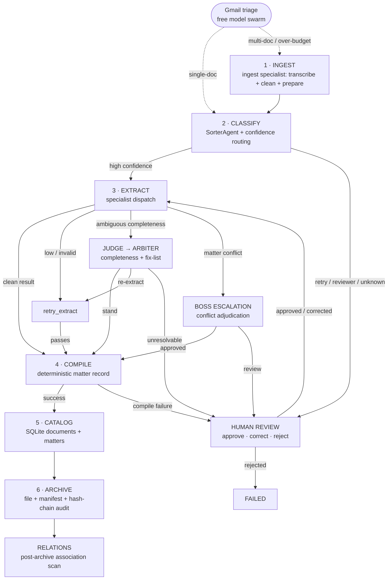

# LLM Mailroom — Operational Procedure

**Purpose:** canonical operator-facing procedure for the current Mailroom pipeline. It describes the runtime path, escalation rules, human-review procedure, artifacts, and operational checks.

## 1. Pipeline at a glance

The Mailroom is a **13-node LangGraph state machine executed once per document**. Two auxiliary flows operate outside the graph: the Gmail triage lane (free model swarm for single-document emails) and the relations clerk (post-archive association scanning). Operationally, the graph nodes collapse into six phases:



### Six operator-visible phases

| Phase | Graph nodes | Operator meaning | Primary artifact |
|---|---|---|---|
| **1. Intake** | `intake` | Claim file, ingest specialist transcribes PDFs/images, deterministic intake clerk normalizes text, gated LLM triage/clean/prepare, create manifest. | Manifest |
| **2. Classify** | `classify`, `retry_classify`, `review_classify` | Determine a live class and confidence; ambiguous/unknown results are not silently remapped. | Classification state + trace |
| **3. Extract** | `extract`, `retry_extract`, `judge_verify`, `arbiter`, `boss_escalation` | Dispatch specialist, validate output, resolve ambiguity, adjudicate conflicts. | Structured extraction |
| **4. Compile** | `compile_report` | Deterministically assemble the matter record. **No reporter LLM call.** | Matter record |
| **5. Catalog** | `catalog_write` | Persist document/matter metadata and extracted data. | SQLite/Postgres rows |
| **6. Archive** | `archive` | Move source, write manifest sidecar, append hash-chained audit entry. | Archived document + audit |

**Auxiliary flows (outside the graph):**
- **Gmail triage lane**: free OpenRouter model handles single-document Gmail uploads (classification + key extraction + archive) without paid agents. Multi-document emails and over-budget documents route to the full pipeline.
- **Relations clerk**: post-archive deterministic association scan (same-matter, keyword Jaccard, party overlap, embedding cosine) with optional LLM judgment for ambiguous near-misses.

The current design has two happy-path LLM generations: classification and extraction; report compilation is procedural. fileciteturn8file0L8-L24

## 2. Classification procedure

1. Watcher/API places the document in the inbox and the pipeline atomically claims it into processing.
2. `intake` creates the manifest and performs deterministic intake normalization.
3. The sorter assigns a live class: `contract`, `merger_agreement`, `corporate_record`, `correspondence`, or `insurance_claim`.
4. `unknown`, retired, empty, or unsupported labels go to human review; they are **not** coerced into a nearby class.
5. Current global defaults are `high = 0.97`, `low = 0.88`, `retry_max = 2`; class-specific overrides take precedence. fileciteturn9file0L2-L6
6. High-confidence live classes proceed to extraction.
7. Medium-band results receive a classification retry; an exhausted medium band can receive the Lane A reviewer second opinion.
8. Results still below the low threshold are parked for human review after the retry budget.

### Current class-specific thresholds

| Class | High | Low | Judge-band high |
|---|---:|---:|---:|
| `contract` | 0.98 | 0.90 | 0.97 |
| `merger_agreement` | 0.98 | 0.90 | 0.97 |
| `insurance_claim` | 0.98 | 0.90 | 0.97 |
| `corporate_record` | 0.96 | 0.86 | 0.94 |
| `correspondence` | 0.95 | 0.85 | 0.92 |

These values live in `src/config/taxonomy.yaml`; operators should change configuration rather than embed routing constants in code. fileciteturn9file0L2-L6

## 3. Extraction procedure

1. Dispatch only to a specialist associated with a live taxonomy class.
2. Validate structured output against the document-type Pydantic schema.
3. Malformed/unsupported output enters the configured retry/review path.
4. Compare extraction confidence and expected-field coverage against configured gates.
5. A matter-level conflict routes to `boss_escalation`; conflicting source values are not silently resolved by recency or confidence.
6. An extraction in the configured ambiguous completeness band enters the Judge/Arbiter lane.

Current Judge/Arbiter controls include `arbiter_retry_max = 2` and `judge_max_passes = 3`. The Judge checks completeness; the Arbiter can stand the result, order re-extraction, or send the matter to human review. fileciteturn9file0L2-L6

The field scorer uses deterministic, type-aware matching and factuality verification. Its configured global ambiguous band is `[0.50, 0.85]`, with type-specific overrides. fileciteturn9file0L2-L6

## 4. Human-review procedure

Human review is a **governance boundary**, not merely an error queue.

### Review triggers

- Unknown/retired/unsupported document class.
- Classification remains below its gate after retries.
- Lane A reviewer cannot establish a high-confidence live class.
- Extraction remains low-confidence after retry.
- Schema/guardrail failure cannot be repaired automatically.
- Judge/Arbiter declares an extraction incomplete or unresolvable.
- Boss escalation requires human review.
- Report compilation fails.

The review filesystem bin is the durable parking mechanism across process restarts; the in-memory LangGraph checkpoint is not assumed to survive a restart. fileciteturn5file1L29-L47

### Operator review sequence

**1 — Inspect.** Review the queue item, source document, manifest, classification/extraction evidence, and trace/audit information.

**2 — Disposition.** Choose explicitly:
- **Approve** — current result is acceptable; resume.
- **Correct classification** — assign the correct live class; resume extraction.
- **Correct/reconcile extraction** — record the authoritative field decision/notes; resume.
- **Reject** — terminate the run into `failed` when processing should not continue.

**3 — Record rationale.** Human decisions are attributable and auditable; the resolution is appended to the audit trail. fileciteturn5file5L97-L114

**4 — Resume.** Use the review-resolution API. If the original checkpoint is unavailable, `resume_from_review` reconstructs from the manifest and parked source.

## 5. Conflict adjudication

A conflict means an extraction disagrees with existing matter data; it is a **consistency problem**, not merely low confidence.

1. Detect the conflict against existing same-class matter fields.
2. Route to `boss_escalation`.
3. If approved, continue to report compilation with the resolved state.
4. If review is required, park in human review.
5. Preserve the conflict and resolution in manifest/audit/catalog records.

## 6. Catalog and archive procedure

After report assembly:

1. `catalog_write` persists document and matter records.
2. Monitor catalog failures as operational failures.
3. `archive` moves the source to `/archive/<matter_id>/<doc_type>/`.
4. Write the manifest sidecar JSON.
5. Append the hash-chained audit entry.
6. Mark the manifest `ARCHIVED`.

The architecture treats filesystem bins as human-legible state and SQLite/catalog plus the hash-chained audit log as durable records. fileciteturn3file0L2-L2

## 7. Operator API

| Endpoint | Use |
|---|---|
| `GET /v1/health` | API/watcher health |
| `POST /v1/upload` | Submit a document |
| `GET /v1/queue` | Inspect queued/in-flight documents |
| `GET /v1/review/queue` | Inspect human-review work |
| `POST /v1/review/{doc_id}/resolve` | Resolve a review item |
| `GET /v1/documents/{doc_id}/source` | Retrieve parked source |
| `GET /v1/status/{doc_id}` | Inspect one document |
| `GET /v1/matters/{matter_id}` | Inspect a matter |
| `GET /v1/audit/{doc_id}` | Inspect the audit trail |
| `GET /v1/ops/status` | Operational health/metrics |
| `POST /v1/ops/sweep` | Run ops sweep |
| `POST /v1/ops/resume` | Resume after an operational pause |

The repository API documentation identifies this `/v1` layout as the current interface. fileciteturn10file0L2-L35

## 8. Filesystem bins

```text
pipeline/
├── inbox/       # new work
├── processing/  # atomically claimed work
├── classified/  # classification/working artifacts when used
├── review/      # durable human-review parking
└── failed/      # terminal rejected/failed work

archive/         # successful durable archive
manifests/       # per-document manifests
```

Operators should not manually move live documents between bins to force state transitions; routing belongs to the graph. fileciteturn5file2L49-L64

## 9. Routine operations checklist

### Start of shift

- Confirm `/v1/health` is healthy and the watcher heartbeat is current.
- Confirm the configured LLM provider/model mappings are reachable.
- Check `/v1/ops/status` for stalled processing, review backlog, and first-pass metrics.
- Inspect the review queue before accepting new workload.

### During processing

- Do not bypass the graph by editing catalog rows manually.
- Treat review decisions as explicit governance actions and record rationale.
- Investigate repeated retries/review loops rather than blindly rerunning.
- Use traces/audit entries to distinguish provider failures from model-quality failures.

### End of shift / handoff

- Ensure no unexplained files remain in `processing/`.
- Hand off outstanding reviews with document ID, matter ID, trigger, evidence inspected, and next action.
- Verify archived documents have manifests and audit entries.
- Record provider outages, model changes, threshold changes, or operational pauses.

## 10. Failure-handling rules

1. **Unknown means review.** Never silently coerce unknown classes.
2. **Confidence is routing evidence, not proof.** Acceptance also depends on deterministic guards and source evidence.
3. **Conflicts require adjudication.** Do not resolve by recency alone.
4. **Audit everything.** Human and terminal decisions must remain reconstructable.
5. **Do not assume checkpoints survive restart.** Review bin + manifest are the durable recovery path. fileciteturn5file1L29-L47
6. **Keep operational knobs in `src/config/taxonomy.yaml`.** fileciteturn9file0L2-L6

## Visual reference

See [`assets/mailroom-pipeline.svg`](assets/mailroom-pipeline.svg) for the operations-facing visualization. It groups the 13 implementation nodes into six operator-visible phases while retaining the human-review, Judge/Arbiter, and Boss escalation lanes.
