# Mailroom watch — terminal TUI + browser UI

Short reference for the **browser** surface. Full operator guide (terminal + web +
Modal log tail + SAND-032 paths): **[mailroom-themed-logging.md](mailroom-themed-logging.md)**.

## Commands

```bash
# Attach to a run YAML (or bare `sandbox watch --web` when sand032/current exists)
sandbox watch --web --config config/runs/my-run.yaml

# Follow the active SAND-032 run file
sandbox watch --web --follow data/runtime/sand032/current

# Launcher equivalent
scripts/mailroom-tui web [--config …]

# Custom bind (localhost only recommended)
sandbox watch --web --host 127.0.0.1 --port 8765
NO_BROWSER=1 sandbox watch --web --config …
# or: sandbox watch --web --no-browser …

# Synthetic UI (no Modal spend)
sandbox dev
sandbox watch --web --demo
```

Default URL: **http://127.0.0.1:8765/** — live JSON via **SSE** at `/api/stream`; snapshot at `/api/state`.

The browser is the **Tray TUI**: per-job subtitle/route from `spec.lock.json`, `Tray TUI watcher · <profile> · <job.mode>` status line, job-manifest strip for non-SAND-032 runs, phase-colored lifecycle (pulse only while active), and a Dispatch log merging the Modal serve stream (+ `sandbox-job` worker when `job.mode=modal`) with `job:` event lines. `sandbox pipeline watcher` is a different surface (mailroom inbox drain), not this viewer.

Stop the server with **Ctrl+C** in the terminal that launched it (does not stop the eval).

## Tray TUI screenshots (pretty logs)

All screenshots below are deterministic captures of the real render functions — no Modal spend, no LLM. Regenerate them with:

```bash
PYTHONPATH=src python scripts/sand032/capture_watch_screenshots.py --out docs/assets/watch
```

Each SVG has a plain-text fallback next to it (same stem, `.ansi.txt`) and every case is listed in `docs/assets/watch/manifest.json`. If GitHub does not render an SVG inline, open the `.ansi.txt` fallback (strip ANSI) — it is the same frame.

### Lifecycle states

| State | Screenshot | What to notice |
|---|---|---|
| SORTING, wide color (100 cols) | 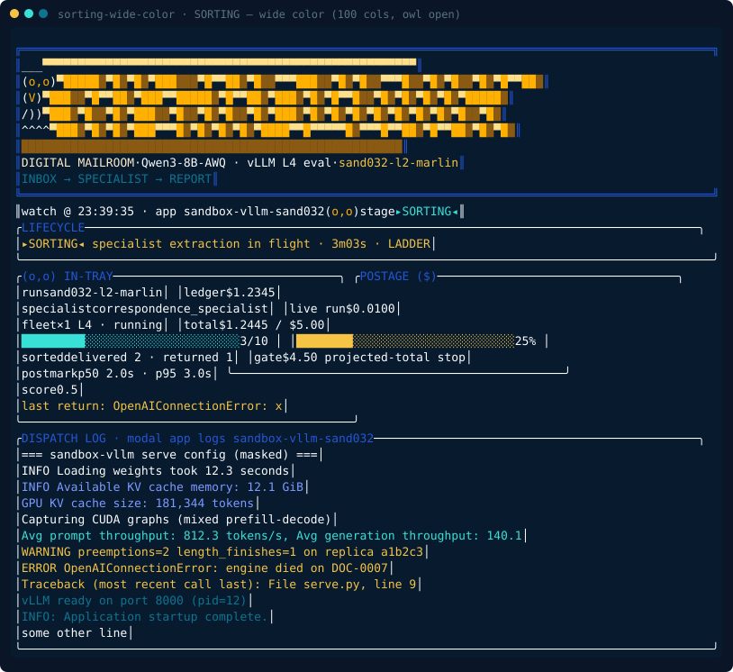 | In-tray + postage side by side; `delivered 2 · returned 1`; postmark p50/p95; colour-coded dispatch log. Produced by `sandbox watch --once`. |
| QUEUED, narrow plain (70 cols, `NO_COLOR`) | 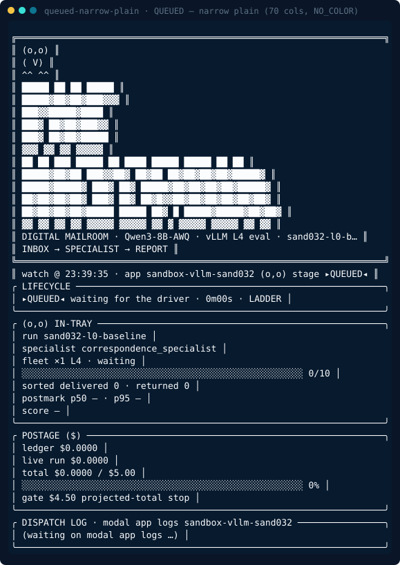 | Waiting run, stacked panels, compact hero, no ANSI. Produced with `NO_COLOR=1 sandbox watch --once`. |
| DEPLOYING — modal deploy | 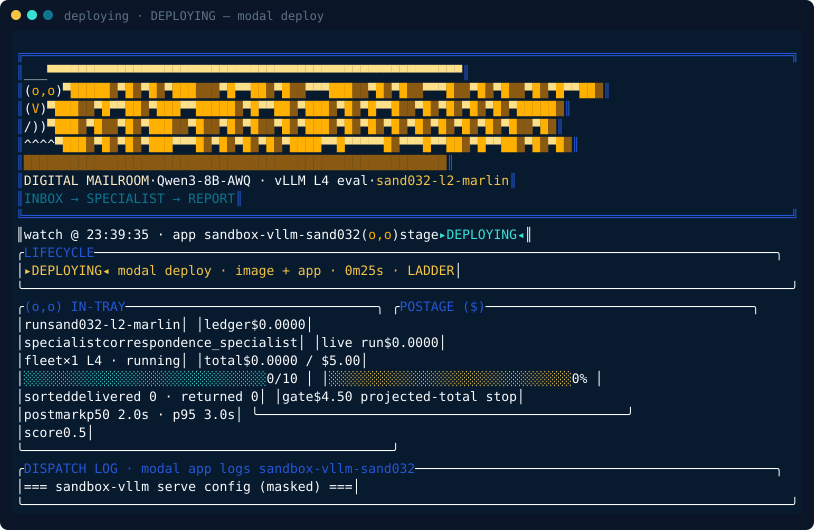 | Driver has started the deploy; the fleet image + app are being pushed. |
| PREFLIGHT — engine verified | 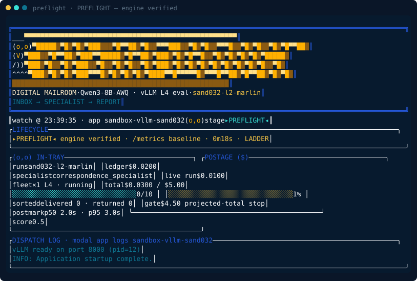 | Engine is up; the TUI has baselined `/metrics` before sorting starts. |
| TEARDOWN — scorecard | 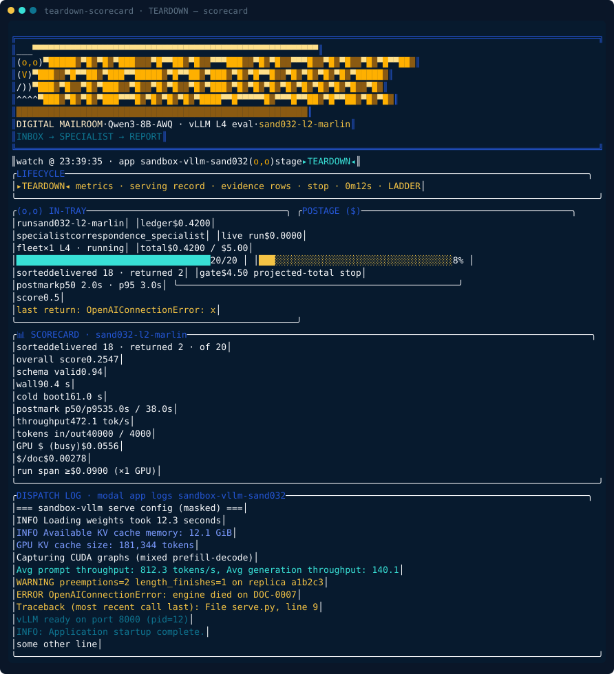 | Scorecard panel appears only in `TEARDOWN`/`STOPPED`: quality + serving record + `/metrics` replica row. Also via `sandbox scorecard --run <id>`. |
| STOPPED — fleet stopped, billing ended | 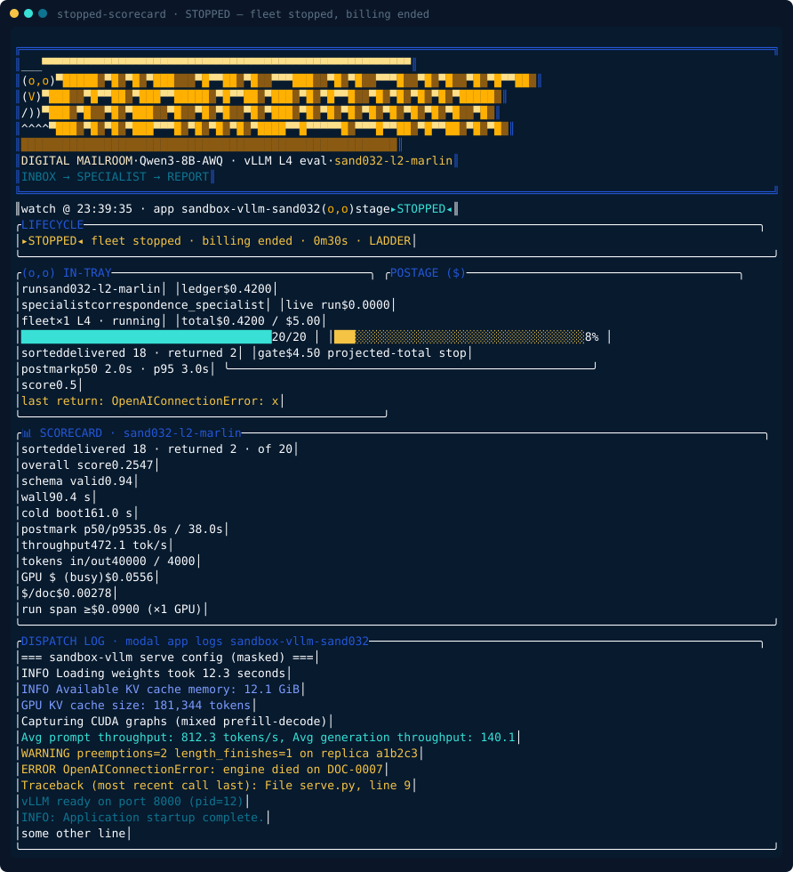 | Terminal phase: the scorecard stays on screen after the fleet stops. |
| Program route — ladder + sweep | 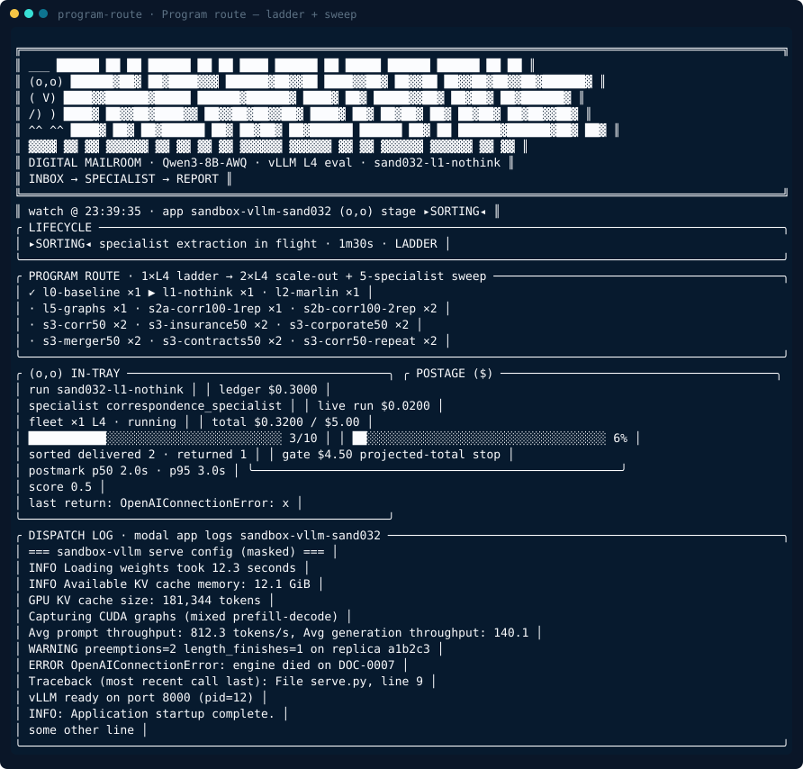 | `✓` done · `▶` live · `·` queued with fleet tags (`×1`/`×2` L4) across the 13-run program (`watch.py::PROGRAM`). |

### Cold boot sub-phases

The `COLD BOOT` detail is derived from Modal log markers (`watch.py::BOOT_MARKERS`) and steps through five sub-phases:

| Sub-phase | Screenshot |
|---|---|
| container starting | 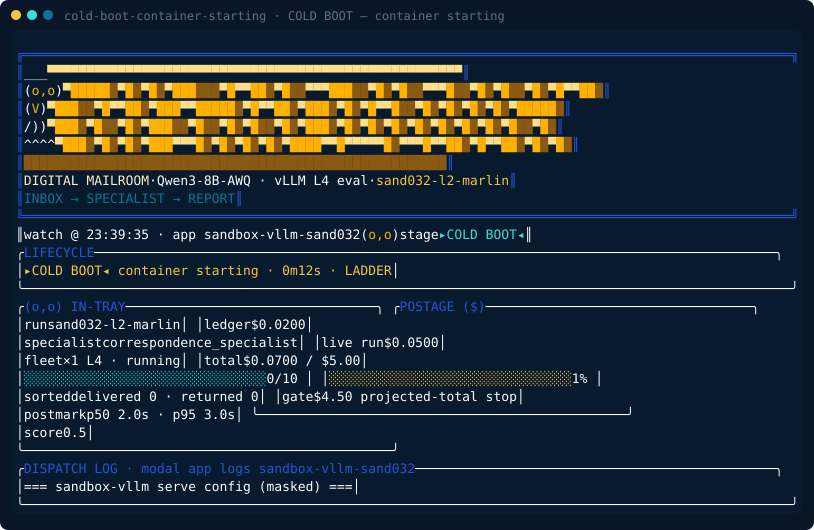 |
| loading weights | 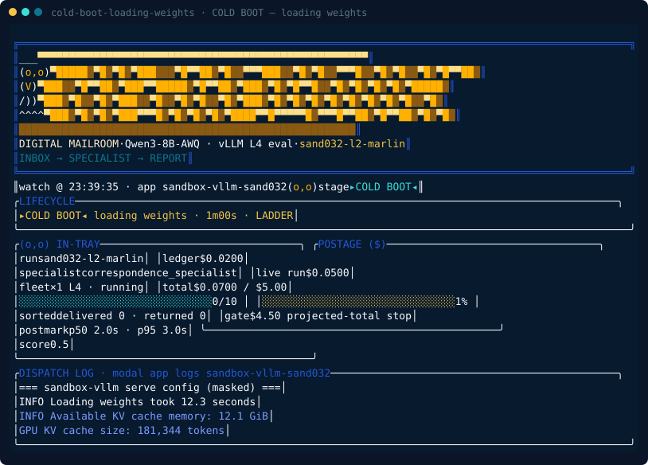 |
| profiling KV cache | 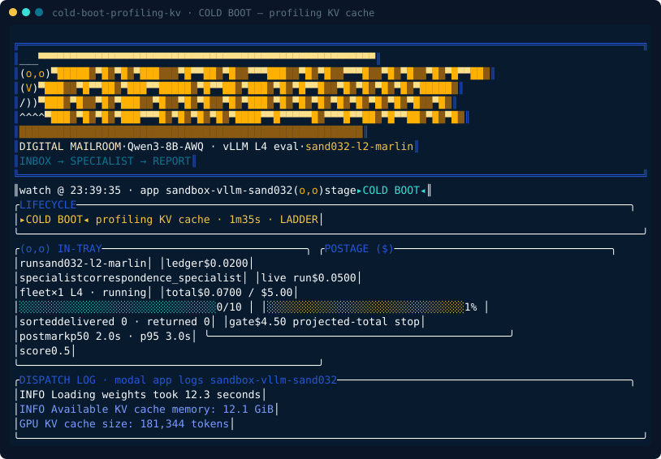 |
| capturing CUDA graphs |  |
| engine ready | 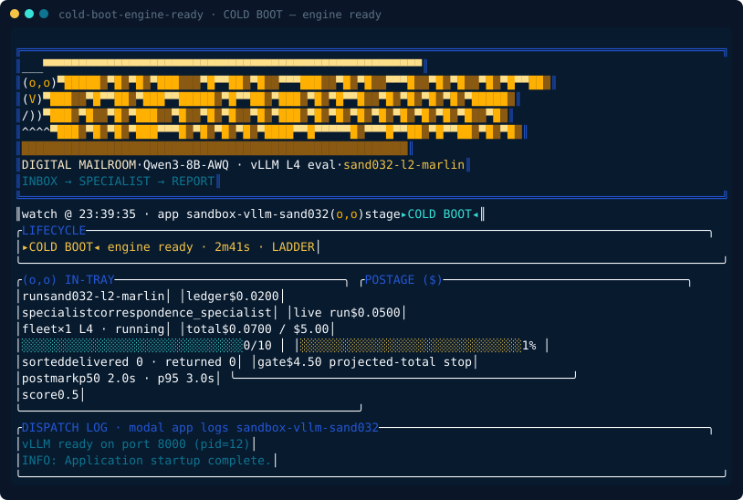 |

### Display aesthetics

| Aesthetic | Screenshot | What to notice |
|---|---|---|
| Postage over-gate warning | 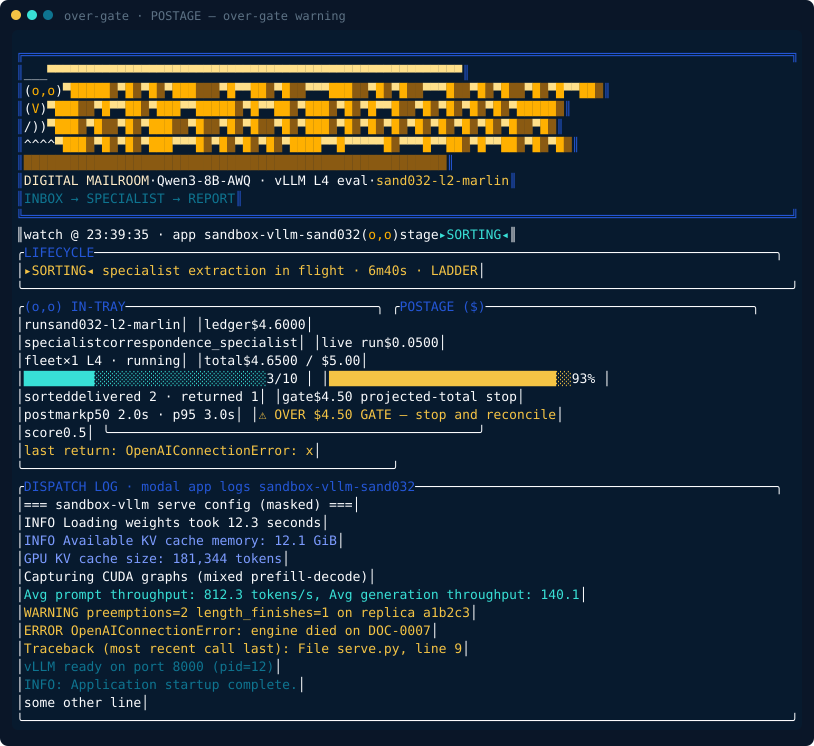 | Gold `OVER $4.50 GATE` row when `total > GATE_USD`; the gate is a projected-total stop, not the cap. |
| Blink frame — owl `(-,-)` | 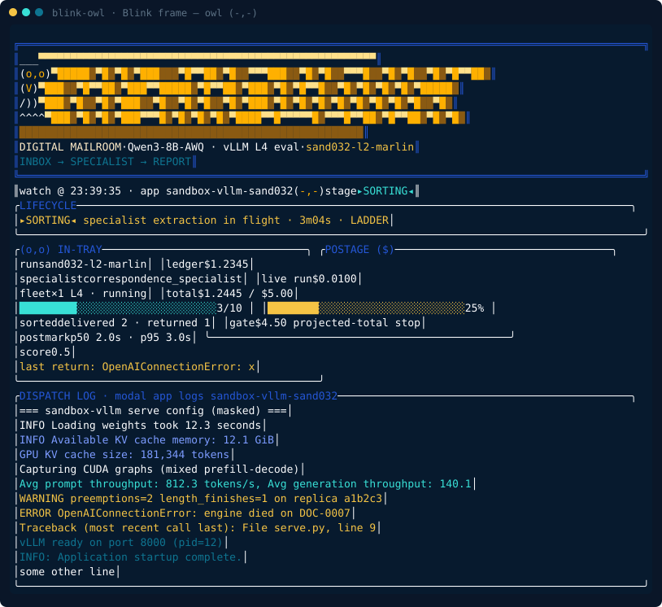 | Same SORTING frame with `blink=True`: the owl blinks every 7th second (`blink=int(time.time())%7==0`). Compare with the open `(o,o)` owl above. |
| Dispatch log — every role | 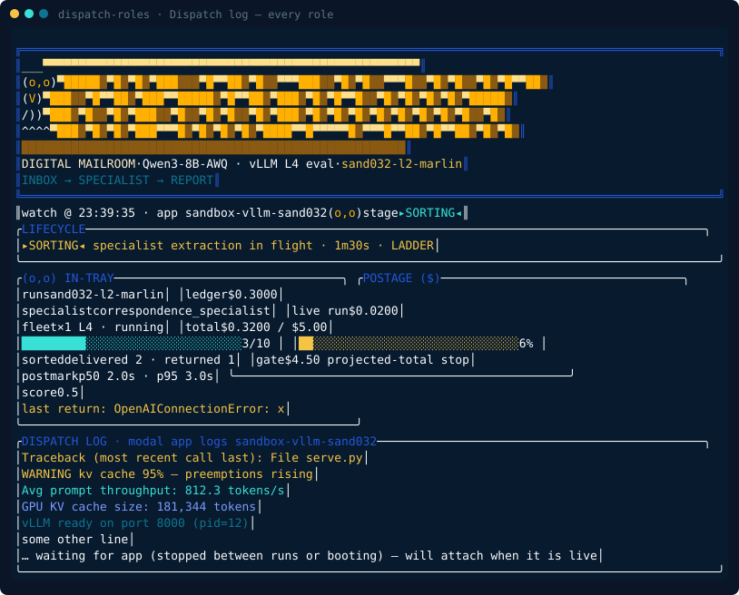 | One line per `classify_log_line` role: error, warn, throughput, kv, ready, plain, plus the reconnect note (`RECONNECT_NOTE`) shown when the app is stopped between runs. |
| Color vs plain, wide vs narrow | Compare `sorting-wide-color` with `queued-narrow-plain` | Color on: amber owl + blue-teal double frame + truecolor wordmark (`pl.palette(True)`). Plain (`NO_COLOR` / `SANDBOX_PLAIN_LOGS=1` / non-TTY): same layout, no ANSI. Wide `>=100` cols: in-tray + postage side by side. Narrow `<90` cols: stacked panels + compact stacked hero (`_wordmark_lines(compact=width<90)`). |

### Job board (beacon)

| State | Screenshot | What to notice |
|---|---|---|
| Board — running / stalled / failed / done | 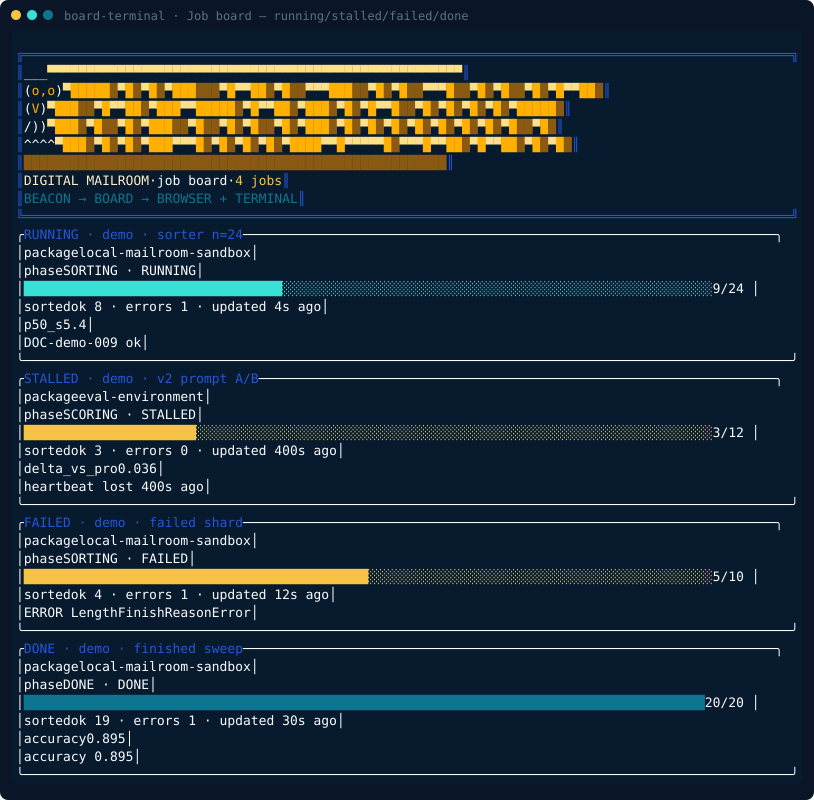 | `sandbox board --tui`: border tone follows status (cyan running, gold stalled/failed, teal done); progress bar + `ok/errors/age` + last log lines per card. Same data serves the browser at `http://127.0.0.1:8767/`. |
| Board — empty in-tray | 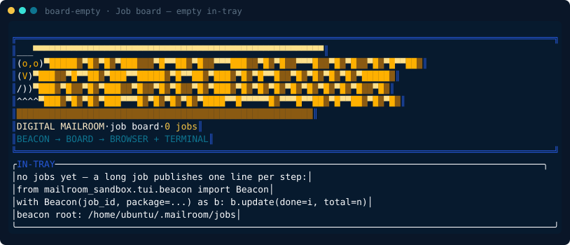 | First-run hint with the `Beacon(job_id, package=...).update(done=i, total=n)` publish snippet. Try `sandbox board --demo` for synthetic jobs. |

### Session CLI (no alt-screen)

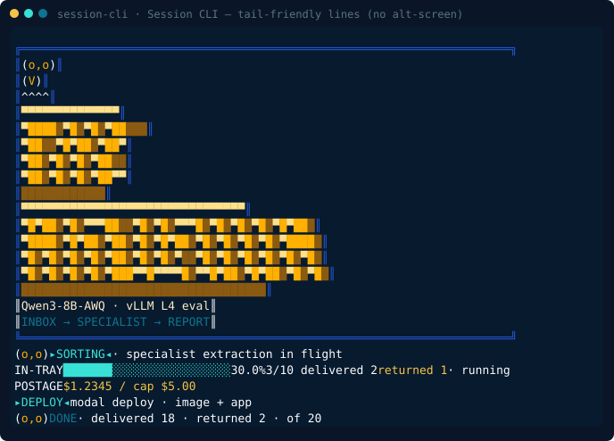

`mailroom_sandbox.tui.session.MailroomConsole` — the tail-friendly layer for `sandbox run|eval|matrix` and deploy entrypoints (stderr lines, no alt-screen): compact double-line run banner, `▸PHASE◂` stamp lines, `IN-TRAY` progress bar, `POSTAGE` cost line, and the `DONE` summary. Plain mode emits `[mailroom]`, `[progress]`, `[postage]`, `[done]` one-liners instead.

### Browser UI theme

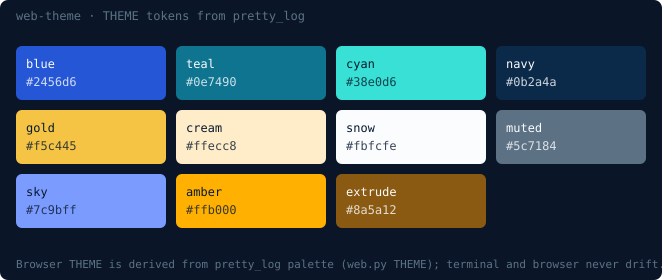

`sandbox watch --web` (`http://127.0.0.1:8765/`) and the board browser reuse the same SAND-032 panels. CSS tokens in `tui/web.py::THEME` are derived from the `pretty_log` palette constants, so the terminal and the browser never drift; log roles map via `_ROLE_TOKEN` (warn→gold, mint→sky, dim→muted). The terminal hero (owl + amber 3D `THE MAILROOM`) is served as HTML (`hero_html` wide + `hero_compact_html` under 800 px) through `ansi_to_html`.

## Security

The server binds to `127.0.0.1` by default and has **no authentication**. Do not expose it on `0.0.0.0` without a reverse proxy and auth.

## Implementation

`mailroom_sandbox.tui.web` (stdlib HTTP + SSE), sharing render state with `mailroom_sandbox.watch.compose_watch_state`. Tail-friendly CLI output for `sandbox run|eval|matrix` lives in `mailroom_sandbox.tui.session`; the alt-screen terminal TUI lives in `mailroom_sandbox.watch`. Both are built on the vendored `mailroom_sandbox.tui.pretty_log` primitives.
