# The-Mailroom


[](https://github.com/Exios66/The-Mailroom/releases/tag/v0.3.0)


**Pixel-art visual engine for the [`llm-mailroom`](https://github.com/Exios66/llm-mailroom)
multi-agent legal-document pipeline.** The Mailroom renders every pipeline run as an
animated conveyor of document envelopes — sorter, specialist bays, the boss's desk,
the reporter, the archive — driven entirely by **Langfuse traces**. 

Four surfaces share one display API (`/api/*` + `/ws`):

| Surface | Command / URL | Notes |
|---|---|---|
| Pixel-art console | `mailroom-web` → `http://127.0.0.1:8001/` | the CRT conveyor floor |
| Hosted Observatory | `mailroom-hosted` (also `/live` on the same server) | public operations desk |
| TUI | `mailroom-tui` | typed-command REPL (`MAILROOM_API_URL`) |
| Terminal site | `…/terminal/` on GH Pages | owlcot-style TTY: `ls`/`cat`/`cd`, `corpus ls|show`, `repos` |

The terminal site and the TUI both add a **dataset viewer** (`corpus …`
commands over `Lucius-Morningstar/mailroom-dataset` — slim windowed
listing, live per-row `doc_text` + ground truth) and a **constellation
repo browser** (`repos …` — every mirror package plus the hub copies and
derived graph sites).

Agent skills (Langfuse / Phoenix / Braintrust / Ollama / Modal / Hugging Face
plus pixel, Observatory, live floor, schema sync, Pages, TUI, operator desk):
[`.cursor/skills/README.md`](.cursor/skills/README.md).

---

<details>
<summary>The governed constellation</summary>

The-Mailroom is one node of a governed family of repositories sharing one kanban
board, one discussion log, and one trace contract:

```
        ┌─────────────────────────┐         ┌─────────────────────────┐
        │  llm-entity-extraction  │ breeds  │      llm-mailroom       │
        │  prompt-experiment loop │ ──────▶ │   the document pipeline │
        └─────────────────────────┘         └────────────┬────────────┘
                                                         │ Langfuse traces (US cloud)
                                                         ▼
                                        ┌──────────────────────────────┐
                             YOU ARE    │         THE-MAILROOM         │
                               HERE ▶   │    pixel-art visual engine   │
                                        └──────────────────────────────┘
```

| Repository | Role | Relationship to The-Mailroom |
|---|---|---|
| [llm-mailroom](https://github.com/Exios66/llm-mailroom) | LangGraph state machine processing legal documents through specialist LLM agents (classify → extract → report → archive); pin `@3cf9fb9` / **v0.6.0** (package `mailroom` 0.6.0) | **Upstream** — its Langfuse project is this visualizer's sole data source; optional `pip install -e ".[pipeline]"` imports `pipeline.review_resolve` |
| [llm-entity-extraction](https://github.com/Exios66/llm-entity-extraction) | Prompt-experiment loop (prompt versions × models, paired-bootstrap ablations) | Breeds the pipeline's sorter/specialist prompts; hosts the shared kanban board + governance log for the whole chain |
| [llm-dojo-scoring](https://github.com/Exios66/llm-dojo-scoring) | Deterministic, field-type-aware scoring engine (`@v0.11.0`) | Upstream governed dependency of both pipeline repos |
| [Enron-Evaluation-Environment](https://github.com/Exios66/Enron-Evaluation-Environment) | EDA + pipeline-ready correspondence dataset (CMU Enron corpus) | Corpus feed for the pipeline's `correspondence` doc class |
| [claims-data-eda](https://github.com/Exios66/claims-data-eda) | Insurance-claims candidate-corpus EDA (CMS DE-SynPUF direction) | Candidate corpus feed for the `insurance_claim` doc class |
| [atticus-investigation](https://github.com/Exios66/atticus-investigation) | LegalBench classification prompt-engineering pipeline | Eval sibling — same methodology family, LegalBench focus |
| [llm-mailroom-graph](https://exios66.github.io/llm-mailroom-graph/) · [llm-entity-extraction-graph](https://exios66.github.io/llm-entity-extraction-graph/) | Interactive graphify knowledge graphs | Derived sites mapping the pipeline's and the loop's code structure |

Full relationship map: [`llm-mailroom/docs/sister-repos.md`](https://github.com/Exios66/llm-mailroom/blob/main/docs/sister-repos.md).

</details>

## Quick start

```bash
pip install -e ".[dev]"
pip install -e ".[pipeline]"  # optional: import llm-mailroom @ 3cf9fb9 (v0.6.0)
cp .env.example .env      # add LANGFUSE_PUBLIC_KEY / LANGFUSE_SECRET_KEY
mailroom-web              # → http://127.0.0.1:8001  (pixel-art console)
                          #    Observatory is also at /live on the same server
mailroom-hosted           # → public Observatory on 0.0.0.0 (container-ready)
mailroom-tui              # typed-command REPL (floor/corpus/repos/inspect)
pip install -e ".[operator]"  # optional: operator desk (auth / archive / observer)
pip install -e ".[ui]"        # marker only; React desk still needs Node
mailroom-observer         # bin watcher (or MAILROOM_OBSERVER=1 on mailroom-web)
# optional React desk: cd ui && npm install && npm run build  →  /desk
```

<details>
<summary>What you see on each surface</summary>

**Pixel console** (`mailroom-web`)

- **FLOOR** — the mailroom: a conveyor belt carrying document envelopes
  through the pipeline's seven stations (SORTER · EXTRACT · JUDGE · BOSS ·
  REPORT · ARCHIVE, plus the human-review siding) grouped into three rooms
  (Intake & Sort · Extraction & Adjudication · Reporting & Archive). The
  JUDGE station is the KANBAN-063 quality gate (`judge_verify` +
  `arbitrate-verdict`). Click an envelope for its full run.
- **REVIEW** — the review siding as a queue: every run waiting on a human,
  with its escalation reason and confidence. Approve / Reject / Requeue
  (and record-only audit), plus doc-type / subtype correction and a raw
  document text viewer, when `MAILROOM_PIPELINE_URL` +
  `MAILROOM_PIPELINE_TOKEN` point at llm-mailroom `:8000`; one click still
  opens the inspector.
- **INSPECTOR** — drill-down into any trace: node-span timeline, LLM
  generations (model, tokens, latency, cost), confidence and judge scores.
- **SESSIONS** — matter explorer grouped by Langfuse session.
- **HISTORY** — recent runs with per-hour volume and **REPLAY** (animates
  a stored trace through its real span sequence on the floor).
- **METRICS** — docs processed, archived/review/failed, cost, tokens, p95
  generation latency, judge-verdict mix, per-doc-type counts.
- **CONSOLE** — a live scrolling log of the pipeline, AgentLaboratory-style.

**Observatory** (`/live`, `mailroom-hosted`) — the **hosted** edition: a
modern, accessible public desk (semantic HTML, keyboard views `1`–`6`,
native inspect dialog, paced replay, Debug desk). Same live traces as the
console; different surface, different URL. Not GitHub Pages.

**TUI** (`mailroom-tui`) — the same pipeline in a terminal: per-doc tables,
`*** Beginning station: ... ***` banners as runs arrive and advance, judge
verdict banners, review siding, sessions, metrics, inspect (`[` / `]` cycle
runs), and a debug ring. It subscribes to the same WebSocket floor snapshots
as the web UI (`--once --view floor|review|metrics|sessions|inspect|debug`
renders a single frame for scripting). `--resolve TRACE --decision
approved|rejected --disposition resume|record|requeue --notes "..."
[--doc-type X --doc-subclass Y]` posts through this visualizer to the
producer. `--source TRACE` prints parked document text. Never point
`MAILROOM_API_URL` at the producer `:8000`.

</details>

## Screenshots

Live captures of the three surfaces against the same display API. Values on
screen are interpreted traces (fixture-shaped exactly like the test suite);
Langfuse remains the sole display source. The full gallery, including the
PR screen recording, lives in the **[demos notebook](docs/demos/The-Mailroom-Demos.ipynb)**
and [`docs/demos.md`](docs/demos.md) (wiki twin: [`Demos`](wiki/Demos.md)).

**Hugging Face Space — live Observatory** (~102s) — public Docker Space
after #30 (classification cards, headline strip, inbox setup hint, Export
snapshot, then Review / History / Matters / Metrics / Debug). Live:
https://lucius-morningstar-mailroom-observatory.hf.space/
[hf-space-observatory-live-walkthrough.mp4](docs/demos/hf-space-observatory-live-walkthrough.mp4)

[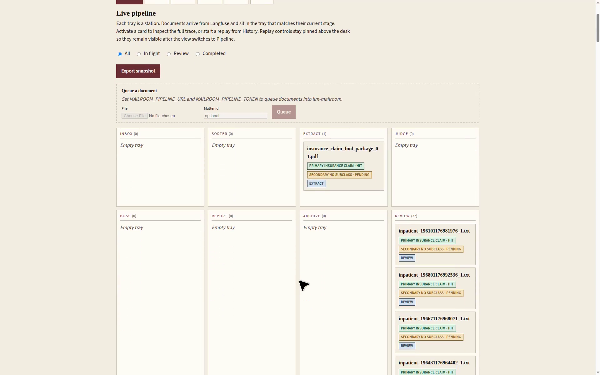](docs/demos/hf-space-observatory-live-walkthrough.mp4)

**Working REVIEW tray** (Approve / Record / Requeue / Complete against a `/v1` stub):

```bash
PYTHONPATH=. python scripts/demo_review_tray.py --port 8006
# http://127.0.0.1:8006/?api=  and  /live?api=
```

**v0.3.0 pixel desks** (~42s) — FLOOR hopper, inspector resolve form, REVIEW
Approve → honest 503, then SESSIONS / HISTORY / METRICS / CONSOLE:
[v030-pixel-desks-review-resolve.mp4](docs/demos/v030-pixel-desks-review-resolve.mp4)

[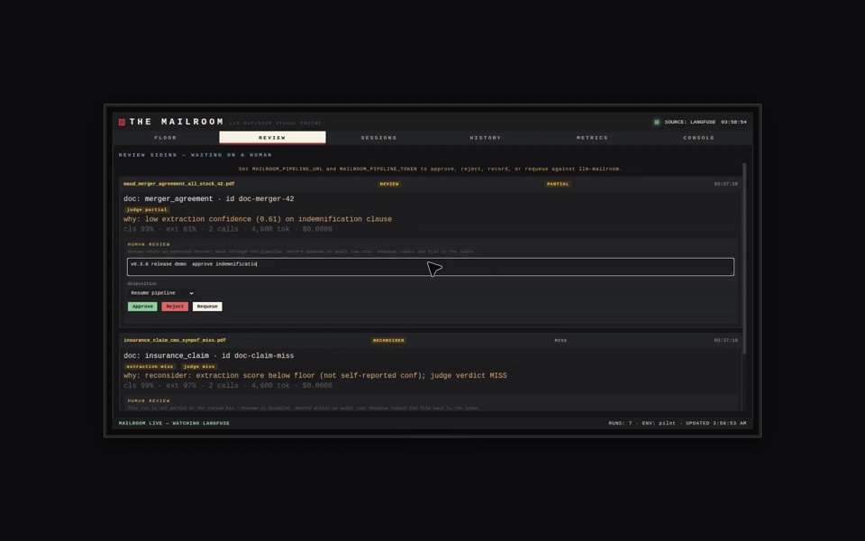](docs/demos/v030-pixel-desks-review-resolve.mp4)

**v0.3.0 Observatory** (~52s) — Inbox tray, Review resolve, inspect dialog,
History / Matters / Metrics / Debug:
[v030-observatory-review-resolve.mp4](docs/demos/v030-observatory-review-resolve.mp4)

[](docs/demos/v030-observatory-review-resolve.mp4)

**Walkthrough video** (~56s, pixel desks then Observatory):
[tui-server-observatory-desk-walkthrough.mp4](docs/demos/tui-server-observatory-desk-walkthrough.mp4)
— click the file on GitHub to play it.

[](docs/demos/tui-server-observatory-desk-walkthrough.mp4)

**Pilot run — documents moving through the pipeline** (~25s): five envelopes
slide SORTER → EXTRACT → JUDGE → REPORT → ARCHIVE; the merger agreement
peels onto REVIEW; a corporate record fails. Re-record with
`python scripts/demo_pilot_run.py --port 8005`.

[](docs/demos/pilot-run-documents-through-pipeline.mp4)

Open a section below to expand the stills.

<details open>
<summary>Pixel-art console (<code>mailroom-web</code>)</summary>

| | |
|---|---|
| 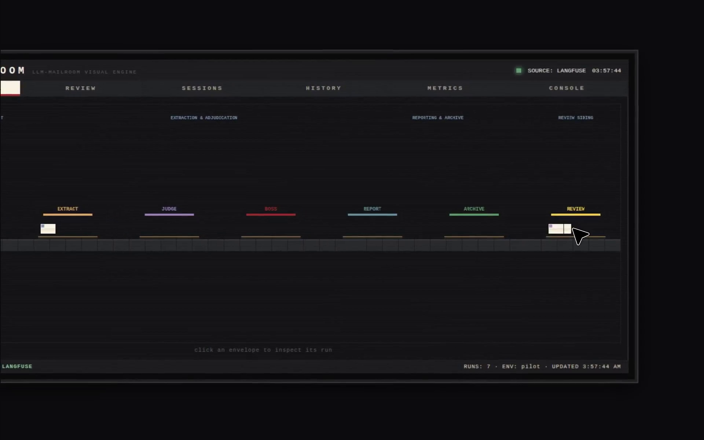 |
| **FLOOR** — seven stations, per-doc-type envelope tints, review siding and failed bin. Click an envelope to inspect. |
|  |
| **PILOT RUN** — live envelopes mid-flight (ACTIVE: 4). Full motion: [pilot-run-documents-through-pipeline.mp4](docs/demos/pilot-run-documents-through-pipeline.mp4). |
| 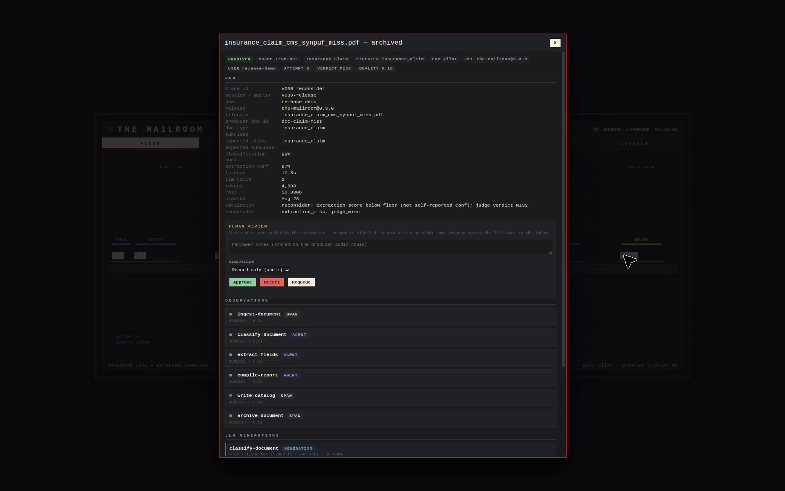 |
| **INSPECTOR** — node spans, LLM generations, classification / extraction / judge scores. |
|  |
| **REVIEW** — parked + RECONSIDER cards with Approve / Reject / Requeue / Complete (disposition resume/record/requeue/complete). |
| 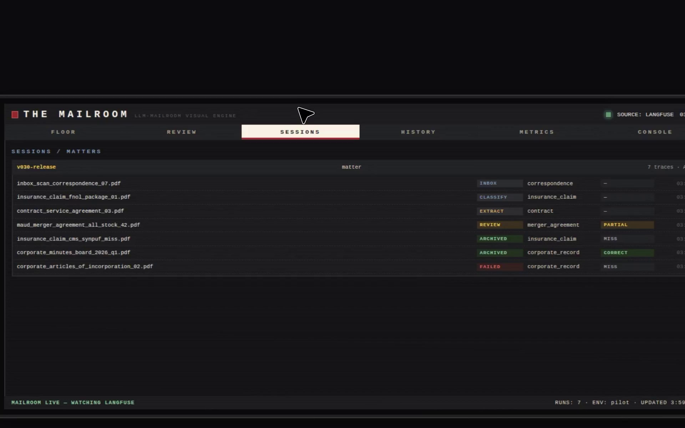 |
| **SESSIONS** — Langfuse matters with their traces, stages, and verdicts. |
|  |
| **HISTORY** — recent runs, per-hour volume, REPLAY onto the floor. |
| 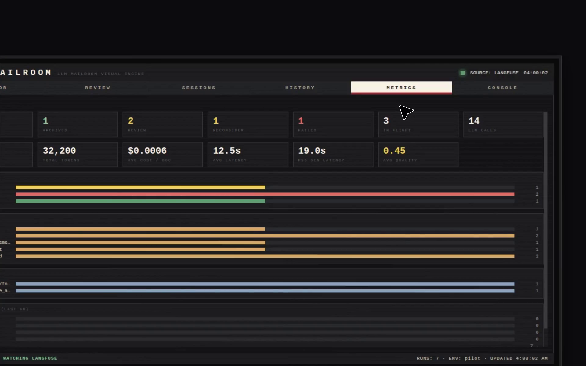 |
| **METRICS** — docs processed, archived/review/failed split, cost, tokens, judge-verdict mix, per-doc-type counts. |
| 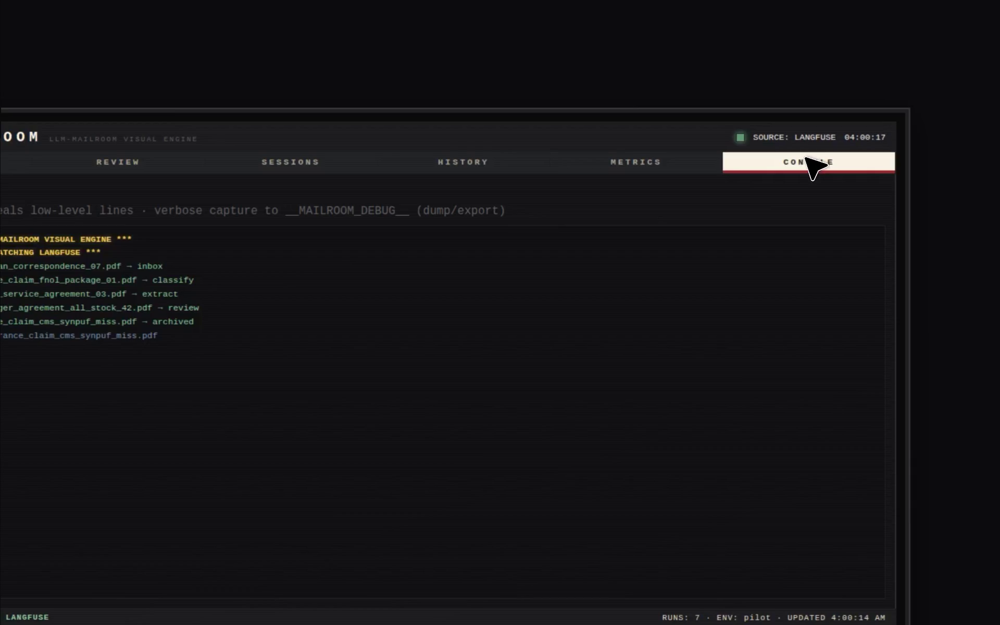 |
| **CONSOLE** — AgentLab-style live log plus the DEBUG capture toggle. |

</details>

<details open>
<summary>Hosted Observatory (<code>/live</code>, <code>mailroom-hosted</code>)</summary>

| | |
|---|---|
|  |
| **Pipeline** — live trays including INBOX hopper, Sorter · Extract · Judge · Boss · Report · Archive · Review · Completed. |
| 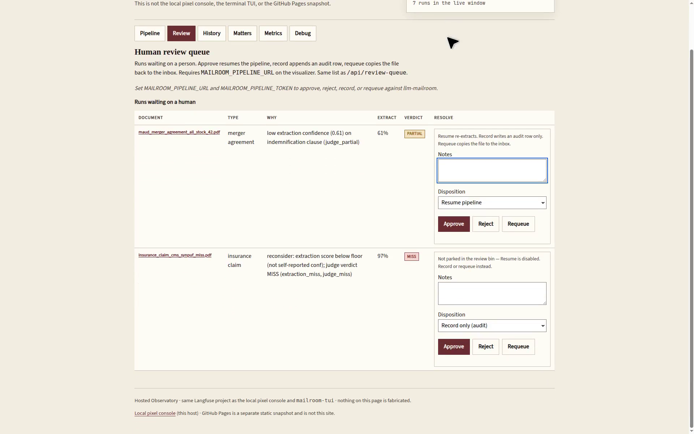 |
| **Review** — human-review queue with inline resolve (Approve / Reject / Requeue / Complete). |
| 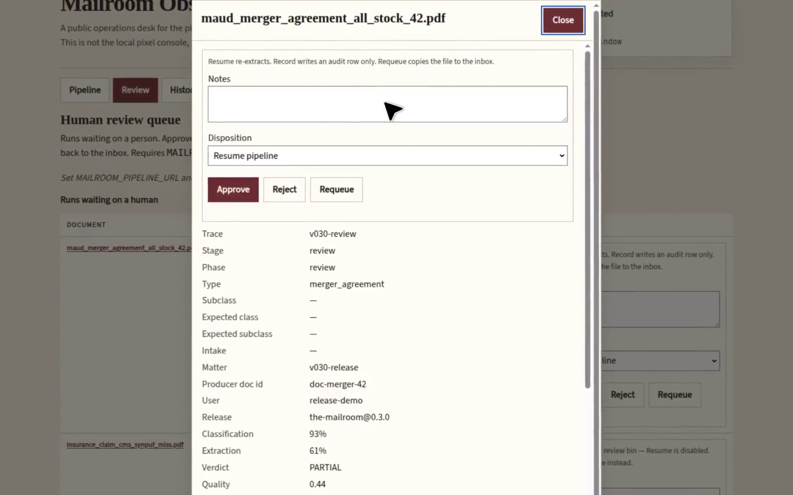 |
| **History** — recent runs with paced Replay of stored span sequences. |
| 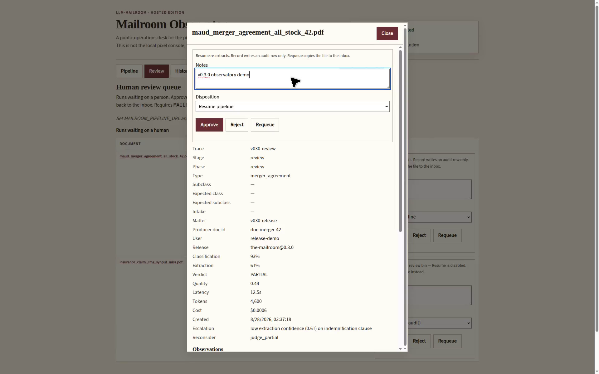 |
| **Matters** — Langfuse sessions grouped as matters. |
| 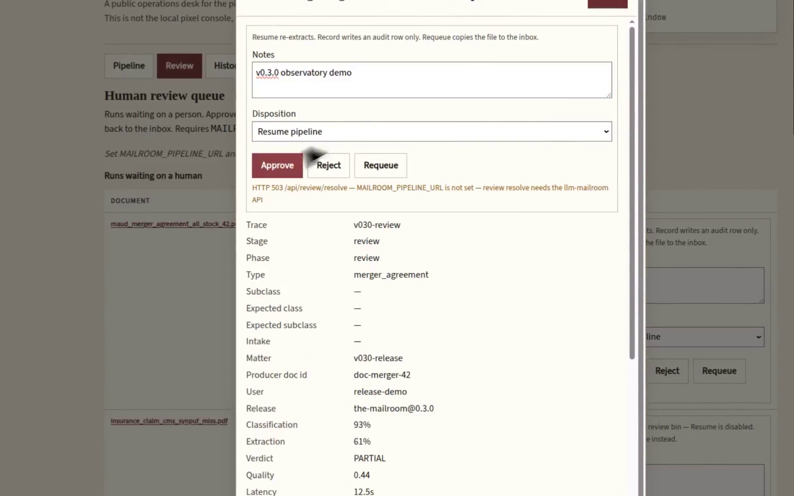 |
| **Metrics** — the same window aggregates as the pixel desk. |
| 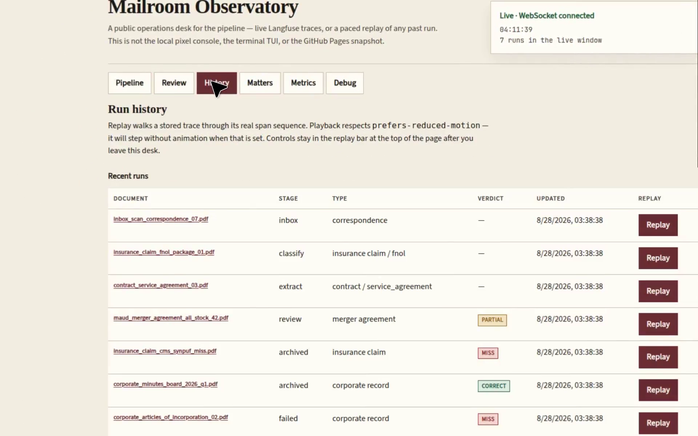 |
| **Debug** — client ring, `GET /api/debug/bundle`, `POST /api/debug/client`. |

</details>

<details open>
<summary>TUI (<code>mailroom-tui</code>)</summary>

| | |
|---|---|
| 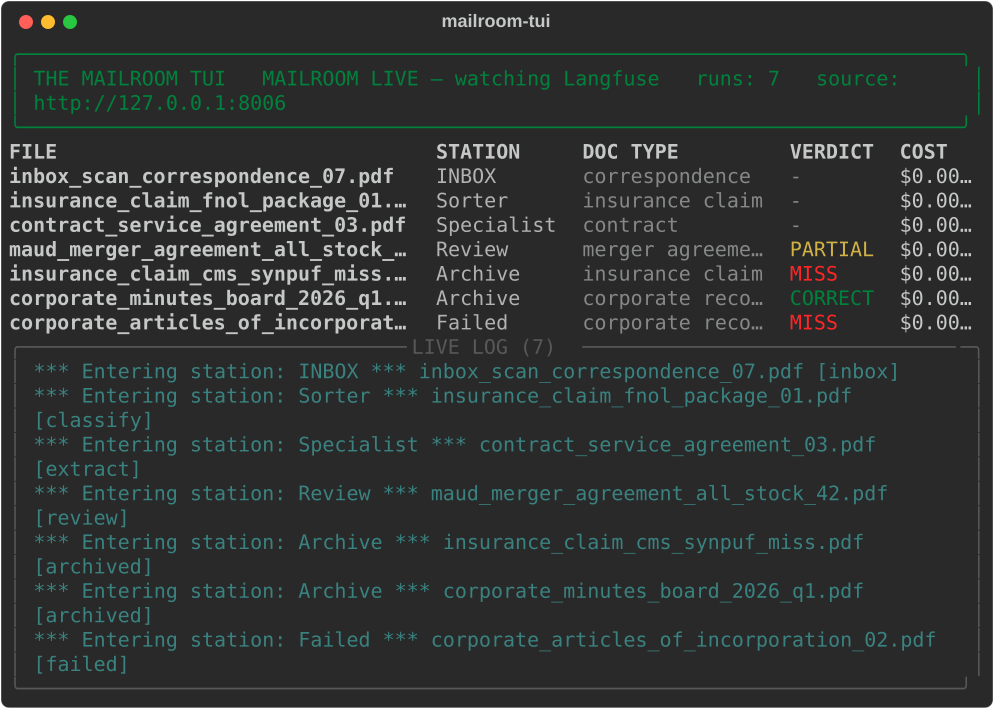 |
| **Floor** (`mailroom-tui --once`) — per-doc table, verdicts, station banners, live log. |
| 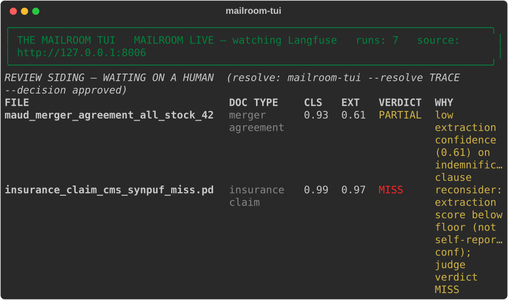 |
| **Review** (`--view review`) — waiting-on-a-human queue with escalation reasons. |
| 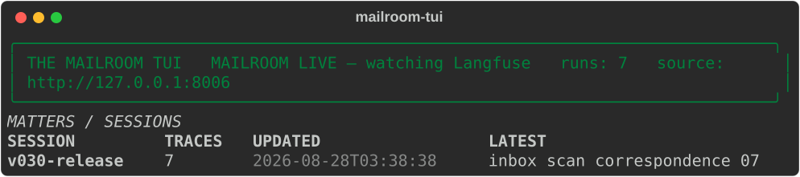 |
| **Sessions** (`--view sessions`) — Langfuse matters. |
| 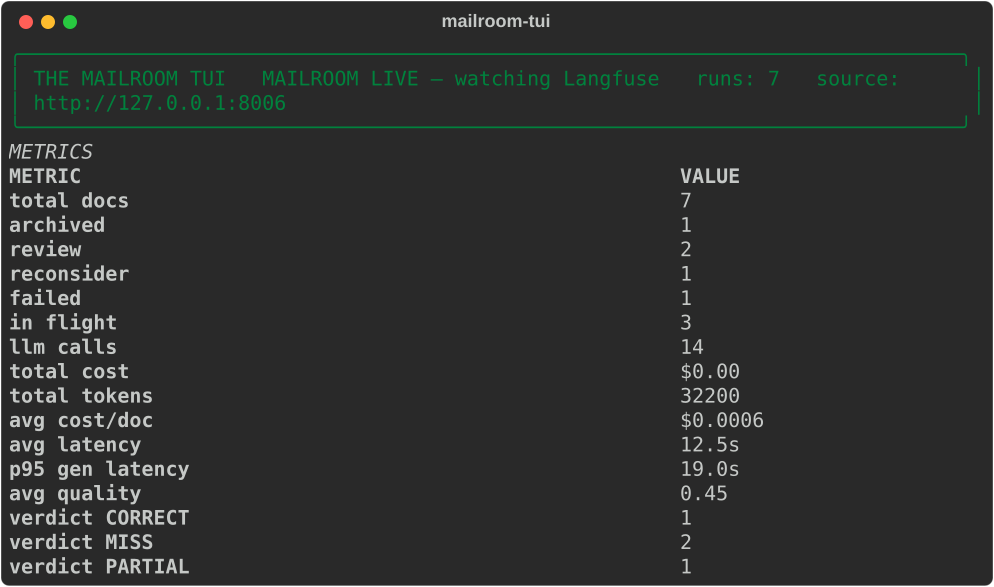 |
| **Metrics** (`--view metrics`) — the same aggregates as `/api/metrics`. |

Keys: `[f]loor` `[r]eview` `[s]essions` `[m]etrics` `[i]nspect` `[` `]` `[d]ebug` `[q]uit`.

</details>

---

<details>
<summary>Demo data (play-testing without a live run)</summary>

Demo runs are seeded **into** Langfuse (env `demo`) — the visualizer still
reads Langfuse only, so nothing on screen is ever canned data:

```bash
python scripts/seed_demo.py                       # seed 13 demo runs (incl.
                                                  # judge-gate + arbiter paths)
python scripts/seed_demo.py --list-scenarios      # what the demo set covers
python scripts/seed_demo.py --check --check-api   # verify seeded runs against
                                                  # stored Langfuse logs AND the
                                                  # running server's display API
python scripts/seed_demo.py --check-logs <dir>    # verify against run logs saved
                                                  # by llm-mailroom's
                                                  # scripts/sync_langfuse_logs.py
```

The pixel `D` key does **not** fabricate envelopes on a live floor. Demo
envelopes are opt-in (`?demo=1`) and only when the trace source is down.

</details>

<details>
<summary>Requirements</summary>

- Python 3.11+
- A Langfuse project (the `llm-mailroom` project on US cloud by default)
  with project-scoped API keys in `.env`
- The sister pipeline repo `../llm-mailroom` (optional — `MAILROOM_TAXONOMY`
  live override, production-pilot scripts, or `mailroom_ui/producer.py`
  checkout import). Prefer `pip install -e ".[pipeline]"` to pin dist
  `mailroom` @ `3cf9fb9` (v0.6.0) when you want to import `pipeline.review_resolve`.
- `arize-phoenix-client` (optional — only for the Phoenix trace source)

</details>

<details>
<summary>Hosted Observatory (public URL — not GitHub Pages)</summary>

The Observatory is a **separate live site** meant to be deployed to a real
host (Railway, Hugging Face Spaces, Fly, Render, Cloud Run, a VPS). It is not the
Pages snapshot and not the pixel-art console.

```bash
mailroom-hosted                          # 0.0.0.0:8001  →  / and /live
docker build -t mailroom-observatory .
docker run --rm -p 7860:7860 --env-file .env mailroom-observatory
python scripts/publish_space.py --check  # Hugging Face Docker Space payload
# Railway: see docs/deployment.md (.railway/railway.py IaC + PORT preference;
# GET /health = liveness (+ platform, build_sha), GET /api/health = Langfuse)
```

Hugging Face Space: SDK **Docker**, root directory **empty** (repo-root
`Dockerfile`), port **7860**. Railway / Fly inject `$PORT` (preferred over
image `MAILROOM_PORT`). Secrets: `LANGFUSE_PUBLIC_KEY`,
`LANGFUSE_SECRET_KEY`, `LANGFUSE_HOST=https://us.cloud.langfuse.com`
(`LANGFUSE_BASE_URL` is accepted as an alias). Do not configure the Space
as FastAPI/Vercel — the image is `python -m server.hosted`.

```bash
HF_TOKEN=hf_... LANGFUSE_PUBLIC_KEY=pk-lf-... LANGFUSE_SECRET_KEY=sk-lf-... \
  python scripts/publish_space.py --repo <user>/mailroom-observatory
```

Full deploy notes (Spaces secrets, keyboard map, how it differs from the
other surfaces): [`hosted/README.md`](hosted/README.md) and
[`hosted/SPACE_README.md`](hosted/SPACE_README.md).

</details>

<details>
<summary>GitHub Pages edition (static site + local Phoenix)</summary>

The Mailroom also runs as a **static site on GitHub Pages** with three data
modes:

```bash
# one-time: Settings → Pages → Source: "Deploy from a branch" → gh-pages /docs
scripts/publish_pages.sh                          # build site/ + push gh-pages docs/
scripts/publish_pages.sh --source both            # Langfuse + Phoenix snapshot
scripts/publish_pages.sh --dry-run                # build + verify, don't push
scripts/publish_pages.sh --status                 # is the live site in sync with HEAD?
```

**Keeping main and gh-pages in sync** (no Actions): enable the committed
pre-push hook once per clone — `git config core.hooksPath hooks` — and every
push of `main` republishes `gh-pages:/docs` automatically. A failed
republish (e.g. a Langfuse hiccup) warns without blocking the code push;
set `MAILROOM_STRICT_SYNC=1` to make failures block instead.
`scripts/publish_pages.sh --status` reports drift any time (exit 1 = stale).
The publisher must run from `main` — it refuses cleanly if another branch
(e.g. `gh-pages` in GitHub Desktop) is checked out.

The publisher needs no GitHub Actions (deliberately — it uses Pages' native
deploy-from-branch mode): it stages `web/` with relative asset paths, exports
a JSON snapshot of the configured trace source, verifies it, and pushes the
site into `docs/` on the `gh-pages` branch (anything else on that branch's
root is left untouched). Re-run any time to refresh the snapshot.

1. **Snapshot mode** — a build-time JSON export of the configured trace
   source is bundled into the site (`data/*.json`). Works with zero backend,
   zero secrets in the browser; the lamp shows `SOURCE: SNAPSHOT`. Published
   locally by `scripts/publish_pages.sh` (no GitHub Actions required) from
   Langfuse repo secrets or a local Phoenix — without a reachable source the
   site ships empty and shows its honest CLOSED state.
2. **Live mode** — point the static page at any reachable Mailroom API:
   append `?api=http://localhost:8001` once (persisted to `localStorage`).
   `?api=` (empty) **clears** a stale persisted base. Run the server locally
   with CORS enabled (`MAILROOM_CORS_ORIGINS`) and the Pages UI goes fully
   live, WS included. Note: Chrome/Firefox allow HTTPS→`http://localhost`
   calls; Safari may block them.
3. **Phoenix mode** — traces from a *locally running* Arize Phoenix
   (default `http://localhost:6006`) can drive the console:

   ```bash
   pip install arize-phoenix-client
   # start Phoenix (e.g. `phoenix serve`) and point your pipeline's OTLP
   # exporter at it, then:
   MAILROOM_SOURCE=phoenix mailroom-web     # or MAILROOM_SOURCE=both for Langfuse + Phoenix
   ```

   Phoenix spans are mapped into the llm-mailroom display contract:
   verb-first span names route through the stage map, LLM spans become
   generations (model/tokens/cost), annotations become scores. Unmapped
   spans degrade to unknown staging — same visible-by-design breakage map.

</details>

<details>
<summary>Debug console for agents</summary>

Every fetch, WS frame, error, and console line lands in a client-side ring
buffer at `window.__MAILROOM_DEBUG__` (`dump()`, clipboard copy,
`pullServer()`, `pushClient()`, `export()` → `mailroom-debug.json`);
`?debug=1` or the CONSOLE tab's DEBUG toggle enables verbose capture.

The hosted Observatory has a parallel suite: `window.__OBSERVATORY_DEBUG__`,
Debug desk `#debug` (`?debug=1`). The TUI records urllib/WS failures in
`LAST_ERRORS` (`[d]ebug`, `--view debug`) and can pull the same bundle.

Server side:

- `GET /api/debug/bundle` — one-pull: health + source + server ring + last
  client dumps
- `POST /api/debug/client` — store a browser dump for the next agent pull
- `GET /api/debug/logs?limit=` — always-on request ring buffer
- `GET /api/debug/source` — configured sources / knobs
- `GET /api/meta` — machine-readable endpoint index plus active sources and
  version
- `MAILROOM_DEBUG=1` — verbose stdout logging

Snapshot builds add `debug/build-info.json` (git SHA, counts, generation time).

</details>

<details>
<summary>Configuration reference</summary>

All knobs live in `.env` (see `.env.example`): Langfuse keys/host
(`LANGFUSE_HOST`, default `https://us.cloud.langfuse.com`), poll cadence
(`MAILROOM_POLL_INTERVAL`), recent window (default **7 days**,
`MAILROOM_RECENT_WINDOW=604800`), trace limit (`MAILROOM_TRACE_LIMIT=200`),
optional tag/env filters, `MAILROOM_PORT` (default `8001`),
`MAILROOM_TAXONOMY`, and `MAILROOM_PIPELINE_URL` + `MAILROOM_PIPELINE_TOKEN`
(producer on `http://127.0.0.1:8000` or a public Space such as
`https://<user>-mailroom-producer.hf.space` — watcher/inbox liveness,
`POST /v1/upload` enqueue, human-review resolve, class correction mapped
to `override_doc_type`, parked-file source via `/v1`). Token is the
producer `MAILROOM_API_TOKEN`.
`MAILROOM_PIPELINE_API_PREFIX` defaults to `/v1`. `MAILROOM_API_URL` is the TUI → this
visualizer (`:8001`), not the producer. The operator desk (`operator_desk/`)
adds `MAILROOM_OPERATOR_*` (JWT, admin seed, ingest token) plus
`MAILROOM_BASE_DIR`, `MAILROOM_OPERATOR_DB`, and `MAILROOM_OBSERVER`. The GH Pages edition adds `MAILROOM_SOURCE`
(`langfuse|phoenix|both`), `PHOENIX_ENDPOINT` / `PHOENIX_API_KEY` /
`MAILROOM_PHOENIX_PROJECT`, `MAILROOM_CORS_ORIGINS`, and `MAILROOM_DEBUG`.

> [!IMPORTANT]
> `pipeline_schema.py` is cached at process level — editing `taxonomy.yaml`
> (or pointing `MAILROOM_TAXONOMY` at the pipeline's copy) requires a server
> restart to take effect.

</details>

<details>
<summary>The trace contract &amp; the mirror duty</summary>

The-Mailroom does not own the trace contract it renders — it **mirrors** it
from the upstream pipeline. This is the repo's #1 maintenance duty: when
`llm-mailroom` changes span names, observation types (`NODE_OBSERVATION_TYPES`:
chain / agent / evaluator / retriever / generation / span), node order, the
agent roster, live doc classes (5 extract classes + `merger_agreement` alias +
`unknown` routing token), Hub subclasses, confidence thresholds, or
judge score names (`mailroom-pipeline-judge`, `mailroom-pipeline-quality`),
this repo must update `mailroom_ui/pipeline_schema.py` and
`mailroom_ui/trace_interpreter.py` in the same change window.

Until mirrored, breakage is visible by design: new spans render as an
`unknown` stage, new observation types can hide a node or mis-file a
generation, new doc classes fall back to the gray default stamp color,
renamed judge scores vanish from runs. The full contract — span inventory,
observation types, score names, metadata/tags, and the complete breakage map
— lives in [`AGENTS.md`](AGENTS.md) ("Sister repo" section), which is
authoritative for pipeline internals alongside the pipeline's own `AGENTS.md`.

</details>

<details>
<summary>Project layout</summary>

```
mailroom_ui/   data core — Langfuse + Phoenix adapters, trace interpreter,
               topology mirror, models, metrics (reads trace sources only)
server/        FastAPI, read-only: /api/* + debug endpoints + WebSocket + serves web/
               (also mounts operator_desk at /v1/* + /ws/pipeline)
operator_desk/ operator submodule — JWT auth, local archive, Langfuse-backed
               ops, bin observer (not a display source)
ui/            optional React operator desk (npm; /desk when built — never
               required for mailroom-web; pixel + Observatory stay vanilla)
web/           pixel-art SPA (vanilla HTML/CSS/JS, no build step)
hosted/        Observatory — public modern accessible desk
tui/           rich console — the pipeline in a terminal (mailroom-tui)
scripts/       seed_demo (demo runs INTO Langfuse) · demo_pilot_run
               (staggered floor recording) · run_production_pilot
               (live Qwen 3.7-Flash HF subset) · eval_pipeline
               (Langfuse traces vs docclass-merged GT) · export_snapshot (Pages
               data) · publish_pages (gh-pages push, no Actions) · release
               · render_tui_shots (README TUI SVGs)
docs/ + wiki/  mirrored documentation (wiki/sync-wiki.sh publishes the wiki)
docs/screenshots/  stills of every pixel / Observatory / TUI desk
docs/demos/        HF Space live walkthrough + v030/pilot mp4s + The-Mailroom-Demos.ipynb
tests/         pytest suite against fake clients — never the real APIs
```

</details>

<details>
<summary>Tests</summary>

```bash
python -m pytest tests/ -q
```

Tests never hit real Langfuse — `tests/fake_langfuse.py` provides v2/v3
snake_case and v4 camelCase fixtures mirroring the trace contract. The
suite covers the TUI, every `/api/meta` endpoint, and SPA source contracts
(no JS test harness).

</details>

<details>
<summary>Releases</summary>

Semantic versioning with a Keep-a-Changelog `CHANGELOG.md`, README/wiki
updates on major changes, and annotated `vX.Y.Z` tags matching the changelog.
`python scripts/release.py --help` drives the mechanical steps. See
`AGENTS.md` → "Release process" for the full procedure.

</details>

---

## License & credits

Visual palette and character direction derived from the AgentLaboratory
project's artwork. Built for the `llm-mailroom` pipeline — see that repo and
its [sister-repos map](https://github.com/Exios66/llm-mailroom/blob/main/docs/sister-repos.md)
for the full governed constellation. No license published yet.
