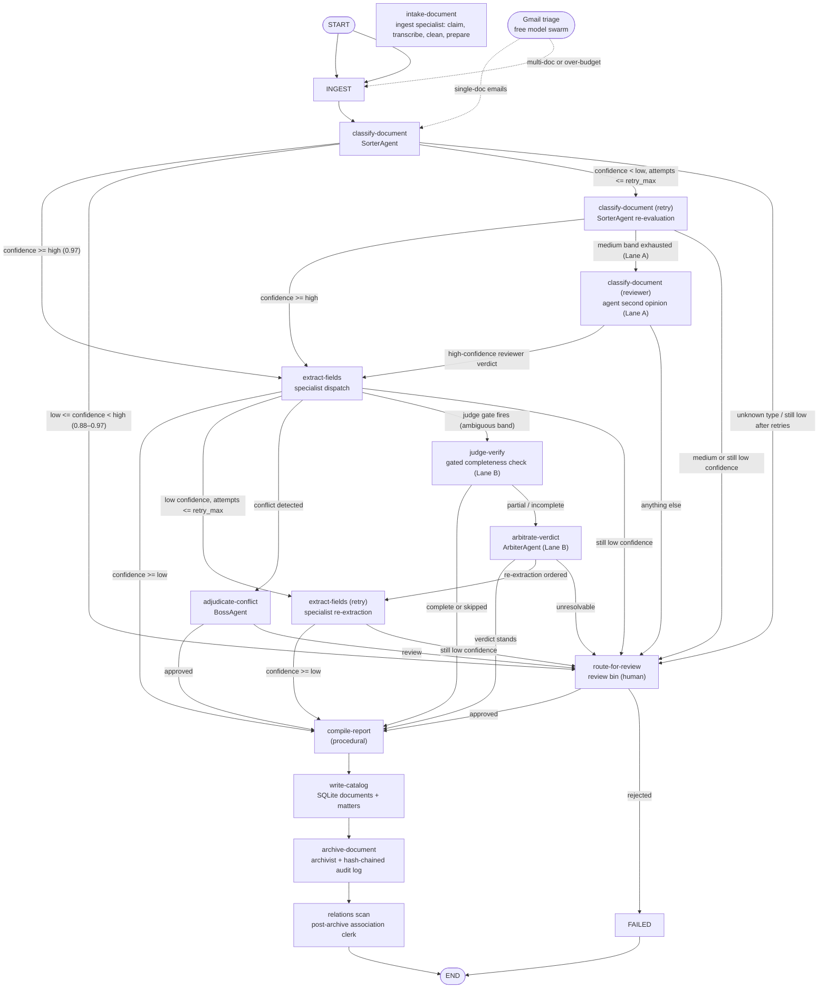
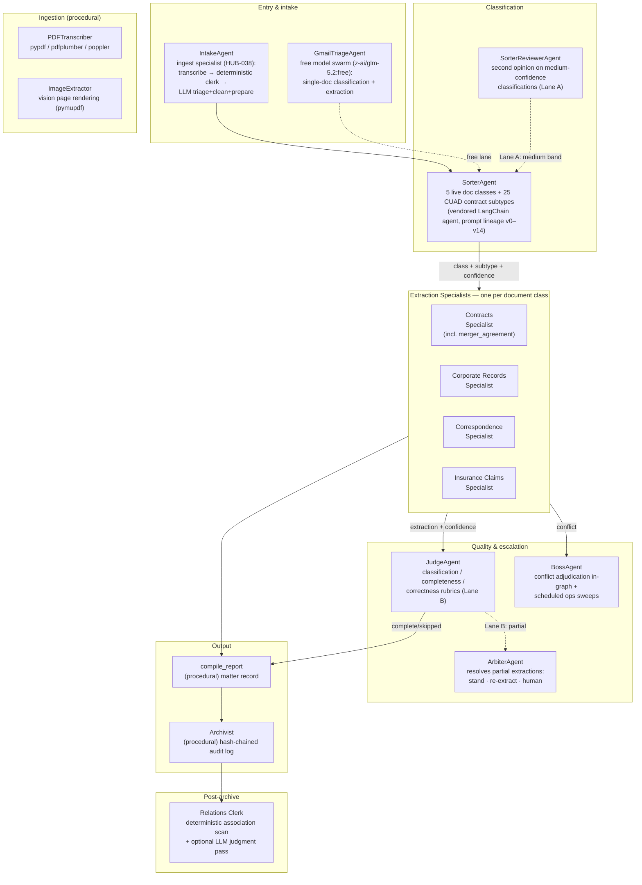

<div align="center">


# The LLM-Mailroom

**A multi-agent pipeline that ingests, classifies, extracts, and archives legal documents — with a full audit trail.**

One LangGraph state machine per document. Specialist LLM agents per document class.
Hash-chained audit log. Provider-agnostic LLM layer. Traced end-to-end.

[](https://www.python.org/)
[](https://langchain-ai.github.io/langgraph/)
[](#llm-providers)
[](#observability)
[](#quick-start)
[](https://github.com/LLM-Mailroom-Services/Digital-Mailroom/releases/tag/v0.6.0)
[](https://github.com/Exios66)

</div>

| At a glance | |
|---|---|
| **Release** | [`v0.6.0`](https://github.com/LLM-Mailroom-Services/Digital-Mailroom/releases/tag/v0.6.0) — see [CHANGELOG.md](CHANGELOG.md) |
| **Runtime** | Python 3.11+ · LangGraph state machine (13 nodes) · FastAPI |
| **Agents** | LLM + procedural agents across 6 document classes (happy path: classify + extract only) |
| **Storage** | SQLite-first (zero-config), Postgres optional · hash-chained audit log |
| **Observability** | Langfuse · Braintrust · Arize Phoenix — optional; the pipeline runs fine without any of them |
| **Docs** | Canonical under [`docs/`](docs/) · browsable locally via [docmd](https://github.com/docmd-io/docmd) |
| **License** | Not yet published — no LICENSE file in the repository yet |

---

This repository consists of:

- A **python library + pipeline** (`src/`) — a LangGraph state machine that moves each document through classification, specialist extraction, quality gates, reporting, and archival.
- **LLM + procedural agents across 6 document classes** — a sorter, five extraction specialists (contracts also covers MAUD `merger_agreement`), a judge/arbiter quality lane, a boss escalation agent, a **procedural** report assembler (no reporter LLM), and procedural PDF/image/archivist workers (see [Agent Organization](#agent-organization)). Happy-path archive uses **two** LLM generations (classify + extract).
- An **evaluation suite** — a 25-sample pilot with ground truth (including three synthetic `insurance_claim` letters), deterministic field scoring, LLM-as-a-judge evaluators, per-agent isolation eval, and a self-contained [LegalBench](https://github.com/HuggingFaceH4/legalbench) harness.
- **Canonical documentation** (`docs/`) — browsable locally with [docmd](https://github.com/docmd-io/docmd) (see [Browsing the Docs Locally](#browsing-the-docs-locally)).
- A **dataset browser notebook** (`notebooks/`) — docile-style thin notebook over a reusable tool module.
- A **Modal+vLLM deploy app** (`deploy/`) — optional local-model serving, flip-the-switch cutover.
- **Project Agent Skills** (`.cursor/skills/`) — Cursor-discoverable router + dedicated skills for every serving/tracing/data/scoring stack this repo uses (companion to the offline [local-mailroom-sandbox](https://github.com/Exios66/local-mailroom-sandbox) skills).

## Contents

- [Getting started](#getting-started) — [Quick Start](#quick-start) · [Installation](#installation)
- [Architecture](#architecture) — [Agent Organization](#agent-organization) · [Design Principles](#design-principles) · [Project Structure](#project-structure)
- [Operations](#operations) — [Configuration](#configuration) · [LLM Providers](#llm-providers) · [Prompt Management](#prompt-management) · [Observability](#observability) · [Evaluators & Quality](#evaluators--quality) · [Guardrails](#guardrails) · [Logging](#logging) · [Local Model Cutover](#local-model-cutover) · [API Endpoints](#api-endpoints) · [Pipeline Bins](#pipeline-bins)
- [Evaluation & ecosystem](#evaluation--ecosystem) — [Testing](#testing) · [Pilot Testing & Evaluation](#pilot-testing--evaluation) · [Full CUAD Corpus](#full-cuad-corpus-issue-9) · [Browsing the Docs Locally](#browsing-the-docs-locally) · [The Mailroom Umbrella](#the-mailroom-umbrella) · [Deployment](#deployment) · [Security](#security)

## Getting started

### Quick Start

> [!NOTE]
> **No database server needed.** Mailroom stores everything (catalog + audit log + crash-resume checkpoints) in a plain **SQLite file** inside your data folder. If you don't already use Docker, you can ignore it entirely.

```bash
# 1. Configure
cp .env.example .env
# Edit .env — add your OPENROUTER_API_KEY (and LANGFUSE_* keys for tracing)

# 2. Install
pip install -e ".[dev]"

# 3. (Optional) Start Langfuse for trace viewing — needs Docker
docker compose -f src/config/docker/docker-compose.yml up -d postgres clickhouse langfuse-server

# 4. (Optional) Sync the agent prompts into Langfuse prompt management
PYTHONPATH=src python src/scripts/sync_prompts.py

# 5. Start the API (embeds the inbox watcher — uploads drain without a second process)
PYTHONPATH=src python -m api.main

# 6. Upload a document
curl -X POST http://localhost:8000/upload \
  -F "file=@src/tests/fixtures/contract/sample_msa.txt" \
  -F "matter_id=MATTER-001"

# 7. Check pipeline status
curl http://localhost:8000/status/{doc_id}

# 8. View full audit trail
curl http://localhost:8000/audit/{doc_id}
```

When a document is processed, you'll get two files under `data/`:
- `data/mailroom.db` — the SQLite database (matters, documents, audit_log tables)
- `data/checkpoints.db` — optional on-disk LangGraph state (only when `MAILROOM_CHECKPOINTER=sqlite`; MemorySaver is the default)

### Installation

<a id="installing"></a>
Core install (pipeline + API + tests):

```bash
pip install -e ".[dev]"
```

Optional install profiles — take only what you need:

| Extra | Adds | Used by |
|---|---|---|
| `[embeddings]` | scipy, sentence-transformers | embedding-rescue second signal + Hungarian matcher in field scoring (degrades gracefully without) |
| `[postgres]` | psycopg | Postgres storage engine (SQLite is the default) |
| `[deploy]` | modal | the Modal+vLLM deploy app in `deploy/` (deploy-time only, never imported by the pipeline) |
| `[notebooks]` | ipywidgets, jupyterlab | interactive `notebooks/dataset_browser.ipynb` (plain-text mode works without) |

```bash
pip install -e ".[embeddings]"   # etc.
```

> **In the monorepo** ([`mailroom-dev`](https://github.com/Exios66/mailroom-dev)):
> this repo is `packages/llm-mailroom` via git subtree. Skip `pip install` —
> `uv sync` at the monorepo root installs every workspace member (this package
> editable) from one `uv.lock`. Release/deploy images still `pip install .`
> from this (or the subtree) directory, where the published pins in
> `pyproject.toml` keep their standalone meaning (see
> [`docs/sister-repos.md`](docs/sister-repos.md)).

---

## Architecture

One **LangGraph state machine run per document** — 13 nodes, MemorySaver-checkpointed by default (opt-in `SqliteSaver` for resume-across-restart experiments), crash-safe via manifest-driven re-invocation. Files move through filesystem bins (`inbox → processing → archive | review | failed`); every decision is a named node with a deterministic trace in the configured observability backend.

### LangGraph state machine

The core pipeline is a **13-node LangGraph state machine** executed once per document. Two auxiliary flows operate outside the graph: the **Gmail triage lane** (free model swarm for single-document emails) and the **relations clerk** (post-archive association scanning).



Thresholds (`confidence.low`, `confidence.high`, `retry_max`) are config in `config/taxonomy.yaml`, never hardcoded.

**Auxiliary flows (outside the 13-node graph):**
- **Gmail triage lane** (`agents/gmail_triage.py`): the free OpenRouter model (`z-ai/glm-5.2:free`) handles single-document Gmail uploads through classification + key extraction + auditable-hash archive without calling paid agents. Multi-document emails and documents exceeding the free budget route to the full pipeline.
- **Relations clerk** (`pipeline/relations.py`): post-archive deterministic association scanning (same-matter, keyword Jaccard, party overlap, embedding cosine) with an optional LLM judgment pass for ambiguous near-misses. Dispatched off the document path at every terminal manifest.

### Agent Organization

The agent roster as declared in `config/taxonomy.yaml` — every LLM agent resolves its provider/model/prompt through `get_llm(agent_name)`; nothing is hardcoded:



Document classes (5): `contract`, `corporate_record`, `correspondence`, `merger_agreement`, `insurance_claim` — each with its own extraction schema and specialist. Court opinions, due-diligence memos, and compliance filings classify as `unknown` (human review), not as a nearby class. `compliance_filing` was retired from the pipeline (zero Hub rows; `status: retired` in `taxonomy.yaml`). The two vendored agents (Sorter, Contracts Specialist) come from the sister repo [llm-entity-extraction](https://github.com/Exios66/llm-entity-extraction) with their full append-only prompt lineage; all other agents are mailroom-native `BaseAgent` subclasses with Langfuse-managed prompts.

## Design Principles

1. **Auditability over cleverness.** Every classification, extraction, and routing decision is traceable (Langfuse trace per document, hash-chained audit log per archive).
2. **Explicit over emergent.** Orchestration is a defined state machine — agents don't freely negotiate.
3. **Human-legible state.** Filesystem bins let anyone `ls` a folder and understand where a document is.
4. **Provider-agnostic LLM layer.** OpenRouter today, local models later — one config change.
5. **Redundant record-keeping.** Audit trail doesn't depend on any single tool staying alive.
6. **Config over code.** Taxonomy, thresholds, model mappings, retry tuning, and per-agent token caps all live in `config/taxonomy.yaml`.

## Project Structure

The repository root holds only the essentials — `src/` (all code), `data/`
(runtime state), `docs/` (documentation + reference material), plus the
tooling files. Everything else is nested:

```
mailroom/
├── src/             # ALL Python code
│   ├── agents/          # Specialist agents (Sorter, Contract, Corp Records, Judge, …)
│   ├── langchain_agents/# Vendored LangChain agents (Sorter, Contracts Specialist) from llm-entity-extraction
│   ├── graph/           # LangGraph state machine: nodes, routing, state
│   ├── llm/             # Provider-agnostic LLM client, retry, Langfuse-managed prompts
│   ├── schemas/         # Pydantic models: manifest, matter, documents, audit
│   ├── pipeline/        # Watcher, filesystem bins, ops monitor
│   ├── storage/         # SQLite/Postgres: catalog CRUD, audit log
│   ├── api/             # FastAPI: upload, review, status, audit
│   ├── observability/   # Langfuse tracing + task-spec scores + deterministic field scoring
│   ├── config/          # taxonomy.yaml — doc classes, thresholds, model mappings
│   │   └── docker/      # docker-compose: Langfuse, Ollama (Postgres optional)
│   ├── legalbench/      # LegalBench evaluation suite (binary QA + family classification)
│   ├── scripts/         # ops & eval: run_pilot, run_quality_judges, run_vision_sweep, sync_*, cutover, compare_runs, fetch_full_cuad, validate_pipeline
│   └── tests/           # pytest: unit, routing, e2e, judge, fixtures
├── notebooks/        # docile-style dataset browser (thin notebook + tool module)
├── deploy/           # Modal+vLLM serving app (optional local-model cutover)
├── data/             # runtime state: inbox/processing/archive bins, mailroom.db, cuad/ corpus, manifests/
└── docs/             # canonical user docs (agents, architecture, configuration, deployment, local-models)
    ├── assets/       # README banner + images
    ├── reports/      # evaluation write-ups: audits/, pilots/, evaluations/ (see docs/reports/README.md)
    ├── examples/     # sample documents + manifest ground truth (samples/, sources/, external/)
    └── wiki/         # GitHub-wiki-only pages, pushed to the GitHub wiki via docs/wiki/sync-wiki.sh (NOT a docs/ mirror)
```

All code runs with `src/` on the import path (`PYTHONPATH=src`), so intra-repo
imports keep their plain package names (`from pipeline import …`).

---

## Operations

### Configuration

All config lives in `config/taxonomy.yaml` — **never hardcoded**.

> [!IMPORTANT]
> `taxonomy.yaml` is cached at import time (`lru_cache` in `pipeline/config.py`, module-level cache in `pipeline/bins.py`) — **restart the watcher/API after editing it**; changes are not picked up live.

<details>
<summary>Config cookbook — doc classes, thresholds, retries, per-agent caps</summary>

```yaml
# Add a doc class:
doc_classes:
  - key: new_doc_type
    label: "New Document Type"
    schema: NewExtractionSchema
    specialist: new_specialist

# Adjust thresholds:
confidence:
  high: 0.97       # global fallback; per-class by_class overrides after type known
  low: 0.88        # below this → retry → still low → human review
  retry_max: 2     # max classify/extract retries before routing to review
  arbiter_retry_max: 2
  judge_max_passes: 3  # 1 + arbiter_retry_max

# Transient-failure LLM retries (connection errors, 429, 5xx):
llm_retry:
  max_attempts: 5
  base_delay: 1.0
  rate_limit_base_delay: 8.0
  max_delay: 60.0
  jitter: 0.3

# PDF transcription: skip the LLM reformat pass for text-based PDFs whose
# extraction yields at least this many chars/page (scanned PDFs still go to LLM):
pipeline:
  pdf_direct_chars_per_page: 800

# Per-agent model mapping + output token caps (caps runaway reasoning output):
agents:
  sorter:
    provider: openrouter
    model: qwen/qwen3.7-flash
    temperature: 0.1
    max_tokens: 2048
```

</details>

### LLM Providers

| Provider | Status | Auth | Base URL |
|---|---|---|---|
| **OpenRouter** | Primary | `OPENROUTER_API_KEY` | `https://openrouter.ai/api/v1` |
| **Ollama** | Local | None | `http://localhost:11434/v1` |
| **vLLM** | Local | None | `http://localhost:8000/v1` |
| **Generic** | Fallback | `GENERIC_API_KEY` | Configurable |

Global override: set `DEFAULT_PROVIDER=ollama` in `.env`.

All LLM calls go through `retry_chat_completion` (`llm/retry.py`): transient failures (`APIConnectionError`, timeouts, rate limits, 5xx) are retried with exponential backoff + jitter; 4xx client errors (e.g. malformed requests) are never retried.

### Prompt Management

Every agent's system prompt is a **Langfuse-managed prompt** (`mailroom-<agent_name>`, type `text`, `production` label) — versioned, editable without a deploy, and linked to every generation in the trace UI.

```bash
# Push the local prompt templates to Langfuse (idempotent: only new versions on change)
PYTHONPATH=src python src/scripts/sync_prompts.py
PYTHONPATH=src python src/scripts/sync_prompts.py --dry-run   # preview
PYTHONPATH=src python src/scripts/sync_prompts.py --agent sorter
```

The code ships the same templates as fallbacks (`llm/prompts.py`): if Langfuse is disabled or unreachable, the pipeline runs identically on the local defaults. The `json_object` response-format boilerplate stays hardcoded — some providers require the literal token `json` in the messages.

### Observability

- **Tracing** — every LLM call (prompt, response, tokens, latency) is auto-logged to **Langfuse** (cloud or self-hosted) or **Braintrust**, selected via `OBSERVABILITY_PROVIDER` in `.env`. One trace per document, one span per node, `session_id = matter_id` (or a run-scoped session for pilot runs), deterministic trace ids seeded from filenames. Optional — the pipeline runs fine with tracing disabled.
- **Scores** — every run emits self-evident scores (`parse_error`, `schema_valid`, `stage_completed`, `success_rate` first-pass STP, confidence values); pilot runs add ground-truth scores (`class_correct`, `stage_correct`, calibration error). Score configs are auto-created by `observability/scores.py` (`ensure_score_configs()`).
- **Run-log mirroring** — pull traces (with observations + scores) into the repo for offline analysis by subagents:

```bash
PYTHONPATH=src python src/scripts/sync_langfuse_logs.py                    # last 24h
PYTHONPATH=src python src/scripts/sync_langfuse_logs.py --since 7d --limit 100
PYTHONPATH=src python src/scripts/sync_langfuse_logs.py --trace-id <id>
# → data/langfuse_logs/<run>/<trace_id>.json + index.json
```

- **Audit log** — append-only, SHA-256 hash-chained entries in SQLite (tamper-evident)
- **Manifest sidecar** — JSON file archived alongside every document (self-contained record)

### Evaluators & Quality

Scoring is layered — cheap deterministic checks fire first, LLM judges only when needed. Every score lands on the Langfuse trace.

#### Band 1: Headline Metrics (per-document)

| Metric | What it measures | Source |
|---|---|---|
| `pipeline-result` verdict | **CORRECT** / **PARTIAL** / **MISS** — overall run quality | `mailroom-pipeline-judge` (LLM-as-a-judge) |
| `pipeline-quality` score | Proportional **0.0–1.0** quality score | `mailroom-pipeline-quality` (LLM-as-a-judge) |
| `classification_correct` | Sorter class matches ground truth (pilot runs) | Deterministic (binary) |
| `stage_correct` | Pipeline reached the expected stage (pilot runs) | Deterministic (binary) |

These are the scores you check first. The verdict is a three-way rubric; the quality score is independent and never overrides the verdict.

#### Band 2: Extraction Quality

| Metric | What it measures | Source |
|---|---|---|
| `completeness` / `completeness_label` | Specialist captured every stated field | Judge (in-pipeline Lane B) |
| `extraction_correctness` / `extraction_correctness_label` | Extracted values are factually accurate | Judge (offline) |
| `extraction_field_score` | Per-field deterministic score (field-type-aware) | `field_scoring.py` (zero API cost) |
| `extraction_overall_score` | Aggregate field score across all fields | `field_scoring.py` |
| `entity_list_precision` / `recall` | Bipartite-matched entity list accuracy | `field_scoring.py` (Hungarian) |

Field scoring fires before any LLM judge — cheap, reproducible, zero API cost. Each field type uses its own matcher (exact for dates/IDs/money, Jaro-Winkler for names, token F1 for free text, Hungarian for entity lists). Calibrated escalation bands determine whether a field needs LLM review or is definitively scored.

#### Band 3: Operational Metrics

| Metric | What it measures | Source |
|---|---|---|
| `stage_completed` | Pipeline reached archive (binary) | `scores.py` |
| `success_rate` | First-pass archive without retry/review | `scores.py` |
| `guardrail_triggered` | Extraction guard caught schema violations | `guards.py` |
| `classification_confidence` / `extraction_confidence` | Agent self-reported confidence | Sorter / specialist |
| `estimated_cost_usd` / `total_tokens` | Pipeline cost per document | Langfuse usage |

#### How scoring flows

1. **Deterministic field scoring** fires on every grounded extraction — no LLM call, instant.
2. **Classification + extraction guards** clamp bad output below routing thresholds.
3. **Lane B judge** (`judge_verify`) fires only on the ambiguous band (`low ≤ confidence < judge_band_high`) — most documents skip it.
4. **Pipeline-result generation** emits the `pipeline-result` output consumed by two independent Langfuse evaluators.
5. **Two live evaluators** score the trace independently: `mailroom-pipeline-judge` (verdict) and `mailroom-pipeline-quality` (numeric).

```bash
PYTHONPATH=src python src/scripts/sync_evaluators.py        # create/update evaluators + rules (idempotent)
PYTHONPATH=src python src/scripts/sync_evaluators.py --dry-run
PYTHONPATH=src python src/scripts/sync_evaluators.py --disable   # pause the rules
```

Pilot runs additionally receive deterministic ground-truth scores (`class_correct`, `stage_correct`, `expected_field_presence`) attached by `run_pilot.py --scores`.

### Guardrails

Agents are LLMs — they can return junk even when the provider call succeeds. `pipeline/guards.py` is the deterministic safety net between raw agent output and routing decisions:

- **Classification guard** — doc type must be in the taxonomy and confidence in `[0,1]`; unknown types still route to human review, out-of-range confidence is discarded.
- **Extraction guard** — every extraction is JSON-parsed and validated against its Pydantic schema; a parse failure or schema violation clamps confidence below the routing threshold, forcing retry → human review instead of trusting bad output.

Triggered guards are logged (`extraction_guardrail_triggered`), recorded on the state (`extraction_guardrail`), and scored (`guardrail_triggered`). On top of this, all LLM calls carry `max_tokens` caps and transient-failure retries.

### Logging

Structured logging via `pipeline/logging.py` (`setup_logging()`, called by every entrypoint): level from `LOG_LEVEL` (default `INFO`), renderer from `LOG_FORMAT` (`pretty` console or `json` for machine parsing). Noisy third-party loggers (httpx, openai, langfuse, opentelemetry) are silenced to WARNING.

### Local Model Cutover

```bash
# See current agent→model assignments
PYTHONPATH=src python src/scripts/cutover.py --list

# Move sorter to local (safest first step)
PYTHONPATH=src python src/scripts/cutover.py --agent sorter --provider ollama --model qwen3:7b

# Validate with tests
PYTHONPATH=src python src/scripts/cutover.py --validate --agent sorter

# View recommended cutover order
PYTHONPATH=src python src/scripts/cutover.py --recommend

# Cut all agents at once
PYTHONPATH=src python src/scripts/cutover.py --all --provider ollama --model qwen3:7b
```

#### Available Local Models (Ollama)

<details>
<summary>The curated Ollama shortlist — 11 models with sizes &amp; strengths</summary>

| Model | Sizes | Best For |
|---|---|---|
| Qwen 3 | 7b, 14b | Structured output, legal text extraction |
| Qwen 2.5 | 14b, 32b | Multilingual support |
| Llama 3.1 | 8b, 70b | General-purpose, reliable structured output |
| Llama 3.2 | 3b | Lightweight classification |
| Mistral | 7b | Fast instruction following |
| Mistral Nemo | 12b | Speed/quality balance |
| Mixtral | 8x7b | Strong extraction (MoE) |
| DeepSeek-R1 | 8b, 14b | Legal reasoning and analysis |
| Phi-4 | 14b | Document understanding |
| Gemma 2 | 9b, 27b | Instruction following |
| Command R | 35b, 104b | RAG and extraction |

</details>

### API Endpoints

Prefer the `/v1` prefix; unversioned routes remain during the deprecation window.

| Method | Path | Description |
|---|---|---|
| `GET` | `/v1/health` | Health check (watcher lamp + `producer` / `review_resolve` / `inbox_upload`) |
| `POST` | `/v1/upload` | Queue a document (The-Mailroom Inbox proxy; 202) |
| `GET` | `/v1/queue` | Current processing queue (inbox + in-flight documents) |
| `POST` | `/v1/review/{doc_id}/resolve` | Resolve human review (Approve / Reject / Record / Requeue / Complete) |
| `GET` | `/v1/status/{doc_id}` | Document pipeline status |
| `GET` | `/v1/matters/{matter_id}` | All documents in a matter |
| `GET` | `/v1/audit/{doc_id}` | Hash-chained audit trail + validity check |
| `GET` | `/v1/ops/status` | Pipeline-wide operational metrics |
| `POST` | `/v1/ops/sweep` | Run a one-off Boss ops-monitor sweep |
| `POST` | `/v1/ops/resume` | Clear the ingestion-pause flag |

All endpoints except `/health` and `/v1/health` require the `MAILROOM_API_TOKEN` bearer token when one is configured (see [Security](#security)).

### Pipeline Bins

<a id="pipeline-bins"></a>

```
data/
  pipeline/
    inbox/               # New uploads land here
    processing/<id>/     # Claimed by worker (atomic rename)
    classified/<type>/   # Sorted, pending specialist
    review/              # Human review required
    failed/              # Unrecoverable errors
  archive/
    <matter_id>/<type>/  # Final durable home
  manifests/
    <doc_id>.json        # Mirror of DocumentManifest
  mailroom.db            # SQLite: matters, documents, audit_log
  checkpoints.db         # LangGraph crash-resume state
  langfuse_logs/         # Mirrored run logs (scripts/sync_langfuse_logs.py)
```

---

## Evaluation & ecosystem

### Testing

```bash
# Run all tests
pytest src/tests/ -v

# Run specific test suites
pytest src/tests/test_agents/ -v
pytest src/tests/test_routing.py -v
pytest src/tests/test_audit_log.py -v
pytest src/tests/test_pipeline_e2e.py -v

# With coverage
pytest src/tests/ --cov=src --cov-report=html
```

Tests never hit a real LLM — the OpenAI client and `BaseAgent.__init__` are mocked (see `src/tests/conftest.py`).

### Pilot Testing & Evaluation

A ready-made set of **25 pilot samples** lives in `docs/examples/samples/` (real SEC-exhibit contracts from the CC-BY-4.0 [CUAD](https://huggingface.co/datasets/theatticusproject/cuad) dataset, LegalBench MAUD merger agreements, public-domain Pile of Law court opinions, plus original text for the other doc classes — see `docs/examples/README.md`). Use them to pilot the pipeline and **measure the effect of procedural changes** on accuracy, efficiency, and quality:

```bash
# Build the sample PDFs into data/samples/ (gitignored)
PYTHONPATH=src python src/scripts/prepare_samples.py

# Deterministic run (fake LLM, no API key) — tests the machinery
PYTHONPATH=src python src/scripts/run_pilot.py --mock

# Real run (needs OPENROUTER_API_KEY in .env) — measures LLM accuracy too
PYTHONPATH=src python src/scripts/run_pilot.py --real --scores

# Diff two runs, e.g. after a routing/threshold change
PYTHONPATH=src python src/scripts/run_pilot.py --mock --baseline data/pilot_report.json

# LLM-as-a-judge over the run: classification, completeness, correctness
PYTHONPATH=src python src/scripts/run_quality_judges.py --real
```

The report records per-document stage, doc type, confidence, retries, LLM call count, wall time, and extracted data, and scores each against the ground truth in `docs/examples/samples/manifest.csv`. See `docs/examples/samples/README.md`.

### Full CUAD Corpus (issue #9)

The **complete CUAD v1 dataset** (510 annotated contracts, 20,910 clause annotations, PDFs + plain text + master clause taxonomy) can be downloaded and validated against the pipeline's 25-family contract-subtype taxonomy:

```bash
# Download everything into data/cuad/ + write the EDA (idempotent, resumes)
PYTHONPATH=src python src/scripts/fetch_full_cuad.py
PYTHONPATH=src python src/scripts/fetch_full_cuad.py --skip-download   # EDA only over existing data
```

The EDA (`data/cuad/EDA.md`) maps each contract to a `contract_subtype` — folder-authoritative from the CUAD PDF tree where available (198 contracts, all 20 folders resolve through the sorter's alias table) and title-derived elsewhere — and compares the resulting distribution against the CUAD paper's canonical 25-type counts. See `docs/reports/audits/` for the subclass-validation write-up.

### Browsing the Docs Locally

The canonical documentation under [`docs/`](docs/) is browsable as a local static site via [docmd](https://github.com/docmd-io/docmd) — zero config, no install beyond Node.js 20+:

```bash
# Live-reload dev server with sidebar nav + full-text search (http://localhost:3000)
npx @docmd/core dev

# One-shot static build → site/ (gitignored; open site/index.html or host anywhere)
npx @docmd/core build
```

The build auto-detects `docs/`, generates navigation from the file tree, and emits an offline search index, `llms.txt` / `llms-full.txt` context files for AI agents, and an OKF knowledge bundle. Mermaid diagrams render offline. No `docmd.config.json` is required; run `npx @docmd/core init` if you want to customize themes or add plugins later.

### The Mailroom Umbrella

Mailroom is the pipeline at the center of a small constellation of governed repositories — full map in [`docs/sister-repos.md`](docs/sister-repos.md):

| Repository | Role | Relationship |
|---|---|---|
| [mailroom-dev](https://github.com/Exios66/mailroom-dev) | **Monorepo** — one uv workspace holding every constellation repo as a git-subtree package (`packages/llm-mailroom` ⇄ this repo), with the sub-package sync driver + `governance/TASKS.md` cross-repo task board | **Development home** — the monorepo is the source of truth for active development (HUB-001/002); standalone-repo work ships through `scripts/sync_packages.py` (`pull`/`push`) |
| [llm-entity-extraction](https://github.com/Exios66/llm-entity-extraction) | Prompt-experiment loop (prompt versions × models over CUAD/LegalBench/MAUD) | **Sister repo** — source of the vendored sorter/contracts prompts; shares ONE kanban board with this repo |
| [llm-dojo-scoring](https://github.com/Exios66/llm-dojo-scoring) | Deterministic field-type-aware scoring engine | **Upstream dependency**, pinned `@v0.12.2` in `pyproject.toml` |
| [Enron-Evaluation-Environment](https://github.com/Exios66/Enron-Evaluation-Environment) | EDA + correspondence dataset from the CMU Enron corpus | **Corpus feed** for the `correspondence` doc class |
| [claims-data-eda](https://github.com/Exios66/claims-data-eda) | Insurance-claims candidate-corpus EDA (CMS DE-SynPUF) | **Corpus feed (candidate)** for `insurance_claim` |
| [atticus-investigation](https://github.com/Exios66/atticus-investigation) | LegalBench classification prompt-engineering pipeline | **Eval sibling** — same methodology |
| [The-Mailroom](https://github.com/Exios66/The-Mailroom) | Pixel-art visual engine + hosted Observatory Space — Langfuse floor, Inbox enqueue, REVIEW resolve (web + TUI) | **Downstream visualizer** — Langfuse-only display; proxies Inbox / REVIEW to this API (`MAILROOM_PIPELINE_URL`) |
| [llm-mailroom-graph](https://exios66.github.io/llm-mailroom-graph/) | Interactive knowledge graph of this codebase | **Derived site** (graphify build artifact) |
| [llm-entity-extraction-graph](https://exios66.github.io/llm-entity-extraction-graph/) | Knowledge graph of the sister loop | **Derived site** |
| [Lucius-Morningstar](https://huggingface.co/Lucius-Morningstar) (HF) | Published eval/corpus dataset family | **Dataset surface** |

**Developing in the monorepo:** cross-repository work happens in
[`mailroom-dev`](https://github.com/Exios66/mailroom-dev) — one `uv sync`
in its root installs every family member (`packages/llm-mailroom` included,
editable) against a single shared `uv.lock`. Branch/subtree discipline,
sync commands, and the monorepo task board (`governance/TASKS.md`) are
documented in `docs/sister-repos.md` § mailroom-dev. This repo remains the
standalone mirror + deploy source (Docker/Railway/HF Space build from here
or from the subtree copy — both are the same tree).

### Deployment

<details>
<summary>Full bring-up runbook — Langfuse stack, prompts sync, watcher, API, ops monitor, log mirroring</summary>

```bash
# 1. (Optional) Start Langfuse for trace viewing
docker compose -f src/config/docker/docker-compose.yml up -d postgres clickhouse langfuse-server

# 2. Set environment
export OPENROUTER_API_KEY=sk-or-v1-...
# MAILROOM_BASE_DIR defaults to ./data; mailroom.db + checkpoints.db are created there automatically

# 3. Sync prompts into Langfuse (once, and after prompt edits)
PYTHONPATH=src python src/scripts/sync_prompts.py

# 4. Run the API (embeds the inbox watcher)
PYTHONPATH=src python -m api.main &

# 5. (Optional) dedicated watcher only if MAILROOM_EMBED_WATCHER=0
# PYTHONPATH=src python -m pipeline.watcher &

# 6. (Optional) Gmail intake channel — the agent mailbox as a second intake
#    route (opt-in via .env: MAILROOM_GMAIL_ENABLED=1 + GMAIL_ADDRESS +
#    GMAIL_APP_PASSWORD). When enabled it runs INSIDE the watcher; standalone:
# PYTHONPATH=src python -m pipeline.gmail_intake &
#    Email format: just attach the document (.pdf/.txt/.docx/.md/.jpg/.png);
#    optionally put [M:<matter_id>] in the subject to route the matter. No
#    subject keyword is required. Full guide (upload best practices, subject-
#    line contract, single-doc free-triage vs multi-doc full-pipeline
#    pathways, echoes, troubleshooting): docs/gmail-intake.md

# 7. (Optional) Run the ops monitor
PYTHONPATH=src python -m pipeline.ops_monitor &

# 8. (Optional) Mirror run logs for analysis
PYTHONPATH=src python src/scripts/sync_langfuse_logs.py --since 24h
```

</details>

The-Mailroom Observatory ([PR #30](https://github.com/Exios66/The-Mailroom/pull/30)) needs this API reachable as `MAILROOM_PIPELINE_URL` + `MAILROOM_PIPELINE_TOKEN` + `MAILROOM_PIPELINE_API_PREFIX=/v1` (Inbox **Queue a document** → `POST /v1/upload`; REVIEW → `POST /v1/review/{doc_id}/resolve`). Local: `docker compose -f deploy/docker-compose.producer.yml --env-file .env up -d --build`. Hosted pair (producer Space + Observatory floor): [`deploy/space/PAIRING.md`](deploy/space/PAIRING.md). Live Observatory: [`Lucius-Morningstar/mailroom-observatory`](https://huggingface.co/spaces/Lucius-Morningstar/mailroom-observatory). A Space floor cannot use `127.0.0.1`.

For fully local/offline serving, see [`deploy/`](deploy/README.md) (Modal+vLLM) and [Local Model Cutover](#local-model-cutover).

### Security

- Encrypt `/archive` at rest and the SQLite files (`mailroom.db`, `checkpoints.db`) at rest
- Access-control the FastAPI endpoints and the Langfuse UI
- Back up `/archive` and the audit log table independently
- Treat retention policy as an open decision — not assumed by this system

## Further Documentation

- [Architecture](docs/architecture.md) — full architectural details
- [Configuration](docs/configuration.md) — config reference
- [Agents](docs/agents.md) — agent specifications and personalities
- [API Reference](docs/api.md) — complete API documentation
- [Deployment](docs/deployment.md) — deployment and operations
- [Testing](docs/testing.md) — testing strategy and fixtures
- [Local Models](docs/local-models.md) — local model cutover guide
- [Sister Repositories](docs/sister-repos.md) — the llm-mailroom umbrella: entity-extraction, llm-dojo-scoring, corpus feeds, derived sites
- [Visualizer pairing](deploy/space/PAIRING.md) — Observatory Space + this producer (`MAILROOM_PIPELINE_URL` / token / `/v1`)
- [Reports](docs/reports/README.md) — audit/pilot/evaluation write-ups (created via `scripts/new_report.py`)
- [Wiki](https://github.com/Exios66/llm-mailroom/wiki) — GitHub wiki (synced from `docs/wiki/` via `docs/wiki/sync-wiki.sh`)
