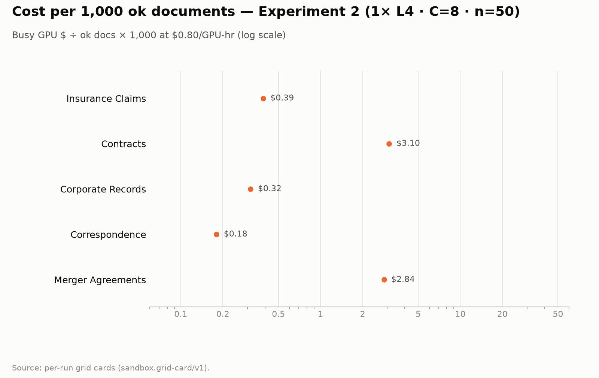
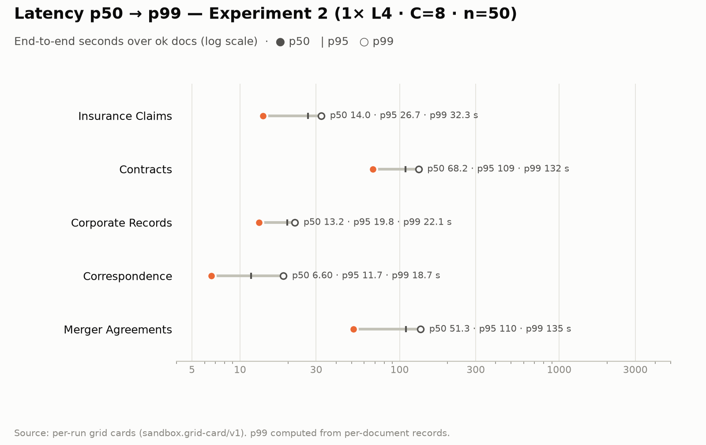

# 1× L4 · C8 score & cost card (Experiments 1–2)

**Cells reported:** 10 of 10 · **Runbook:** `grid-1l4` · **Model:** Qwen/Qwen3-8B-AWQ · L4 @ $0.80/GPU-hr

## Shared conditions

| Condition | Value |
| --- | --- |
| Engine | awq_marlin · fp8 KV · CUDA graphs [1, 2, 4, 8, 16] · prefix caching on · thinking off |
| Admission | max_model_len 32768 · max_num_seqs 16 per replica · max_inputs 32 |
| Fleet | 1 replica(s) · client concurrency 8 |
| Dataset | Lucius-Morningstar/mailroom-dataset ground_truth @ ed7576b6, split=all, seed 42, one class bucket (n=20 nested in n=50) |
| Output cap | max_tokens 8,192 |
| Temperature | 0.7 contracts and merger (JSON-schema grammar); 0.1 elsewhere (vendored call site) |

## Pooled totals

| Metric | n = 20 | n = 50 | All cells |
| --- | ---: | ---: | ---: |
| Cells reported | 5 | 5 | 10 |
| Documents ok / total | 97 / 100 | 243 / 250 | 340 / 350 |
| Error rate | 3.0% | 2.8% | 2.9% |
| Wall (Σ busy) | 686.6 s | 1,442.7 s | 2,129.3 s |
| Busy-window GPU $ | $0.1526 | $0.3206 | $0.4732 |
| Cost per document (pooled) | $0.001526 | $0.001282 | $0.001352 |
| Cost per 1M tokens (pooled) | $0.2737 | $0.2217 | $0.2362 |
| Tokens | 557,581 | 1,445,996 | 2,003,577 |
| Tokens / second (pooled) | 812.0 | 1,002.3 | 940.9 |
| Tokens / second per L4 | 812.0 | 1,002.3 | 940.9 |
| Documents / minute (pooled) | 8.74 | 10.40 | 9.86 |

## Figures

## Per specialist · n = 20

| Metric | Correspondence | Insurance Claims | Corporate Records | Contracts | Merger Agreements |
| --- | ---: | ---: | ---: | ---: | ---: |
| **Status** | | | | | |
| Run ID | `grid-20-correspondence-specialist-awq-1l4` | `grid-20-insurance-claims-specialist-awq-1l4` | `grid-20-corporate-records-specialist-awq-1l4` | `grid-20-contracts-specialist-awq-1l4` | `grid-20-merger-specialist-awq-1l4-rerun` |
| Documents ok / total | 20 / 20 | 20 / 20 | 20 / 20 | 19 / 20 | 18 / 20 |
| Errors | 0 | 0 | 0 | LengthFinishReasonError 1 | LengthFinishReasonError 2 |
| **Time** | | | | | |
| Wall (busy) | 10.1 s | 37.8 s | 23.4 s | 299.3 s | 316.1 s |
| **Cost** | | | | | |
| Busy-window GPU $ | $0.0022 | $0.0084 | $0.0052 | $0.0665 | $0.0703 |
| Cost per document | $0.000112 | $0.000420 | $0.000260 | $0.003326 | $0.003513 |
| Cost per 1M tokens | $0.0442 | $0.1225 | $0.0515 | $0.4289 | $0.3846 |
| **Tokens** | | | | | |
| Total tokens | 50,542 | 68,536 | 100,791 | 155,054 | 182,658 |
| Completion share | 5.4% | 11.3% | 3.6% | 20.6% | 8.5% |
| Completion max (ok docs) | 296 | 968 | 247 | 4,860 | 1,661 |
| **Throughput** | | | | | |
| Tokens / second | 5,028.6 | 1,813.5 | 4,314.9 | 518.1 | 577.8 |
| Tokens / second per L4 | 5,028.6 | 1,813.5 | 4,314.9 | 518.1 | 577.8 |
| Documents / minute | 119.39 | 31.75 | 51.37 | 4.01 | 3.80 |
| **Latency** | | | | | |
| p50 / p95 | 5.8 / 7.9 s | 13.2 / 19.0 s | 14.4 / 20.5 s | 65.8 / 104.9 s | 50.5 / 66.1 s |
| Max | 12.2 s | 24.8 s | 20.7 s | 187.8 s | 113.3 s |
| **Engine** | | | | | |
| Slot occupancy | 140.1% | 88.9% | 152.3% | 63.4% | 61.4% |
| Mean TTFT per replica | 0.96 | 1.06 | 1.84 | 3.14 | 4.89 |
| Prefix-cache hit per replica | 67% | 61% | 47% | 43% | 31% |
| Length-capped finishes | 0 | 0 | 0 | 1 | 2 |
| **Quality** | | | | | |
| Overall extraction score | 0.3268 | 0.6836 | 0.4592 | 0.6307 | 0.0129 |
| Clause score | — | — | — | CUAD F1 0.597 | MAUD acc 1.4% |
| Schema-valid rate | 1.00 | 0.30 | 0.95 | 1.00 | 1.00 |

## Per specialist · n = 50

| Metric | Correspondence | Insurance Claims | Corporate Records | Contracts | Merger Agreements |
| --- | ---: | ---: | ---: | ---: | ---: |
| **Status** | | | | | |
| Run ID | `grid-50-correspondence-specialist-awq-1l4` | `grid-50-insurance-claims-specialist-awq-1l4` | `grid-50-corporate-records-specialist-awq-1l4` | `grid-50-contracts-specialist-awq-1l4` | `grid-50-merger-specialist-awq-1l4` |
| Documents ok / total | 50 / 50 | 50 / 50 | 50 / 50 | 47 / 50 | 46 / 50 |
| Errors | 0 | 0 | 0 | LengthFinishReasonError 3 | LengthFinishReasonError 4 |
| **Time** | | | | | |
| Wall (busy) | 40.6 s | 87.4 s | 71.2 s | 655.2 s | 588.4 s |
| **Cost** | | | | | |
| Busy-window GPU $ | $0.0090 | $0.0194 | $0.0158 | $0.1456 | $0.1308 |
| Cost per document | $0.000180 | $0.000389 | $0.000316 | $0.002912 | $0.002615 |
| Cost per 1M tokens | $0.0631 | $0.1065 | $0.0683 | $0.3493 | $0.2768 |
| **Tokens** | | | | | |
| Total tokens | 142,881 | 182,401 | 231,520 | 416,807 | 472,387 |
| Completion share | 5.7% | 10.9% | 3.6% | 17.8% | 9.3% |
| Completion max (ok docs) | 463 | 956 | 247 | 3,391 | 2,535 |
| **Throughput** | | | | | |
| Tokens / second | 3,522.8 | 2,086.6 | 3,253.9 | 636.2 | 802.8 |
| Tokens / second per L4 | 3,522.8 | 2,086.6 | 3,253.9 | 636.2 | 802.8 |
| Documents / minute | 73.97 | 34.32 | 42.16 | 4.58 | 5.10 |
| **Latency** | | | | | |
| p50 / p95 | 6.6 / 11.7 s | 14.0 / 26.7 s | 13.2 / 19.8 s | 68.2 / 108.9 s | 51.3 / 109.7 s |
| Max | 19.8 s | 36.7 s | 22.3 s | 134.2 s | 146.1 s |
| **Engine** | | | | | |
| Slot occupancy | 112.2% | 108.1% | 115.2% | 81.5% | 90.9% |
| Mean TTFT per replica | 0.81 | 1.00 | 1.42 | 1.78 | 2.35 |
| Prefix-cache hit per replica | 61% | 58% | 48% | 44% | 37% |
| Length-capped finishes | 0 | 0 | 0 | 3 | 4 |
| **Quality** | | | | | |
| Overall extraction score | 0.3446 | 0.6838 | 0.4492 | 0.6020 | 0.0480 |
| Clause score | — | — | — | CUAD F1 0.590 | MAUD acc 4.8% |
| Schema-valid rate | 1.00 | 0.20 | 0.94 | 1.00 | 1.00 |

## Per-run cards

| Specialist | n | Run ID | Card |
| --- | ---: | --- | --- |
| Correspondence | 20 | `grid-20-correspondence-specialist-awq-1l4` | [grid-20-correspondence-specialist-awq-1l4.card.md](correspondence/grid-20-correspondence-specialist-awq-1l4.card.md) |
| Insurance Claims | 20 | `grid-20-insurance-claims-specialist-awq-1l4` | [grid-20-insurance-claims-specialist-awq-1l4.card.md](insurance_claims/grid-20-insurance-claims-specialist-awq-1l4.card.md) |
| Corporate Records | 20 | `grid-20-corporate-records-specialist-awq-1l4` | [grid-20-corporate-records-specialist-awq-1l4.card.md](corporate_records/grid-20-corporate-records-specialist-awq-1l4.card.md) |
| Contracts | 20 | `grid-20-contracts-specialist-awq-1l4` | [grid-20-contracts-specialist-awq-1l4.card.md](contracts/grid-20-contracts-specialist-awq-1l4.card.md) |
| Merger Agreements | 20 | `grid-20-merger-specialist-awq-1l4-rerun` | [grid-20-merger-specialist-awq-1l4-rerun.card.md](merger_agreement/grid-20-merger-specialist-awq-1l4-rerun.card.md) |
| Correspondence | 50 | `grid-50-correspondence-specialist-awq-1l4` | [grid-50-correspondence-specialist-awq-1l4.card.md](correspondence/grid-50-correspondence-specialist-awq-1l4.card.md) |
| Insurance Claims | 50 | `grid-50-insurance-claims-specialist-awq-1l4` | [grid-50-insurance-claims-specialist-awq-1l4.card.md](insurance_claims/grid-50-insurance-claims-specialist-awq-1l4.card.md) |
| Corporate Records | 50 | `grid-50-corporate-records-specialist-awq-1l4` | [grid-50-corporate-records-specialist-awq-1l4.card.md](corporate_records/grid-50-corporate-records-specialist-awq-1l4.card.md) |
| Contracts | 50 | `grid-50-contracts-specialist-awq-1l4` | [grid-50-contracts-specialist-awq-1l4.card.md](contracts/grid-50-contracts-specialist-awq-1l4.card.md) |
| Merger Agreements | 50 | `grid-50-merger-specialist-awq-1l4` | [grid-50-merger-specialist-awq-1l4.card.md](merger_agreement/grid-50-merger-specialist-awq-1l4.card.md) |

_Generated 2026-10-01T19:05:09+00:00 by `sandbox run card --runbook grid-1l4` from the committed per-run `*.card.json`._
