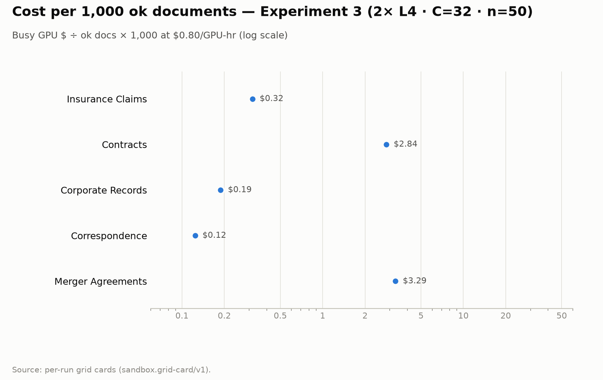
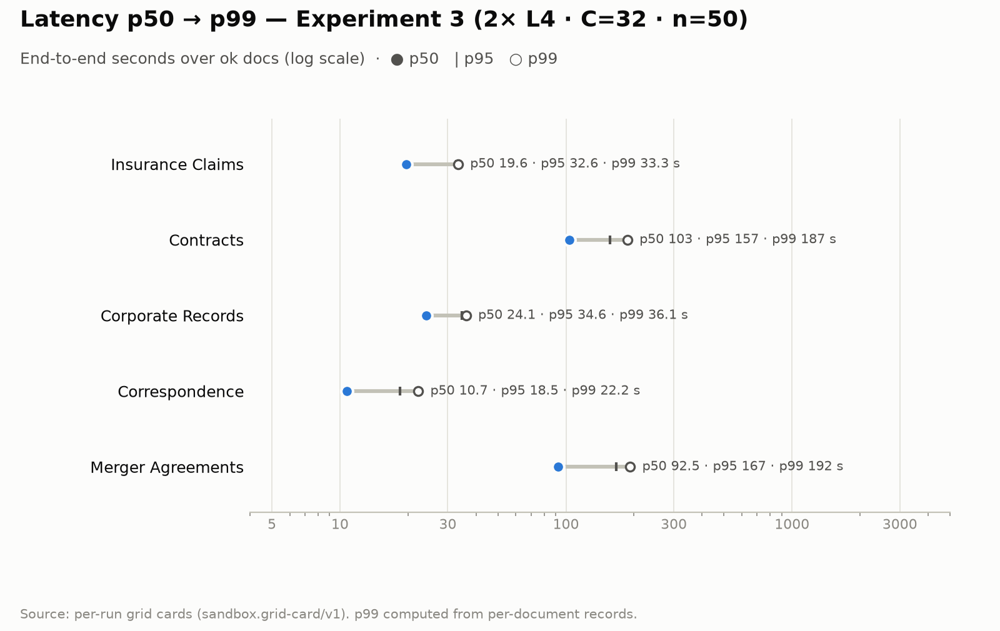
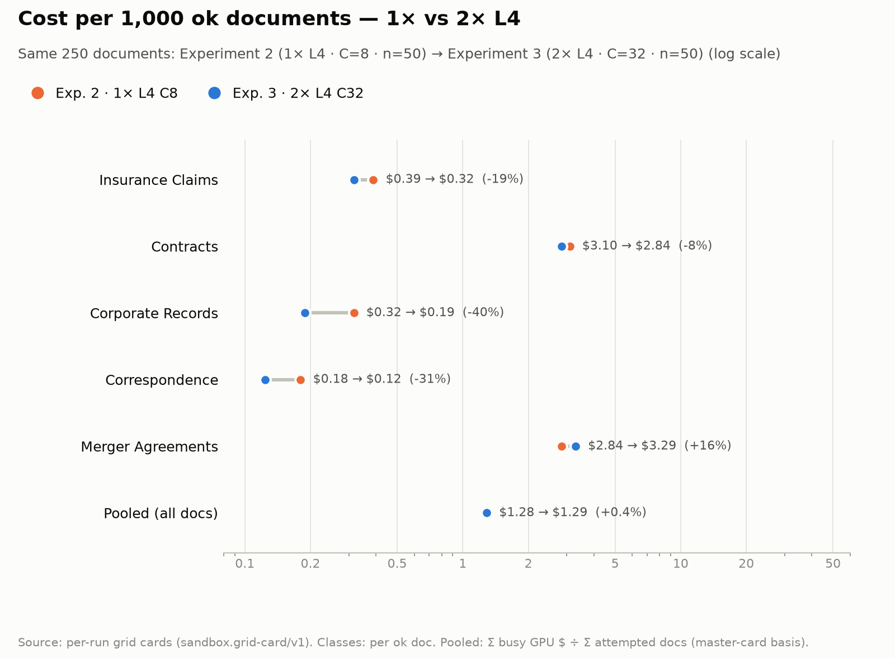
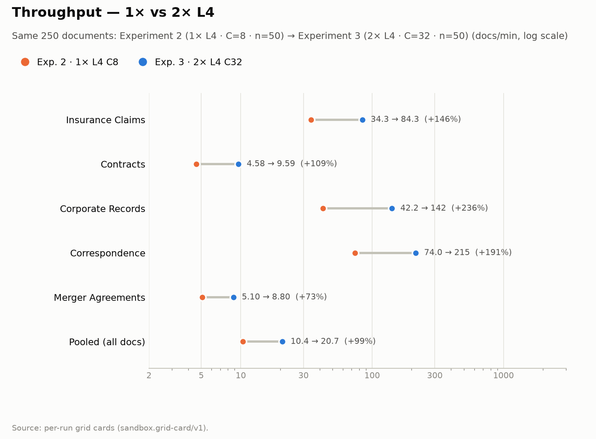

# 2× L4 · C32 score & cost card (Experiment 3)

**Cells reported:** 5 of 10 · **Runbook:** `grid-2l4` · **Model:** Qwen/Qwen3-8B-AWQ · L4 @ $0.80/GPU-hr

## Shared conditions

| Condition | Value |
| --- | --- |
| Engine | awq_marlin · fp8 KV · CUDA graphs [1, 2, 4, 8, 16] · prefix caching on · thinking off |
| Admission | max_model_len 32768 · max_num_seqs 16 per replica · max_inputs 32 |
| Fleet | 2 replica(s) · client concurrency 32 |
| Dataset | Lucius-Morningstar/mailroom-dataset ground_truth @ ed7576b6, split=all, seed 42, one class bucket (n=20 nested in n=50) |
| Output cap | max_tokens 8,192 |
| Temperature | 0.7 contracts and merger (JSON-schema grammar); 0.1 elsewhere (vendored call site) |

## Pooled totals

| Metric | n = 20 | n = 50 | All cells |
| --- | ---: | ---: | ---: |
| Cells reported | 0 | 5 | 5 |
| Documents ok / total | 0 / 0 | 245 / 250 | 245 / 250 |
| Error rate | not captured | 2.0% | 2.0% |
| Wall (Σ busy) | not captured | 724.3 s | 724.3 s |
| Busy-window GPU $ | not captured | $0.3219 | $0.3219 |
| Cost per document (pooled) | not captured | $0.001288 | $0.001288 |
| Cost per 1M tokens (pooled) | not captured | $0.2193 | $0.2193 |
| Tokens | 0 | 1,467,839 | 1,467,839 |
| Tokens / second (pooled) | not captured | 2,026.4 | 2,026.4 |
| Tokens / second per L4 | not captured | 1,013.2 | 1,013.2 |
| Documents / minute (pooled) | not captured | 20.71 | 20.71 |

## Figures

## Per specialist · n = 20

| Metric | Correspondence | Insurance Claims | Corporate Records | Contracts | Merger Agreements |
| --- | ---: | ---: | ---: | ---: | ---: |
| **Status** | | | | | |
| Run ID | not run | not run | not run | not run | not run |
| Documents ok / total | not run | not run | not run | not run | not run |
| Errors | not run | not run | not run | not run | not run |
| **Time** | | | | | |
| Wall (busy) | not run | not run | not run | not run | not run |
| **Cost** | | | | | |
| Busy-window GPU $ | not run | not run | not run | not run | not run |
| Cost per document | not run | not run | not run | not run | not run |
| Cost per 1M tokens | not run | not run | not run | not run | not run |
| **Tokens** | | | | | |
| Total tokens | not run | not run | not run | not run | not run |
| Completion share | not run | not run | not run | not run | not run |
| Completion max (ok docs) | not run | not run | not run | not run | not run |
| **Throughput** | | | | | |
| Tokens / second | not run | not run | not run | not run | not run |
| Tokens / second per L4 | not run | not run | not run | not run | not run |
| Documents / minute | not run | not run | not run | not run | not run |
| **Latency** | | | | | |
| p50 / p95 | not run | not run | not run | not run | not run |
| Max | not run | not run | not run | not run | not run |
| **Engine** | | | | | |
| Slot occupancy | not run | not run | not run | not run | not run |
| Mean TTFT per replica | not run | not run | not run | not run | not run |
| Prefix-cache hit per replica | not run | not run | not run | not run | not run |
| Length-capped finishes | not run | not run | not run | not run | not run |
| **Quality** | | | | | |
| Overall extraction score | not run | not run | not run | not run | not run |
| Clause score | not run | not run | not run | not run | not run |
| Schema-valid rate | not run | not run | not run | not run | not run |

## Per specialist · n = 50

| Metric | Correspondence | Insurance Claims | Corporate Records | Contracts | Merger Agreements |
| --- | ---: | ---: | ---: | ---: | ---: |
| **Status** | | | | | |
| Run ID | `grid-50-correspondence-specialist-awq-2l4` | `grid-50-insurance-claims-specialist-awq-2l4` | `grid-50-corporate-records-specialist-awq-2l4` | `grid-50-contracts-specialist-awq-2l4-rerun` | `grid-50-merger-specialist-awq-2l4` |
| Documents ok / total | 50 / 50 | 50 / 50 | 50 / 50 | 49 / 50 | 46 / 50 |
| Errors | 0 | 0 | 0 | LengthFinishReasonError 1 | LengthFinishReasonError 4 |
| **Time** | | | | | |
| Wall (busy) | 14.0 s | 35.6 s | 21.2 s | 312.8 s | 340.8 s |
| **Cost** | | | | | |
| Busy-window GPU $ | $0.0062 | $0.0158 | $0.0094 | $0.1390 | $0.1515 |
| Cost per document | $0.000124 | $0.000316 | $0.000188 | $0.002780 | $0.003030 |
| Cost per 1M tokens | $0.0434 | $0.0867 | $0.0406 | $0.3181 | $0.3196 |
| **Tokens** | | | | | |
| Total tokens | 142,903 | 182,539 | 231,514 | 436,946 | 473,937 |
| Completion share | 5.7% | 11.0% | 3.6% | 17.5% | 9.3% |
| Completion max (ok docs) | 443 | 956 | 247 | 2,915 | 2,852 |
| **Throughput** | | | | | |
| Tokens / second | 10,239.5 | 5,127.5 | 10,934.4 | 1,397.0 | 1,390.5 |
| Tokens / second per L4 | 5,119.8 | 2,563.8 | 5,467.2 | 698.5 | 695.2 |
| Documents / minute | 214.96 | 84.27 | 141.69 | 9.59 | 8.80 |
| **Latency** | | | | | |
| p50 / p95 | 10.7 / 18.5 s | 19.6 / 32.6 s | 24.1 / 34.6 s | 103.3 / 156.6 s | 92.5 / 167.2 s |
| Max | 22.3 s | 33.4 s | 36.5 s | 213.6 s | 211.6 s |
| **Engine** | | | | | |
| Slot occupancy | 124.7% | 91.9% | 165.6% | 53.5% | 53.6% |
| Mean TTFT per replica | 2.32 / 2.96 | 2.41 / 3.61 | 3.68 / 4.20 | 8.76 / 4.79 | 9.74 / 9.07 |
| Prefix-cache hit per replica | 57% / 63% | 55% / 58% | 46% / 49% | 42% / 45% | 36% / 37% |
| Length-capped finishes | 0 / 0 | 0 / 0 | 0 / 0 | 0 / 1 | 1 / 3 |
| **Quality** | | | | | |
| Overall extraction score | 0.3340 | 0.6859 | 0.4520 | 0.6146 | 0.0351 |
| Clause score | — | — | — | CUAD F1 0.605 | MAUD acc 3.5% |
| Schema-valid rate | 1.00 | 0.24 | 0.94 | 1.00 | 1.00 |

## Per-run cards

| Specialist | n | Run ID | Card |
| --- | ---: | --- | --- |
| Correspondence | 20 | `grid-20-correspondence-specialist-awq-2l4` | not run |
| Insurance Claims | 20 | `grid-20-insurance-claims-specialist-awq-2l4` | not run |
| Corporate Records | 20 | `grid-20-corporate-records-specialist-awq-2l4` | not run |
| Contracts | 20 | `grid-20-contracts-specialist-awq-2l4` | not run |
| Merger Agreements | 20 | `grid-20-merger-specialist-awq-2l4` | not run |
| Correspondence | 50 | `grid-50-correspondence-specialist-awq-2l4` | [grid-50-correspondence-specialist-awq-2l4.card.md](correspondence/grid-50-correspondence-specialist-awq-2l4.card.md) |
| Insurance Claims | 50 | `grid-50-insurance-claims-specialist-awq-2l4` | [grid-50-insurance-claims-specialist-awq-2l4.card.md](insurance_claims/grid-50-insurance-claims-specialist-awq-2l4.card.md) |
| Corporate Records | 50 | `grid-50-corporate-records-specialist-awq-2l4` | [grid-50-corporate-records-specialist-awq-2l4.card.md](corporate_records/grid-50-corporate-records-specialist-awq-2l4.card.md) |
| Contracts | 50 | `grid-50-contracts-specialist-awq-2l4-rerun` | [grid-50-contracts-specialist-awq-2l4-rerun.card.md](contracts/grid-50-contracts-specialist-awq-2l4-rerun.card.md) |
| Merger Agreements | 50 | `grid-50-merger-specialist-awq-2l4` | [grid-50-merger-specialist-awq-2l4.card.md](merger_agreement/grid-50-merger-specialist-awq-2l4.card.md) |

_Generated 2026-10-01T19:05:10+00:00 by `sandbox run card --runbook grid-2l4` from the committed per-run `*.card.json`._
