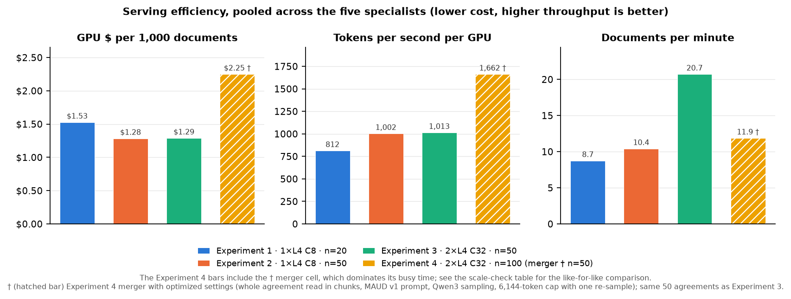
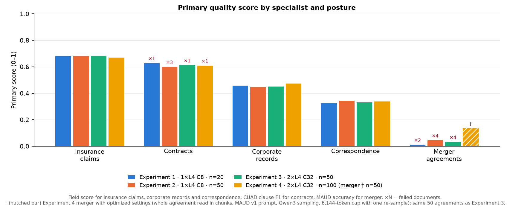
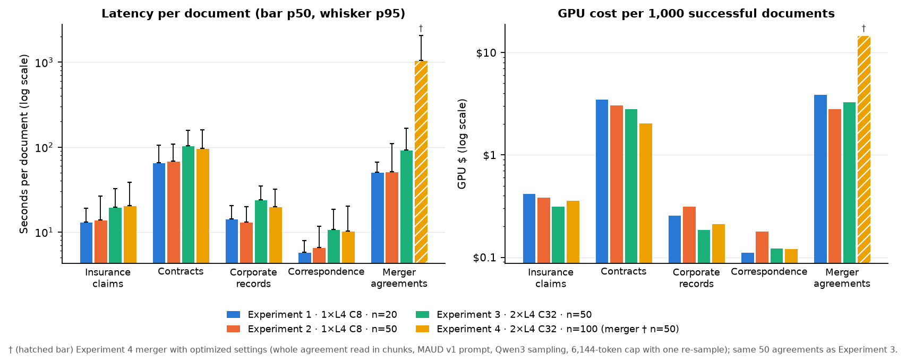
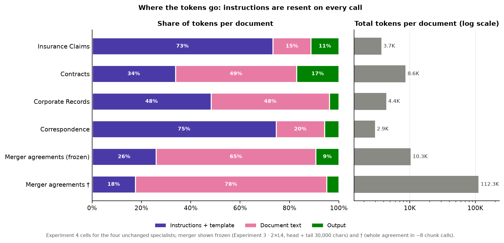
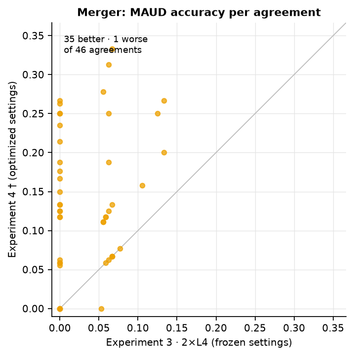
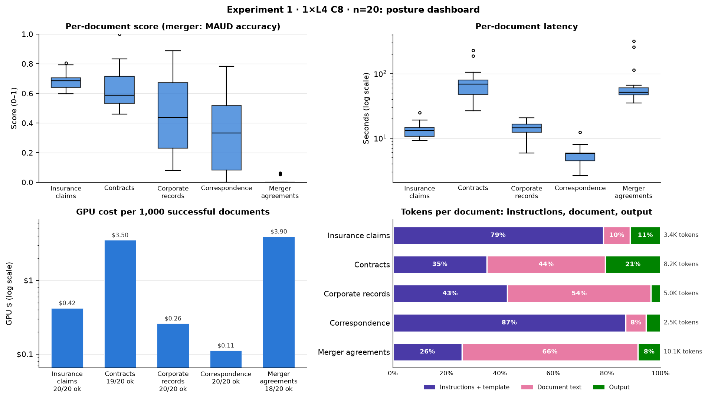
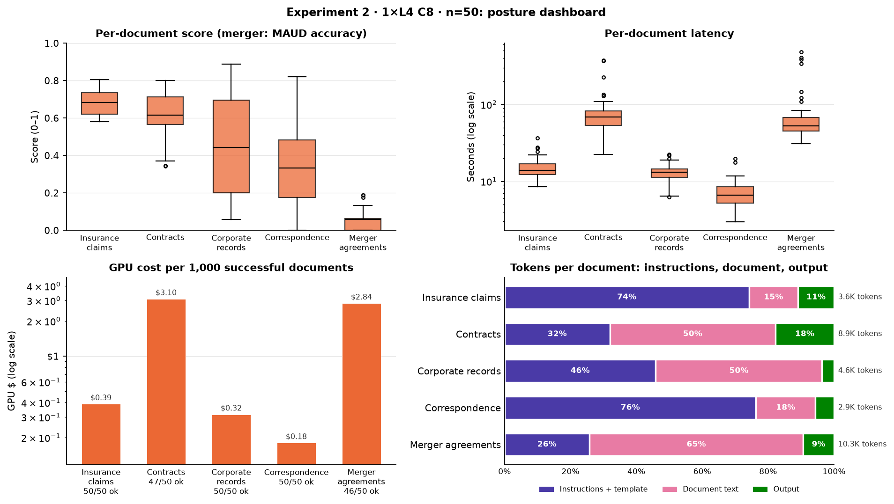
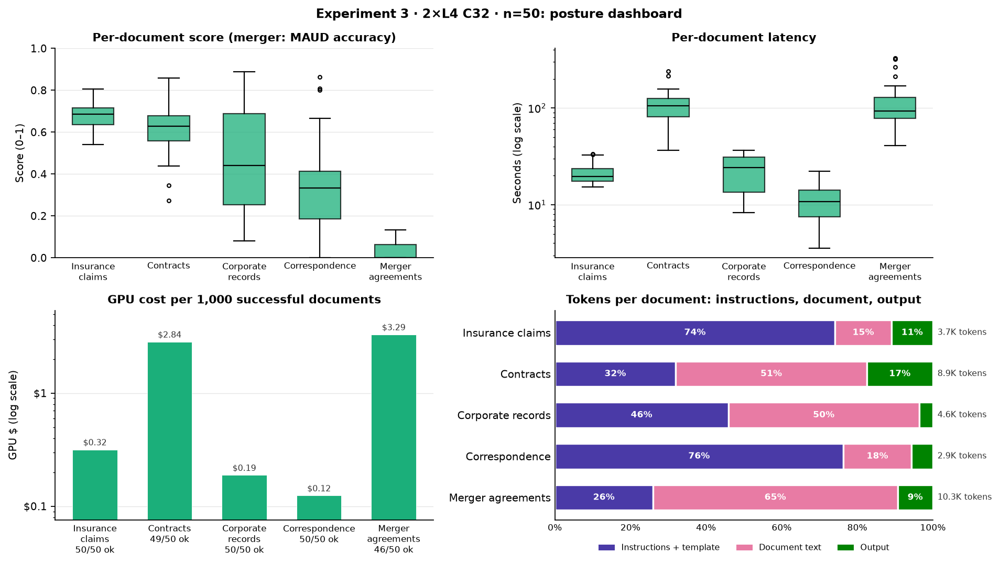
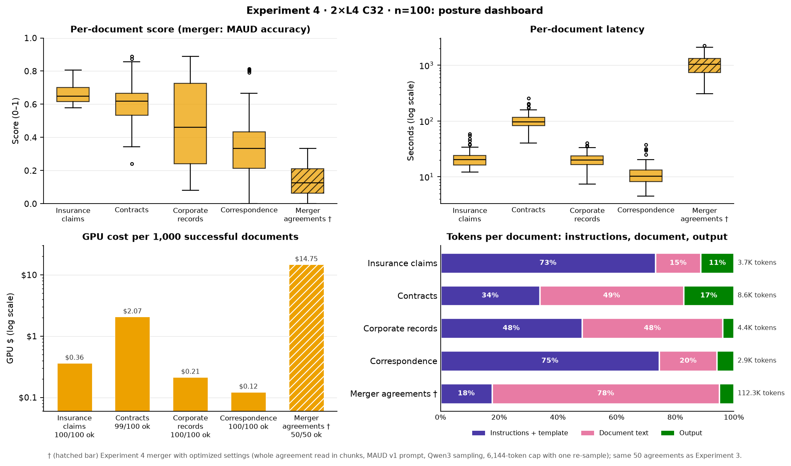

# Appendix: L4 Specialist Grid (Experiments 1–4)

Full findings, detail tables, method and figures behind the [executive summary](./SAND-37-MASTER-SCORE-COST-CARD.md). Regenerate both with `sandbox run card --master`.

**Model:** Qwen/Qwen3-8B-AWQ on vLLM v0.29.0 · **GPU:** NVIDIA L4 at $0.80 per GPU-hour  
**Data:** public `Lucius-Morningstar/mailroom-dataset` ground_truth @ `ed7576b6`, seed 42; the n = 20 draw is nested in the n = 50 draw, and every n = 50 posture scores the identical documents.  
**Engine (Experiments 1–3):** AWQ-Marlin, fp8 KV cache, CUDA graphs, prefix caching, thinking disabled, 8,192-token output cap, frozen prompts (see *Run conditions by specialist*); temperature 0.7 for contracts and merger, 0.1 otherwise.  
**Experiment 4:** one 32K deploy of the same 2×L4 engine at C32. Four specialists run n = 100 on unchanged settings (the n = 50 draw nested inside); merger runs the same 50 agreements as Experiment 3 with the optimized settings marked † (see *Merger † settings* on the executive card).

| Experiment | Posture | GPUs | Client concurrency | Documents per class | Status |
| --- | --- | ---: | ---: | ---: | --- |
| Experiment 1 | 1×L4 C8 n=20 | 1 | 8 | 20 | 5 of 5 cells |
| Experiment 2 | 1×L4 C8 n=50 | 1 | 8 | 50 | 5 of 5 cells |
| Experiment 3 | 2×L4 C32 n=50 | 2 | 32 | 50 | 5 of 5 cells |
| Experiment 4 | 2×L4 C32 n=100 | 2 | 32 | 100 (merger 50†) | 5 of 5 cells |

## Findings (full)

1. **Scaling out to 2×L4 at C32 raises throughput by 99% at unchanged cost per document** (identical 250 documents, Experiment 2 · 1×L4 C8 n=50 vs Experiment 3 · 2×L4 C32 n=50). Cost per document changes by +0.4% and tokens per second per GPU by +1%, so per-GPU efficiency holds and capacity grows with GPU count. GPU count and client concurrency changed together (8 → about 16 in-flight requests per replica), so this comparison does not separate their effects. Median per-document latency rises 1.4–1.8×, and mean time to first token rises from 0.8–2.4 s to 2.7–9.4 s, consistent with requests queueing at the higher per-replica load.
2. **Running n = 100 per specialist instead of n = 50 lowers GPU cost per document by 19% on the four unchanged specialists** (Experiment 3 · 2×L4 C32 n=50 vs Experiment 4 · 2×L4 C32 n=100, merger excluded; each n = 100 draw contains the n = 50 documents). Tokens per second per GPU change by +22% and documents per minute by +24%. A likely contributor is that each cell's fixed ramp-up and drain time is spread over twice as many documents; the cards do not measure that split directly. 1 of 400 documents failed (0.25%).
3. **Serving posture has no detectable effect on extraction quality.** On the 230 documents scored successfully under both Experiment 2 · 1×L4 C8 n=50 and Experiment 3 · 2×L4 C32 n=50, the mean per-document score change for each specialist ranges from −0.011 to +0.023; on the 190 documents the four unchanged specialists share between Experiment 3 (n = 50) and Experiment 4 (n = 100), it ranges from −0.017 to +0.016. Every 95% confidence interval includes zero; the widest is ±0.041, so smaller effects cannot be ruled out. Unmatched means across all postures differ by at most 0.026 for field scores and 0.029 for contracts CUAD F1. Contracts and merger sample at temperature 0.7, so their outputs vary from run to run.
4. **All 16 errors are output-cap truncations: the model reached the 8,192-token limit before closing the JSON** (contracts 1/20, 3/50, 1/50, 1/100; merger agreements 2/20, 4/50, 4/50; cells with errors, in posture order). No errors arose from infrastructure, authentication or JSON parsing. Failed documents are excluded from scores and token totals; the GPU time they used is included in cost.
5. **Merger agreements are the principal quality gap on the frozen settings.** The median agreement is 381,761 characters, about 13× the 30,000-character input cap (head plus tail), so the frozen settings read under a tenth of a typical agreement. The model answers only 13%–24% of labeled MAUD questions, with 10%–20% precision on those answered, and serving posture does not change that.
6. **The † merger settings raise MAUD accuracy from 0.035 to 0.140 on the same 50 agreements.** Question coverage rises 23% → 69% and precision on answered questions 15% → 20%; 50 of 50 agreements return a result (46 before). On the 46 agreements scored under both, the mean per-agreement score changes by +0.106 (95% CI +0.079 to +0.133; 35 better, 1 worse, 10 unchanged). This is the like-for-like figure: the pooled accuracies use different denominators (747 vs 817 labeled questions) because the frozen settings lost agreements to the output cap. The † cell changes input, prompt, sampling, output cap and re-sampling together, so this run does not attribute the gain to any one of them. The cost: prompt tokens per agreement rise 11×, GPU cost per agreement $0.0033 → $0.0147 (4.5×) and median latency 92 s → 1,044 s. vLLM recorded 23 length-capped finishes over 418 requests and 8 preemptions; the preemptions indicate KV-cache pressure from ~50,000-character sections at C32. Those two are the first places to look for cost and latency savings.
7. **Fixed instructions, not document text, account for most tokens in the short classes.** By the estimate in *Token composition*, the instructions and template are 75% of a correspondence document's tokens and 73% of an insurance claim's (2,193 and 2,702 tokens per call). Prefix caching already reuses part of that prefix (hit rate 35%–40% in Experiment 4). A shorter template, or several short documents per call, would cut these classes' token cost; neither has been tested.
8. **Correspondence scores are low and widely spread** (mean 0.33–0.34, standard deviation 0.19–0.24, across all postures). The score does not move with serving posture, so the cause most likely sits in the prompt, the ground truth or the scorer. It has not been diagnosed yet and is the next item to review.
9. **Most insurance-claims outputs fail strict schema validation** (schema-valid rate 0.20–0.30; corporate records 0.94–0.97; contracts, merger and correspondence 1.00), although insurance claims has the highest field score of the field-scored classes (0.67–0.69). A strict-schema consumer would reject 70%–80% of these outputs. Contracts and merger request structured output against their JSON schema (LangChain `with_structured_output`) and validate at 1.00; moving insurance claims to the same call mode is the likely fix and has not been tested.

## Serving efficiency (pooled across the five specialists)

| Metric | Experiment 1 · 1×L4 C8 n=20 | Experiment 2 · 1×L4 C8 n=50 | Experiment 3 · 2×L4 C32 n=50 | Experiment 4 · 2×L4 C32 n=100 |
| --- | ---: | ---: | ---: | ---: |
| Documents ok / total | 97 / 100 | 243 / 250 | 245 / 250 | 449 / 450 |
| Error rate | 3.0% | 2.8% | 2.0% | 0.22% |
| Throughput (documents per minute) | 8.74 | 10.40 | 20.71 | 11.86 |
| Throughput (tokens per second per GPU) | 812 | 1,002 | 1,013 | 1,662 |
| GPU cost per document | $0.00153 | $0.00128 | $0.00129 | $0.00225 |
| GPU cost per 1M tokens | $0.274 | $0.222 | $0.219 | $0.134 |
| Busy-window GPU cost | $0.153 | $0.321 | $0.322 | $1.012 |
| Busy wall time (sum of cells) | 687 s | 1,443 s | 724 s | 2,277 s |
| Tokens processed (prompt / completion) | 496,135 / 61,446 | 1,291,533 / 154,463 | 1,310,750 / 157,089 | 7,067,110 / 500,477 |
| Length-capped finishes (vLLM) | 3 | 7 | 5 | 24 |
| Preemptions (vLLM) | 0 | 0 | 0 | 8 |

Token counts cover successful documents only. The 16 failed documents (see *Findings*) are in busy time and cost but not in token totals, so tokens per second read slightly low and cost per 1M tokens slightly high for postures with failures.

The Experiment 4 column includes the † merger cell, which reads whole agreements and takes most of the posture's busy time, so its pooled throughput and cost per document are not a serving comparison. The like-for-like check is below.

### Scale check: four unchanged specialists (merger excluded)

| Metric | Experiment 3 · 2×L4 C32 n=50 | Experiment 4 · 2×L4 C32 n=100 | Change |
| --- | ---: | ---: | ---: |
| Documents ok / total | 199 / 200 | 399 / 400 | — |
| Error rate | 0.50% | 0.25% | — |
| Throughput (documents per minute) | 31.29 | 38.85 | +24% |
| Throughput (tokens per second per GPU) | 1,296 | 1,582 | +22% |
| GPU cost per document | $0.00085 | $0.00069 | −19% |
| GPU cost per 1M tokens | $0.171 | $0.140 | −18% |
| Length-capped finishes (vLLM) | 1 | 1 | — |

## Score definitions

Field scores (insurance claims, corporate records, correspondence) are the mean suite extraction score against ground truth over successful documents. Contracts ground truth is CUAD clause labels, so its score is the per-document CUAD clause-presence F1 averaged over the successful documents that carry CUAD labels (see *Clause scoring detail* for counts), with the pooled micro F1 in parentheses; the committed run reports count unlabeled documents as 0 and so read lower. Merger is micro-accuracy over labeled MAUD questions, with question coverage in parentheses, a different scale from the field scores. † marks the optimized merger cell (settings on the executive card).

## Token composition

Prompt tokens split into the instructions and template (system prompt, schema, field list; resent on every model call) and the document text the model reads, plus the output. The split is fitted per run across documents of different lengths (`prompt = I × calls + characters ÷ r`); where every document is cut to the same cap, or a chunked run's re-samples blur the call count, document tokens use 4.5 characters per token (the contracts fits measure 4.4–4.6) and instructions are the remainder.

| Specialist | Instructions + template | Document text | Output | Tokens per document | Calls per document | Instructions per call | Basis |
| --- | ---: | ---: | ---: | ---: | ---: | ---: | --- |
| Insurance Claims | 2,702 (73%) | 570 (15%) | 416 (11%) | 3,688 | 1.0 | 2,702 | fit, 4.46 chars/token |
| Contracts | 2,916 (34%) | 4,229 (49%) | 1,481 (17%) | 8,626 | 1.0 | 2,916 | fit, 4.58 chars/token |
| Corporate Records | 2,110 (48%) | 2,101 (48%) | 166 (4%) | 4,377 | 1.0 | 2,110 | fit, 4.40 chars/token |
| Correspondence | 2,193 (75%) | 578 (20%) | 170 (6%) | 2,941 | 1.0 | 2,193 | fit, 3.89 chars/token |
| Merger Agreements (frozen, Experiment 3) | 2,675 (26%) | 6,667 (65%) | 962 (9%) | 10,303 | 1.0 | 2,675 | 4.5 chars/token |
| Merger Agreements † (Experiment 4) | 19,669 (18%) | 87,019 (78%) | 5,571 (5%) | 112,260 | 7.9 | 2,484 | 4.5 chars/token |

## Per-cell detail

One table per posture. Latency, tokens per document and completion p95 / max cover successful documents (the run store records no token counts for a failed document); busy GPU $ is the cell's busy wall × GPUs × $0.80 per GPU-hour and includes the time failed documents used.

### Experiment 1 · 1×L4 C8 n=20

| Specialist | ok / n | Errors | Schema-valid | Score (sd) | p50 / p95 latency (s) | Tokens per doc | Completion p95 / max | Wall (s) | Busy GPU $ | $ per ok doc | $ per 1M tokens | Tokens/s/GPU |
| --- | :---: | :---: | ---: | ---: | ---: | ---: | ---: | ---: | ---: | ---: | ---: | ---: |
| Insurance Claims | 20/20 | 0 | 0.30 | 0.684 (0.054) | 13.2 / 19.0 | 3,427 | 496 / 968 | 37.8 | $0.0084 | $0.00042 | $0.123 | 1,813 |
| Contracts | 19/20 | 1 (length 1) | 1.00 | 0.631 (0.143) | 65.8 / 104.9 | 8,161 | 2,442 / 4,860 | 299.3 | $0.0665 | $0.00350 | $0.429 | 518 |
| Corporate Records | 20/20 | 0 | 0.95 | 0.459 (0.245) | 14.4 / 20.5 | 5,040 | 239 / 247 | 23.4 | $0.0052 | $0.00026 | $0.052 | 4,315 |
| Correspondence | 20/20 | 0 | 1.00 | 0.327 (0.241) | 5.8 / 7.9 | 2,527 | 180 / 296 | 10.1 | $0.0022 | $0.00011 | $0.044 | 5,029 |
| Merger Agreements | 18/20 | 2 (length 2) | 1.00 | 0.014 (0.024) | 50.5 / 66.1 | 10,148 | 1,279 / 1,661 | 316.1 | $0.0703 | $0.00390 | $0.385 | 578 |

### Experiment 2 · 1×L4 C8 n=50

| Specialist | ok / n | Errors | Schema-valid | Score (sd) | p50 / p95 latency (s) | Tokens per doc | Completion p95 / max | Wall (s) | Busy GPU $ | $ per ok doc | $ per 1M tokens | Tokens/s/GPU |
| --- | :---: | :---: | ---: | ---: | ---: | ---: | ---: | ---: | ---: | ---: | ---: | ---: |
| Insurance Claims | 50/50 | 0 | 0.20 | 0.684 (0.069) | 14.0 / 26.7 | 3,648 | 624 / 956 | 87.4 | $0.0194 | $0.00039 | $0.107 | 2,087 |
| Contracts | 47/50 | 3 (length 3) | 1.00 | 0.602 (0.118) | 68.2 / 108.9 | 8,868 | 2,829 / 3,391 | 655.2 | $0.1456 | $0.00310 | $0.349 | 636 |
| Corporate Records | 50/50 | 0 | 0.94 | 0.449 (0.249) | 13.2 / 19.8 | 4,630 | 237 / 247 | 71.2 | $0.0158 | $0.00032 | $0.068 | 3,254 |
| Correspondence | 50/50 | 0 | 1.00 | 0.345 (0.218) | 6.6 / 11.7 | 2,858 | 298 / 463 | 40.6 | $0.0090 | $0.00018 | $0.063 | 3,523 |
| Merger Agreements | 46/50 | 4 (length 4) | 1.00 | 0.048 (0.049) | 51.3 / 109.7 | 10,269 | 1,798 / 2,535 | 588.4 | $0.1308 | $0.00284 | $0.277 | 803 |

### Experiment 3 · 2×L4 C32 n=50

| Specialist | ok / n | Errors | Schema-valid | Score (sd) | p50 / p95 latency (s) | Tokens per doc | Completion p95 / max | Wall (s) | Busy GPU $ | $ per ok doc | $ per 1M tokens | Tokens/s/GPU |
| --- | :---: | :---: | ---: | ---: | ---: | ---: | ---: | ---: | ---: | ---: | ---: | ---: |
| Insurance Claims | 50/50 | 0 | 0.24 | 0.686 (0.068) | 19.6 / 32.6 | 3,651 | 709 / 956 | 35.6 | $0.0158 | $0.00032 | $0.087 | 2,564 |
| Contracts | 49/50 | 1 (length 1) | 1.00 | 0.615 (0.127) | 103.3 / 156.6 | 8,917 | 2,688 / 2,915 | 312.8 | $0.1390 | $0.00284 | $0.318 | 699 |
| Corporate Records | 50/50 | 0 | 0.94 | 0.452 (0.235) | 24.1 / 34.6 | 4,630 | 233 / 247 | 21.2 | $0.0094 | $0.00019 | $0.041 | 5,467 |
| Correspondence | 50/50 | 0 | 1.00 | 0.334 (0.203) | 10.7 / 18.5 | 2,858 | 296 / 443 | 14.0 | $0.0062 | $0.00012 | $0.043 | 5,120 |
| Merger Agreements | 46/50 | 4 (length 4) | 1.00 | 0.035 (0.041) | 92.5 / 167.2 | 10,303 | 1,543 / 2,852 | 340.8 | $0.1515 | $0.00329 | $0.320 | 695 |

### Experiment 4 · 2×L4 C32 n=100

| Specialist | ok / n | Errors | Schema-valid | Score (sd) | p50 / p95 latency (s) | Tokens per doc | Completion p95 / max | Wall (s) | Busy GPU $ | $ per ok doc | $ per 1M tokens | Tokens/s/GPU |
| --- | :---: | :---: | ---: | ---: | ---: | ---: | ---: | ---: | ---: | ---: | ---: | ---: |
| Insurance Claims | 100/100 | 0 | 0.23 | 0.672 (0.064) | 20.4 / 38.4 | 3,688 | 697 / 1,683 | 81.5 | $0.0362 | $0.00036 | $0.098 | 2,263 |
| Contracts | 99/100 | 1 (length 1) | 1.00 | 0.612 (0.127) | 96.1 / 159.3 | 8,626 | 2,226 / 3,235 | 460.6 | $0.2047 | $0.00207 | $0.240 | 927 |
| Corporate Records | 100/100 | 0 | 0.97 | 0.475 (0.246) | 19.9 / 31.8 | 4,377 | 233 / 250 | 48.1 | $0.0214 | $0.00021 | $0.049 | 4,549 |
| Correspondence | 100/100 | 0 | 1.00 | 0.341 (0.188) | 10.3 / 20.3 | 2,941 | 269 / 621 | 27.5 | $0.0122 | $0.00012 | $0.042 | 5,343 |
| Merger Agreements | 50/50 | 0 | 1.00 | 0.140 (0.090) | 1,044.4 / 2,067.4 | 112,260 | 8,012 / 13,241 | 1,658.8 | $0.7373 | $0.01475 | $0.131 | 1,692 |

Merger score is MAUD micro-accuracy; its sd is over per-document scores.

## Clause scoring detail

| Posture | Contracts: CUAD-labeled docs | Precision | Recall | Micro F1 | Labeled-doc mean F1 | Value accuracy | Merger: MAUD questions | Answered (coverage) | Correct | Accuracy | Precision on answered |
| --- | ---: | ---: | ---: | ---: | ---: | ---: | ---: | ---: | ---: | ---: | ---: |
| Experiment 1 · 1×L4 C8 n=20 | 16 of 19 ok | 0.657 | 0.548 | 0.597 | 0.631 | 32/44 (73%) | 289 | 39 (13%) | 4 | 0.014 | 0.103 |
| Experiment 2 · 1×L4 C8 n=50 | 39 of 47 ok | 0.624 | 0.559 | 0.590 | 0.602 | 71/110 (65%) | 751 | 179 (24%) | 36 | 0.048 | 0.201 |
| Experiment 3 · 2×L4 C32 n=50 | 40 of 49 ok | 0.703 | 0.531 | 0.605 | 0.615 | 77/113 (68%) | 747 | 174 (23%) | 26 | 0.035 | 0.149 |
| Experiment 4 · 2×L4 C32 n=100 | 82 of 99 ok | 0.684 | 0.548 | 0.608 | 0.612 | 156/237 (66%) | 817 | 561 (69%) | 114 | 0.140 | 0.203 |

Clause counts cover successful documents only, so two postures on the same draw can differ slightly in labeled documents and MAUD questions when different documents hit the output cap.

## Engine telemetry (vLLM /metrics, this run's delta)

Requests, length-capped finishes and preemptions are summed over replicas; prefix-cache hit rate and mean time to first token are request-weighted across replicas. A chunked or re-sampled document issues more than one request.

| Specialist | Requests | Length-capped finishes | Preemptions | Prefix-cache hit rate | Mean TTFT (s) |
| --- | :---: | :---: | :---: | :---: | :---: |
| Insurance Claims | 20 · 50 · 50 · 100 | 0 · 0 · 0 · 0 | 0 · 0 · 0 · 0 | 61% · 58% · 57% · 40% | 1.1 · 1.0 · 3.0 · 2.8 |
| Contracts | 20 · 50 · 50 · 100 | 1 · 3 · 1 · 1 | 0 · 0 · 0 · 0 | 43% · 44% · 43% · 40% | 3.1 · 1.8 · 6.9 · 4.4 |
| Corporate Records | 20 · 50 · 50 · 100 | 0 · 0 · 0 · 0 | 0 · 0 · 0 · 0 | 47% · 48% · 47% · 40% | 1.8 · 1.4 · 4.0 · 3.1 |
| Correspondence | 20 · 50 · 50 · 100 | 0 · 0 · 0 · 0 | 0 · 0 · 0 · 0 | 67% · 61% · 60% · 35% | 1.0 · 0.8 · 2.7 · 2.6 |
| Merger Agreements | 20 · 50 · 50 · 418 | 2 · 4 · 4 · 23 | 0 · 0 · 0 · 8 | 31% · 37% · 36% · 28% | 4.9 · 2.4 · 9.4 · 10.8 |

Columns follow the posture order (1×L4 C8 n=20 · 1×L4 C8 n=50 · 2×L4 C32 n=50 · 2×L4 C32 n=100).

## Run conditions by specialist

Identical across the postures above unless a cell lists more than one value.

| Specialist | Prompt | Input cap (chars) | Output cap (tokens) | Temperature | Retries |
| --- | --- | ---: | ---: | ---: | ---: |
| Insurance Claims | `insurance_claims_specialist_simplified` | 13,500 | 8,192 | 0.1 | 2 |
| Contracts | `contracts_specialist_v33_simplified` | 24,000 | 8,192 | 0.7 | 2 |
| Corporate Records | `corporate_records_specialist_simplified` | 15,000 | 8,192 | 0.1 | 2 |
| Correspondence | `correspondence_specialist_simplified` | 12,000 | 8,192 | 0.1 | 2 |
| Merger Agreements | `merger_agreement_specialist_simplified / merger_agreement_specialist_maud_v1` | 30,000 / 54,000 | 8,192 / 6,144 | 0.7 | 2 |

## Figures: posture comparison

*Figure 1. Pooled serving efficiency by posture: GPU cost per 1,000 documents, tokens per second per GPU, and documents per minute. The Experiment 4 bar includes the † merger cell, which dominates its busy time; the like-for-like scale check is the table under *Serving efficiency*.*

*Figure 2. Primary quality metric by specialist and posture; labels mark failed documents. Merger is MAUD accuracy, a different scale from the field scores; † (hatched) marks the optimized Experiment 4 merger cell.*

*Figure 3. Per-document latency (bar p50, whisker p95) and GPU cost per 1,000 successful documents, by specialist and posture, on log scales; † (hatched) marks the optimized Experiment 4 merger cell.*

*Figure 4. Matched-sample check: each point is one document scored under Experiment 2 (1×L4 C8) and Experiment 3 (2×L4 C32). Points on the diagonal mean the posture did not change the output's score.*

*Figure 5. Where the tokens go, per document: instructions and template (resent on every model call), document text, and output. Left: share of each document's tokens; right: total tokens per document on a log scale. Instruction tokens are fitted per run across documents of different lengths (see *Token composition*).*

*Figure 6. Merger † effect on the same agreements: per-agreement MAUD accuracy under Experiment 3 (frozen settings) and Experiment 4 † (optimized settings). Points above the diagonal improved.*

## Cost accounting and run integrity

- **Experiments 1 + 3 metered Modal total:** $1.09 ($0.00 billed after credits). Covers both Experiment 1 and Experiment 3 plus cold boots, pinned-warm idle between cells, the weight pre-warm, and one invalidated contracts attempt (client credential-precedence defect; excluded and rerun).
- **Experiment 2 metered Modal total:** $0.49 ($0.00 billed after credits). One 1×L4 session: weight pre-warm, cold boot, the five cells pinned warm, and teardown. October month-to-date metering ($1.42) less the Experiments 1 + 3 October hours ($0.93).
- **Experiment 4 metered Modal total:** $1.81 ($0.00 billed after credits). One 2×L4 32K session (app stopped 06:33 UTC): cold boot, the 5-agreement chunk gate, the four n=100 cells and † merger n=50, pinned-warm idle, and teardown. Excludes the two 64K validation-probe deploys earlier the same morning ($1.32) and an unrelated GT-labeler app ($0.54).
- **Teardown** to zero warm containers is part of every posture's runbook; the metered totals above come from the teardown spend check.
- **Comparability:** Experiments 2 and 3 score identical n = 50 documents and differ only in GPU count and client concurrency; Experiment 1 is a nested n = 20 subset. Experiment 4 runs the same 2×L4 engine as Experiment 3; its n = 100 draws contain the n = 50 documents, and its merger cell scores the same 50 agreements with the † settings.

**Source data:** per-cell score and cost cards, run reports and vLLM serving telemetry under `1L4/<specialist>/` and `2L4/<specialist>/`; posture suite cards `1L4/L4x1-SCORE-COST-CARD.md` and `2L4/L4x2-SCORE-COST-CARD.md`. Regenerate with `sandbox run card --master`.

## Appendix: posture dashboards

*Dashboard 1. Experiment 1 · 1×L4 C8 n=20: per-document score and latency distributions, cost per 1,000 successful documents, and token mix by specialist.*

*Dashboard 2. Experiment 2 · 1×L4 C8 n=50: per-document score and latency distributions, cost per 1,000 successful documents, and token mix by specialist.*

*Dashboard 3. Experiment 3 · 2×L4 C32 n=50: per-document score and latency distributions, cost per 1,000 successful documents, and token mix by specialist.*

*Dashboard 4. Experiment 4 · 2×L4 C32 n=100: per-document score and latency distributions, cost per 1,000 successful documents, and token mix by specialist.*
