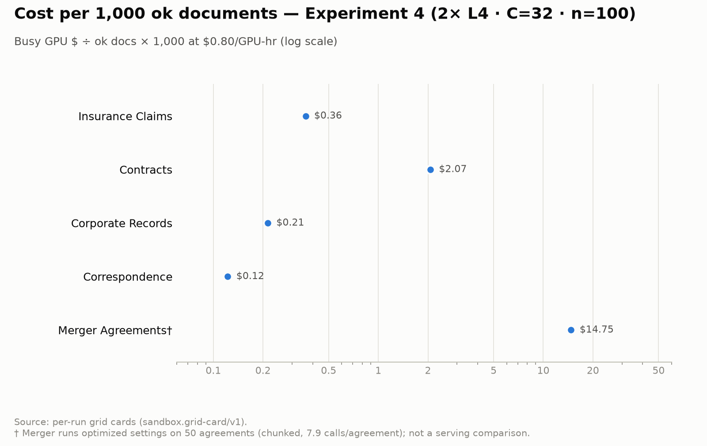
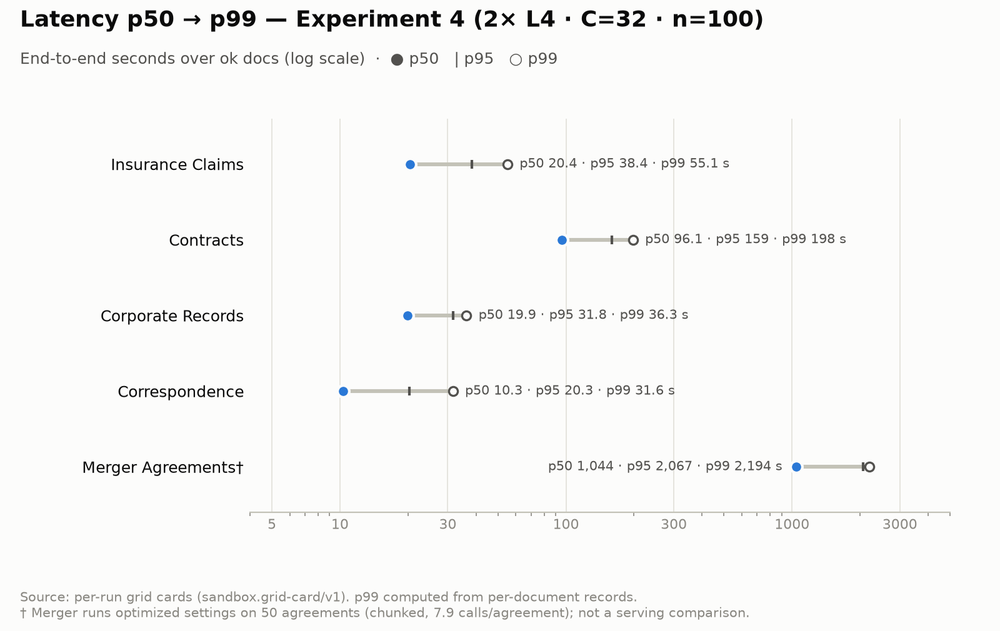
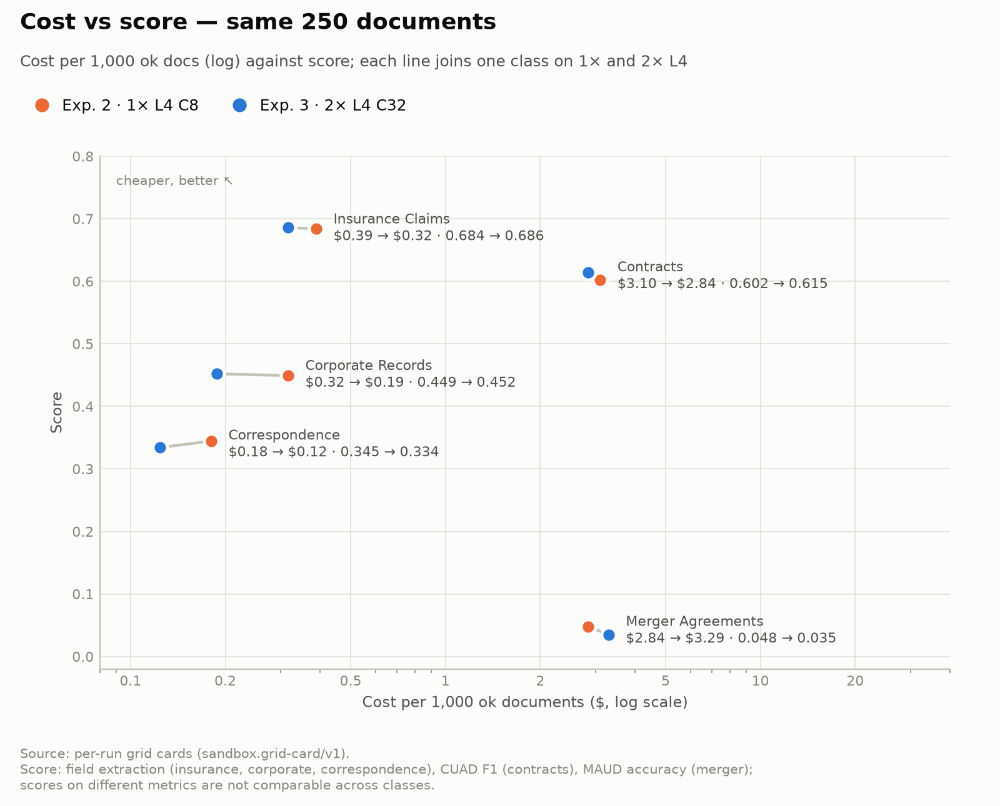
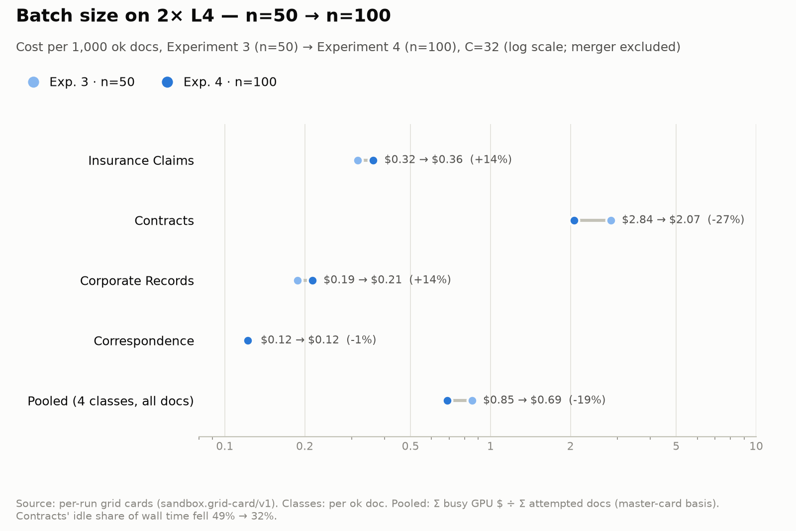
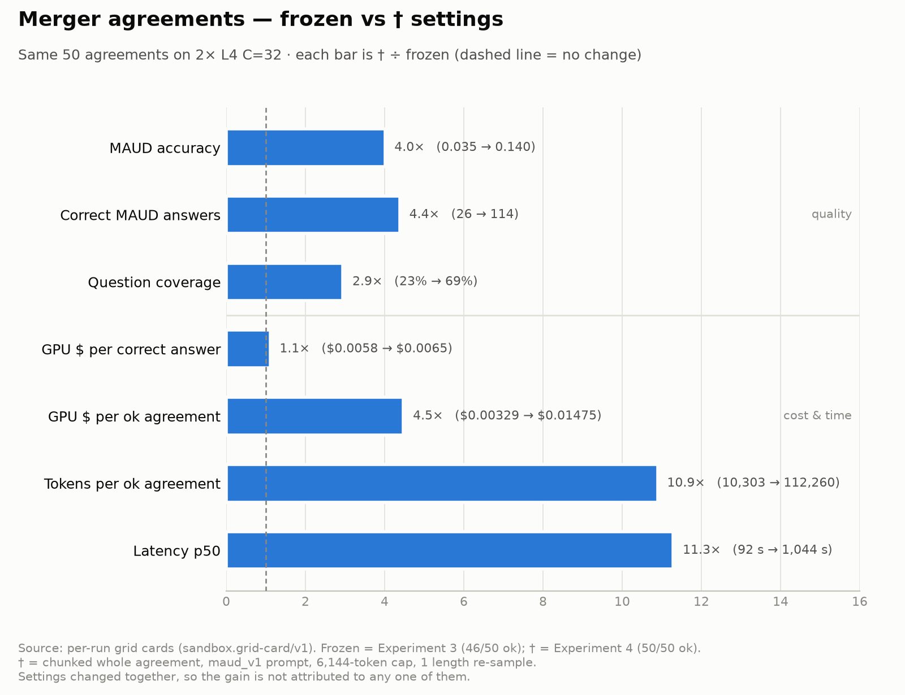

# L4 Specialist Grid (Experiments 1–4) — GPU Cost-Per-Doc, Score, Latency & Throughput Record

**Source of truth:** the 20 per-cell grid cards `reports/SAND-37/{1L4,2L4}/<specialist>/*.card.json` (schema `sandbox.grid-card/v1`, generated 2026-10-01 06:44 UTC) and `reports/SAND-37/metered-costs.json`. Each card holds conditions, per-document records, vLLM `/metrics` deltas per replica and cost. Per-cell blocks: [`SAND37_L4_cost_cards.md`](./SAND37_L4_cost_cards.md).
Model `Qwen/Qwen3-8B-AWQ`, vLLM `v0.29.0`, awq_marlin, fp8 KV, max_num_seqs 16, max_model_len 32,768, prefix caching, thinking off. Rate: L4 **$0.80/GPU-hr**.
Data: `Lucius-Morningstar/mailroom-dataset` ground_truth @ `ed7576b6`, seed 42. Draws are nested (n=20 ⊂ n=50 ⊂ n=100), and every n=50 posture scores the same documents.
Cost/ok doc = busy GPU $ ÷ ok docs; pooled rows (all docs) = busy GPU $ ÷ all attempted docs, the master card's basis. Latency is per-document end-to-end over ok docs. TTFT is vLLM's request-weighted mean. Compiled 2026-10-01.

| Experiment | Posture | GPUs | Client concurrency | Docs per class | Cells |
|---|---|---|---|---|---|
| Experiment 1 | 1×L4 C8 n=20 | 1 | 8 | 20 | 5/5 |
| Experiment 2 | 1×L4 C8 n=50 | 1 | 8 | 50 | 5/5 |
| Experiment 3 | 2×L4 C32 n=50 | 2 | 32 | 50 | 5/5 |
| Experiment 4 | 2×L4 C32 n=100 | 2 | 32 | 100 (merger 50†) | 5/5 |

**Checks:** busy GPU $ = wall × replicas × $0.80 ÷ 3,600 in all 20 cards. Field-score means and MAUD accuracies match the master card to 3 dp.

### Metrics on these cards

| Metric | Where it comes from |
|---|---|
| ok / n, error rate, error kind, parse errors | `quality` block; cost is per **ok** document |
| Score (sd), per-doc min/p10/p50/p90/max, named metric | `quality` and per-document scores (field score, CUAD F1, MAUD accuracy) |
| Schema-valid rate | `quality.schema_valid_rate` |
| Latency mean / p50 / p95 / p99 / max / min | `latency` and per-document `latency_seconds` (p99 and min computed) |
| TTFT, per replica and pooled | vLLM `time_to_first_token_seconds` sum/count |
| Parallelism, occupancy, slot utilization | `concurrency` block (Σ per-doc latency ÷ wall) |
| Cold boot, busy wall, GPU-seconds | `time` block |
| Billed vs busy vs idle $ | `cost` block, plus session-level metered $ |
| $ per ok doc, $ per 1k, $ per 1M tokens, docs per GPU-hour | `cost` and `time` |
| Prompt / completion / total tokens; instruction / document / output split | `tokens` and `tokens.split` |
| Requests, length-capped finishes, preemptions, prefix-cache hit, per replica | `engine_telemetry.replicas` |
| GPU $ per correct MAUD answer | busy $ ÷ `quality.clause.correct` |

---

## 1. Per-class score, cost, latency & throughput — 1× L4 (Experiment 2, C8, n=50)

**Score, reliability & cost**

| Class | ok / n | Err | Schema-valid | Score (sd) | Cost/ok doc ($) | $ per 1k ok | Docs/min | Docs/GPU-hr | Tok/s/GPU | $ per 1M tok |
|---|---|---|---|---|---|---|---|---|---|---|
| Insurance Claims | 50/50 | 0 | 0.20 | 0.684 (0.069) | 0.00039 | 0.39 | 34.32 | 2,052 | 2,087 | 0.107 |
| Contracts | 47/50 | 3 | 1.00 | 0.602 (0.118) | 0.00310 | 3.10 | 4.58 | 258 | 636 | 0.349 |
| Corporate Records | 50/50 | 0 | 0.94 | 0.449 (0.249) | 0.00032 | 0.32 | 42.16 | 2,520 | 3,254 | 0.068 |
| Correspondence | 50/50 | 0 | 1.00 | 0.345 (0.218) | 0.00018 | 0.18 | 73.97 | 4,402 | 3,523 | 0.063 |
| Merger Agreements | 46/50 | 4 | 1.00 | 0.048 (0.049) | 0.00284 | 2.84 | 5.10 | 281 | 803 | 0.277 |

**Latency & engine**

| Class | Lat mean (s) | p50 | p95 | p99 | Max | TTFT (s) | Occupancy | Requests | Length-capped | Preempt | Prefix hit |
|---|---|---|---|---|---|---|---|---|---|---|---|
| Insurance Claims | 15.1 | 14.0 | 26.7 | 32.3 | 36.7 | 1.00 | 1.08 | 50 | 0 | 0 | 58% |
| Contracts | 70.2 | 68.2 | 108.9 | 131.7 | 134.2 | 1.78 | 0.81 | 50 | 3 | 0 | 44% |
| Corporate Records | 13.1 | 13.2 | 19.8 | 22.1 | 22.3 | 1.42 | 1.15 | 50 | 0 | 0 | 48% |
| Correspondence | 7.3 | 6.6 | 11.7 | 18.7 | 19.8 | 0.81 | 1.12 | 50 | 0 | 0 | 61% |
| Merger Agreements | 57.9 | 51.3 | 109.7 | 135.4 | 146.1 | 2.35 | 0.91 | 50 | 4 | 0 | 37% |

Contracts score = CUAD clause-presence F1 (labeled-doc mean). Merger = MAUD micro-accuracy, which is a different scale. Field classes = mean extraction score vs ground truth.

## 2. Per-class score, cost, latency & throughput — 2× L4 (Experiment 4, C32, n=100)

**Score, reliability & cost**

| Class | ok / n | Err | Schema-valid | Score (sd) | Cost/ok doc ($) | $ per 1k ok | Docs/min | Docs/GPU-hr | Tok/s/GPU | $ per 1M tok |
|---|---|---|---|---|---|---|---|---|---|---|
| Insurance Claims | 100/100 | 0 | 0.23 | 0.672 (0.064) | 0.00036 | 0.36 | 73.62 | 4,401 | 2,263 | 0.098 |
| Contracts | 99/100 | 1 | 1.00 | 0.612 (0.127) | 0.00207 | 2.07 | 13.03 | 773 | 927 | 0.240 |
| Corporate Records | 100/100 | 0 | 0.97 | 0.475 (0.246) | 0.00021 | 0.21 | 124.72 | 7,432 | 4,549 | 0.049 |
| Correspondence | 100/100 | 0 | 1.00 | 0.341 (0.188) | 0.00012 | 0.12 | 218.03 | 12,789 | 5,343 | 0.042 |
| Merger Agreements† | 50/50 | 0 | 1.00 | 0.140 (0.090) | 0.01475 | 14.75 | 1.81 | 108 | 1,692 | 0.131 |

**Latency & engine**

| Class | Lat mean (s) | p50 | p95 | p99 | Max | TTFT (s) | Occupancy | Requests | Length-capped | Preempt | Prefix hit |
|---|---|---|---|---|---|---|---|---|---|---|---|
| Insurance Claims | 22.1 | 20.4 | 38.4 | 55.1 | 58.5 | 2.76 | 0.85 | 100 | 0 | 0 | 40% |
| Contracts | 101.0 | 96.1 | 159.3 | 197.8 | 204.0 | 4.43 | 0.70 | 100 | 1 | 0 | 40% |
| Corporate Records | 20.5 | 19.9 | 31.8 | 36.3 | 40.4 | 3.15 | 1.33 | 100 | 0 | 0 | 40% |
| Correspondence | 11.5 | 10.3 | 20.3 | 31.6 | 37.9 | 2.65 | 1.31 | 100 | 0 | 0 | 35% |
| Merger Agreements† | 1,120.4 | 1,044.4 | 2,067.4 | 2,194.2 | 2,264.4 | 10.81 | 1.06 | 418 | 23 | 8 | 28% |

†Merger runs the optimized settings on the same 50 agreements as Experiment 3: whole agreement chunked (7.9 calls per agreement), `maud_v1` prompt, 6,144-token cap, 1 length re-sample. Its row is not a serving comparison; see §5.

## 3. Single vs double L4 — identical 250 documents (Experiment 2 · 1×L4 C8 vs Experiment 3 · 2×L4 C32, n=50)

| Class | Cost/ok doc 1× → 2× | Δ cost | Docs/min 1× → 2× | Δ thru | Per-GPU scaling | Lat p50 1× → 2× (s) | Lat p95 1× → 2× (s) | TTFT 1× → 2× (s) | Score 1× → 2× | Err 1× / 2× |
|---|---|---|---|---|---|---|---|---|---|---|
| Insurance Claims | 0.00039 → 0.00032 | -19% | 34.32 → 84.27 | +146% | 123% | 14.0 → 19.6 | 26.7 → 32.6 | 1.00 → 3.03 | 0.684 → 0.686 | 0 / 0 |
| Contracts | 0.00310 → 0.00284 | -8% | 4.58 → 9.59 | +109% | 105% | 68.2 → 103.3 | 108.9 → 156.6 | 1.78 → 6.94 | 0.602 → 0.615 | 3 / 1 |
| Corporate Records | 0.00032 → 0.00019 | -40% | 42.16 → 141.69 | +236% | 168% | 13.2 → 24.1 | 19.8 → 34.6 | 1.42 → 3.95 | 0.449 → 0.452 | 0 / 0 |
| Correspondence | 0.00018 → 0.00012 | -31% | 73.97 → 214.96 | +191% | 145% | 6.6 → 10.7 | 11.7 → 18.5 | 0.81 → 2.65 | 0.345 → 0.334 | 0 / 0 |
| Merger Agreements | 0.00284 → 0.00329 | +16% | 5.10 → 8.80 | +73% | 86% | 51.3 → 92.5 | 109.7 → 167.2 | 2.35 → 9.39 | 0.048 → 0.035 | 4 / 4 |
| **Pooled (all docs)** | 0.00128 → 0.00129 | **+0.4%** | 10.40 → 20.71 | **+99%** | 100% | | | | no detectable change | 7 / 5 |

- Pooled throughput doubles (+99%) at flat cost per document (+0.4%); tokens/s/GPU 1,002 → 1,013.
- Scaling above 100% (insurance claims, corporate records, correspondence) is confounded with client concurrency 8 → 32.
- Latency p50 rises 1.4–1.8× and TTFT 2.8–4.0×; per-specialist quality change −0.011 to +0.023, every 95% CI includes 0.

## 4. Batch-size check — n=50 vs n=100 on 2× L4 (Experiment 3 → Experiment 4; four unchanged classes, merger excluded)

| Class | Cost/ok doc n=50 → n=100 | Δ | Docs/min | Δ | Tok/s/GPU | Δ | Lat p50 (s) | Lat p95 (s) | Idle share of wall |
|---|---|---|---|---|---|---|---|---|---|
| Insurance Claims | 0.00032 → 0.00036 | +14% | 84.27 → 73.62 | -13% | 2,564 → 2,263 | -12% | 19.6 → 20.4 | 32.6 → 38.4 | 8% → 15% |
| Contracts | 0.00284 → 0.00207 | -27% | 9.59 → 13.03 | +36% | 699 → 927 | +33% | 103.3 → 96.1 | 156.6 → 159.3 | 49% → 32% |
| Corporate Records | 0.00019 → 0.00021 | +14% | 141.69 → 124.72 | -12% | 5,467 → 4,549 | -17% | 24.1 → 19.9 | 34.6 → 31.8 | 0% → 0% |
| Correspondence | 0.00012 → 0.00012 | -1% | 214.96 → 218.03 | +1% | 5,120 → 5,343 | +4% | 10.7 → 10.3 | 18.5 → 20.3 | 0% → 0% |
| **Pooled (4 classes, all docs)** | 0.00085 → 0.00069 | **-19%** | 31.29 → 38.85 | **+24%** | 1,296 → 1,582 | **+22%** | | | |

- Pooled cost per document falls 19%, almost all from contracts (-27% per ok doc; idle share 49% → 32%).
- Correspondence is flat (-1%); corporate records (+14%) and insurance claims (+14%) got more expensive.

## 5. Merger — frozen vs † settings (Experiment 3 → Experiment 4; same 50 agreements, 2× L4 C32)

| Metric | Frozen (Experiment 3) | † (Experiment 4) | Change |
|---|---|---|---|
| ok / n | 46/50 | 50/50 | +4 |
| MAUD accuracy | 0.035 | 0.140 | +0.105 |
| Question coverage | 23% | 69% | +45 pts |
| Precision on answered | 0.149 | 0.203 | +0.054 |
| Matched per-agreement score (n=46) | — | — | +0.106 (95% CI +0.079 to +0.133; 35 better / 1 worse / 10 same) |
| Model calls per agreement | 1.00 | 7.92 | ×7.9 |
| Tokens per agreement | 10,303 | 112,260 | ×10.9 |
| Cost per ok agreement | $0.00329 | $0.01475 | ×4.5 |
| GPU $ per correct MAUD answer | $0.0058 | $0.0065 | +11% |
| Latency p50 / p95 / max (s) | 92.5 / 167.2 / 211.6 | 1,044.4 / 2,067.4 / 2,264.4 | ×11.3 p50 |
| TTFT (s) | 9.39 | 10.81 | — |
| vLLM requests / length-capped / preemptions | 50 / 4 / 0 | 418 / 23 / 8 | — |

- † costs 4.5× more per agreement but only +11% per correct MAUD answer; the settings changed together, so the gain is not attributed to any one.
- Replica 1 took all 8 preemptions and 14 of 23 length-capped finishes.

## 6. Latency, all 20 cells (ok documents, end-to-end seconds)

| Class | Posture | Mean | p50 | p95 | p99 | Max | TTFT | TTFT share of mean |
|---|---|---|---|---|---|---|---|---|
| Insurance Claims | Experiment 1 · 1×L4 C8 n=20 | 13.4 | 13.2 | 19.0 | 23.7 | 24.8 | 1.06 | 8% |
| Insurance Claims | Experiment 2 · 1×L4 C8 n=50 | 15.1 | 14.0 | 26.7 | 32.3 | 36.7 | 1.00 | 7% |
| Insurance Claims | Experiment 3 · 2×L4 C32 n=50 | 20.9 | 19.6 | 32.6 | 33.3 | 33.4 | 3.03 | 14% |
| Insurance Claims | Experiment 4 · 2×L4 C32 n=100 | 22.1 | 20.4 | 38.4 | 55.1 | 58.5 | 2.76 | 12% |
| Contracts | Experiment 1 · 1×L4 C8 n=20 | 67.9 | 65.8 | 104.9 | 172.9 | 187.8 | 3.14 | 5% |
| Contracts | Experiment 2 · 1×L4 C8 n=50 | 70.2 | 68.2 | 108.9 | 131.7 | 134.2 | 1.78 | 3% |
| Contracts | Experiment 3 · 2×L4 C32 n=50 | 104.3 | 103.3 | 156.6 | 186.8 | 213.6 | 6.94 | 7% |
| Contracts | Experiment 4 · 2×L4 C32 n=100 | 101.0 | 96.1 | 159.3 | 197.8 | 204.0 | 4.43 | 4% |
| Corporate Records | Experiment 1 · 1×L4 C8 n=20 | 14.2 | 14.4 | 20.5 | 20.7 | 20.7 | 1.84 | 13% |
| Corporate Records | Experiment 2 · 1×L4 C8 n=50 | 13.1 | 13.2 | 19.8 | 22.1 | 22.3 | 1.42 | 11% |
| Corporate Records | Experiment 3 · 2×L4 C32 n=50 | 22.4 | 24.1 | 34.6 | 36.1 | 36.5 | 3.95 | 18% |
| Corporate Records | Experiment 4 · 2×L4 C32 n=100 | 20.5 | 19.9 | 31.8 | 36.3 | 40.4 | 3.15 | 15% |
| Correspondence | Experiment 1 · 1×L4 C8 n=20 | 5.6 | 5.8 | 7.9 | 11.4 | 12.2 | 0.96 | 17% |
| Correspondence | Experiment 2 · 1×L4 C8 n=50 | 7.3 | 6.6 | 11.7 | 18.7 | 19.8 | 0.81 | 11% |
| Correspondence | Experiment 3 · 2×L4 C32 n=50 | 11.1 | 10.7 | 18.5 | 22.2 | 22.3 | 2.65 | 24% |
| Correspondence | Experiment 4 · 2×L4 C32 n=100 | 11.5 | 10.3 | 20.3 | 31.6 | 37.9 | 2.65 | 23% |
| Merger Agreements | Experiment 1 · 1×L4 C8 n=20 | 54.2 | 50.5 | 66.1 | 105.3 | 113.3 | 4.89 | 9% |
| Merger Agreements | Experiment 2 · 1×L4 C8 n=50 | 57.9 | 51.3 | 109.7 | 135.4 | 146.1 | 2.35 | 4% |
| Merger Agreements | Experiment 3 · 2×L4 C32 n=50 | 100.2 | 92.5 | 167.2 | 192.1 | 211.6 | 9.39 | 9% |
| Merger Agreements† | Experiment 4 · 2×L4 C32 n=100 | 1,120.4 | 1,044.4 | 2,067.4 | 2,194.2 | 2,264.4 | 10.81 | 1% |

- p99 and min computed from per-document `latency_seconds`. TTFT is 3–24% of mean latency outside †.

## 7. Concurrency & slot use (all 20 cells)

| Class | Posture | Client conc. | Parallelism (Σlat/wall) | Occupancy | Idle slot s | Idle share of wall |
|---|---|---|---|---|---|---|
| Insurance Claims | Experiment 1 · 1×L4 C8 n=20 | 8 | 7.1 | 0.89 | 4.2 | 11% |
| Insurance Claims | Experiment 2 · 1×L4 C8 n=50 | 8 | 8.6 | 1.08 | 0.0 | 0% |
| Insurance Claims | Experiment 3 · 2×L4 C32 n=50 | 32 | 29.4 | 0.92 | 2.9 | 8% |
| Insurance Claims | Experiment 4 · 2×L4 C32 n=100 | 32 | 27.1 | 0.85 | 12.6 | 15% |
| Contracts | Experiment 1 · 1×L4 C8 n=20 | 8 | 5.1 | 0.63 | 138.0 | 46% |
| Contracts | Experiment 2 · 1×L4 C8 n=50 | 8 | 6.5 | 0.81 | 242.4 | 37% |
| Contracts | Experiment 3 · 2×L4 C32 n=50 | 32 | 17.1 | 0.53 | 153.0 | 49% |
| Contracts | Experiment 4 · 2×L4 C32 n=100 | 32 | 22.3 | 0.70 | 148.3 | 32% |
| Corporate Records | Experiment 1 · 1×L4 C8 n=20 | 8 | 12.2 | 1.52 | 0.0 | 0% |
| Corporate Records | Experiment 2 · 1×L4 C8 n=50 | 8 | 9.2 | 1.15 | 0.0 | 0% |
| Corporate Records | Experiment 3 · 2×L4 C32 n=50 | 32 | 53.0 | 1.66 | 0.0 | 0% |
| Corporate Records | Experiment 4 · 2×L4 C32 n=100 | 32 | 42.6 | 1.33 | 0.0 | 0% |
| Correspondence | Experiment 1 · 1×L4 C8 n=20 | 8 | 11.2 | 1.40 | 0.0 | 0% |
| Correspondence | Experiment 2 · 1×L4 C8 n=50 | 8 | 9.0 | 1.12 | 0.0 | 0% |
| Correspondence | Experiment 3 · 2×L4 C32 n=50 | 32 | 39.9 | 1.25 | 0.0 | 0% |
| Correspondence | Experiment 4 · 2×L4 C32 n=100 | 32 | 41.9 | 1.31 | 0.0 | 0% |
| Merger Agreements | Experiment 1 · 1×L4 C8 n=20 | 8 | 4.9 | 0.61 | 194.3 | 61% |
| Merger Agreements | Experiment 2 · 1×L4 C8 n=50 | 8 | 7.3 | 0.91 | 255.6 | 43% |
| Merger Agreements | Experiment 3 · 2×L4 C32 n=50 | 32 | 17.1 | 0.54 | 196.9 | 58% |
| Merger Agreements† | Experiment 4 · 2×L4 C32 n=100 | 32 | 33.8 | 1.06 | 0.0 | 0% |

- Occupancy = parallelism ÷ client concurrency (client slots, not GPU).
- 10 of 20 cells read above 1.0: per-doc latency likely includes pre-dispatch wait (or parallel chunk calls for †). Check how `latency_ms` is stamped before treating it as utilization.
- Contracts and frozen merger idle 32–61% of wall time.

## 8. Replica balance (2× L4 cells, vLLM /metrics per replica)

| Class | Posture | Requests r1 / r2 | TTFT r1 / r2 (s) | Prefix hit r1 / r2 | Length-capped r1 / r2 | Preempt r1 / r2 |
|---|---|---|---|---|---|---|
| Insurance Claims | Experiment 3 · 2×L4 C32 n=50 | 24 / 26 | 2.41 / 3.61 | 55% / 58% | 0 / 0 | 0 / 0 |
| Insurance Claims | Experiment 4 · 2×L4 C32 n=100 | 48 / 52 | 2.25 / 3.23 | 40% / 41% | 0 / 0 | 0 / 0 |
| Contracts | Experiment 3 · 2×L4 C32 n=50 | 27 / 23 | 8.76 / 4.79 | 42% / 45% | 0 / 1 | 0 / 0 |
| Contracts | Experiment 4 · 2×L4 C32 n=100 | 47 / 53 | 3.22 / 5.49 | 39% / 40% | 0 / 1 | 0 / 0 |
| Corporate Records | Experiment 3 · 2×L4 C32 n=50 | 24 / 26 | 3.68 / 4.20 | 46% / 49% | 0 / 0 | 0 / 0 |
| Corporate Records | Experiment 4 · 2×L4 C32 n=100 | 49 / 51 | 2.59 / 3.68 | 39% / 40% | 0 / 0 | 0 / 0 |
| Correspondence | Experiment 3 · 2×L4 C32 n=50 | 24 / 26 | 2.32 / 2.96 | 57% / 63% | 0 / 0 | 0 / 0 |
| Correspondence | Experiment 4 · 2×L4 C32 n=100 | 52 / 48 | 2.80 / 2.49 | 35% / 35% | 0 / 0 | 0 / 0 |
| Merger Agreements | Experiment 3 · 2×L4 C32 n=50 | 24 / 26 | 9.74 / 9.07 | 36% / 37% | 1 / 3 | 0 / 0 |
| Merger Agreements† | Experiment 4 · 2×L4 C32 n=100 | 199 / 219 | 12.72 / 9.09 | 28% / 29% | 14 / 9 | 8 / 0 |

- Load splits at most 54/46, but TTFT does not: contracts' busier replica was slower in both runs (8.8 vs 4.8 s; 5.5 vs 3.2 s).

## 9. Error ledger (all L4 cells)

| Cell (run_id) | Errors | Kind |
|---|---|---|
| `grid-20-contracts-specialist-awq-1l4` | 1 | LengthFinishReasonError ×1 |
| `grid-20-merger-specialist-awq-1l4-rerun` | 2 | LengthFinishReasonError ×2 |
| `grid-50-contracts-specialist-awq-1l4` | 3 | LengthFinishReasonError ×3 |
| `grid-50-merger-specialist-awq-1l4` | 4 | LengthFinishReasonError ×4 |
| `grid-50-contracts-specialist-awq-2l4-rerun` | 1 | LengthFinishReasonError ×1 |
| `grid-50-merger-specialist-awq-2l4` | 4 | LengthFinishReasonError ×4 |
| `sand40-100-contracts-specialist-awq-2l4` | 1 | LengthFinishReasonError ×1 |

- **16 errors / 1,050 documents = 1.52%**, all `LengthFinishReasonError`; 0 parse errors. Excluding merger: 6 / 880 = 0.68%.

## 10. Cost layers — billed vs busy vs idle (cell level) and metered (session level)

| Posture | Busy GPU $ | Billed GPU $ (busy + boot) | Idle-slot $ | Idle share of busy $ | Cold boot (s, Σ cells) |
|---|---|---|---|---|---|
| Experiment 1 · 1×L4 C8 n=20 | $0.1526 | $0.1530 | $0.0748 | 49% | 1.87 |
| Experiment 2 · 1×L4 C8 n=50 | $0.3206 | $0.3211 | $0.1107 | 35% | 2.38 |
| Experiment 3 · 2×L4 C32 n=50 | $0.3219 | $0.3227 | $0.1568 | 49% | 1.63 |
| Experiment 4 · 2×L4 C32 n=100 | $1.0118 | $1.0127 | $0.0715 | 7% | 1.90 |

| Session | Documents | Busy-window GPU | Metered session | Busy share | Metered $ per doc | Billed |
|---|---|---|---|---|---|---|
| Experiments 1 + 3 | 350 | $0.47 | $1.09 | 44% | $0.00311 | $0.00 |
| Experiment 2 | 250 | $0.32 | $0.49 | 65% | $0.00196 | $0.00 |
| Experiment 4 | 450 | $1.01 | $1.81 | 56% | $0.00402 | $0.00 |
| **Total** | 1,050 | $1.81 | $3.39 | 53% | $0.00323 | $0.00 |

- Overhead (boot, pre-warm, gates, teardown) is about half of metered spend. Idle-slot $ reads $0 where occupancy > 1, so it is a lower bound there.
