# Modal specialist performance visuals

Deterministic SVGs from committed SAND-032 run reports and serving exports (`hub_data.json`). Regenerate with `python scripts/sand032/render_modal_performance.py` (also writes 2× PNGs under `viz/modal-performance/`).

## Cost per document by specialist and hardware

PNG (2×): [`viz/modal-performance/cost-by-specialist-hardware.png`](viz/modal-performance/cost-by-specialist-hardware.png)

Grouped bar chart of busy-window GPU cost per document for the same specialist × hardware matrix.

## Cost breakdown stacked bar

PNG (2×): [`viz/modal-performance/cost-doc-breakdown.png`](viz/modal-performance/cost-doc-breakdown.png)

Stacked $/doc: GPU busy wall time, idle slots, and amortized cold boot for the five-class sweep.

## Cost vs quality scatter

PNG (2×): [`viz/modal-performance/cost-vs-quality-scatter.png`](viz/modal-performance/cost-vs-quality-scatter.png)

Scatter of busy $/doc vs extraction score; color = hardware, marker shape = specialist family.

## Modal vs API Qwen3-8B cost per 1,000 docs

PNG (2×): [`viz/modal-performance/modal-api-qwen8b-cost.png`](viz/modal-performance/modal-api-qwen8b-cost.png)

Grouped horizontal bars: Modal L4 vs API Qwen3-8B cost per 1,000 documents, four specialist classes.

## Modal vs API Qwen3-8B comparison table

PNG (2×): [`viz/modal-performance/modal-api-qwen8b-table.png`](viz/modal-performance/modal-api-qwen8b-table.png)

Modal vs API Qwen3-8B per class: $/doc, scores, cost ratios, warm break-even docs/h and cold-batch N.

## Prefix-cache hit over wall time

PNG (2×): [`viz/modal-performance/prefix-cache-over-time.png`](viz/modal-performance/prefix-cache-over-time.png)

Prefix-cache hit vs wall time; lines per replica with end points from vLLM /metrics (42.8% / 43.2% on s9 insurance bal).

## Extraction score by specialist and hardware

PNG (2×): [`viz/modal-performance/score-by-specialist-hardware.png`](viz/modal-performance/score-by-specialist-hardware.png)

Grouped bar chart of overall extraction score per specialist, with one bar per Modal hardware config.

## Score heatmap (specialist × hardware)

PNG (2×): [`viz/modal-performance/score-heatmap.png`](viz/modal-performance/score-heatmap.png)

Heatmap of extraction score: rows = specialists, columns = hardware configs, cell text = raw score.

## Throughput vs concurrency

PNG (2×): [`viz/modal-performance/throughput-vs-concurrency.png`](viz/modal-performance/throughput-vs-concurrency.png)

Throughput vs client concurrency, faceted by specialist; one line per fleet shape.
