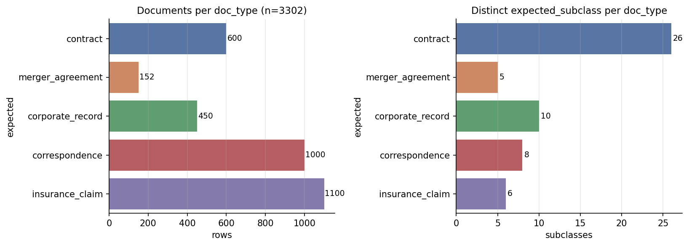

<div align="center">

# 📊 Mailroom-Dataset EDA

**Full-corpus exploratory data analysis for the mailroom-dataset (v1, canonically v9 of the mailroom corpus family) — 3,302 legal documents across 5 classes, 55 strata, with centralized HuggingFace upload helpers.**

[](https://www.python.org/)
[](reports/SUMMARY_REPORT.md)
[](https://huggingface.co/datasets/Lucius-Morningstar/mailroom-dataset)



</div>

---

## Corpus at a Glance

<div align="center">

| Metric | Value |
|:---|:---|
| **Documents** | 3,302 |
| **Doc Types** | 5 (insurance_claim, contract, correspondence, merger_agreement, corporate_record) |
| **Strata** | 55 |
| **Imbalance Ratio** | 7.2× |
| **CUAD Spans** | 13,753 |
| **Offset Match** | 100% |

</div>

<div align="center">

| Class | Count | % |
|:---|---:|---:|
| `insurance_claim` | 1,100 | 33.3% |
| `correspondence` | 1,000 | 30.3% |
| `contract` | 600 | 18.2% |
| `corporate_record` | 450 | 13.6% |
| `merger_agreement` | 152 | 4.6% |

</div>

## Quick Start

```bash
git clone https://github.com/Exios66/Mailroom-Corpus-EDA.git
cd Mailroom-Corpus-EDA

# 1. Install dependencies
.venv/bin/pip install -r requirements.txt

# 2. Run the full pipeline (P0–P6)
.venv/bin/python run_all.py

# 3. Or run just the figures
.venv/bin/python run_all.py --phases P3 P4
```

## Pipeline (run_all.py)

<div align="center">

| Phase | What | Output |
|:---|:---|:---|
| **P0** | Corpus download + manifest validation | `data/parquet/**` |
| **P1** | Structural integrity & provenance audit | `reports/tables/integrity_report.json` |
| **P2** | Composition: strata, imbalance, provenance | `strata_counts.csv`, `imbalance_metrics.json` |
| **P3** | Static PNG figures + EDA tables | `reports/figures/`, `reports/tables/` |
| **P4** | Interactive Plotly HTML figures | `reports/figures_interactive/` |
| **P5** | Cast-safe JSONL + parquet staging helpers | `data/staging/` |
| **P6** | Correspondence intent coverage & provenance audit | `reports/SUMMARY_REPORT.json` |

</div>

## Reports

| Artifact | Description |
|:---|:---|
| [`reports/SUMMARY_REPORT.md`](reports/SUMMARY_REPORT.md) | Narrative summary of all findings |
| [`reports/figures/`](reports/figures/) | 30 static PNGs (text/token, CUAD, MAUD, claims, correspondence, imbalance, temporal, metadata) |
| [`reports/figures_interactive/`](reports/figures_interactive/) | 18 Plotly HTML figures |
| [`reports/tables/`](reports/tables/) | CSV/JSON tables |

## Dataset Cards

Per-source documentation for the corpora integrated into [`mailroom-dataset`](https://huggingface.co/datasets/Lucius-Morningstar/mailroom-dataset) lives in [`docs/dataset-cards/`](docs/dataset-cards/):

| Corpus | Doc Type | Count | Card |
|:---|:---|---:|:---|
| CUAD contracts + SEC EDGAR EX-10 | `contract` | 600 | [View →](docs/dataset-cards/cuad-contracts.md) |
| MAUD merger agreements | `merger_agreement` | 152 | [View →](docs/dataset-cards/maud-merger-agreements.md) |
| S-1 + EDGAR corporate records | `corporate_record` | 450 | [View →](docs/dataset-cards/s1-corporate-records.md) |
| Enron correspondence | `correspondence` | 1,000 | [View →](docs/dataset-cards/enron-correspondence.md) |
| CMS DE-SynPUF + GNOTHEIA + BDR + INSURBIAS insurance claims | `insurance_claim` | 1,100 | [View →](docs/dataset-cards/cms-desynpuf-insurance-claims.md) |

## HF Hub Interface

The upload/publish helpers previously living in [llm-entity-extraction](https://github.com/Exios66/llm-entity-extraction) are centralized here:

| Module | Purpose |
|:---|:---|
| `src/mailroom_eda/hf_interface.py` | Hub client (upload, sha256 verify, repo mgmt) |
| `src/mailroom_eda/dataset_export.py` | Cast-safe metadata (KANBAN-076), JSONL line-boundary safety (KANBAN-088), parquet staging |
| `src/mailroom_eda/docclass_uploader.py` | Docclass v7 publish, surgical card rendering, blind-label strip, GT leak guard |
| `src/mailroom_eda/intent_backfill.py` | Correspondence intent hydration (issue #5): cross-walk, Enron/AESLC sha256 join, LLM pass |
| `src/mailroom_eda/token_budget.py` | Token estimation & budget coverage |

### CLI Commands

<details>
<summary>v9 build/publish, intent backfill & verification</summary>

```bash
# v9 mailroom-dataset build — stage-only by default
.venv/bin/python scripts/build/build_v9.py

# ...and publish to https://huggingface.co/datasets/Lucius-Morningstar/mailroom-dataset
HF_TOKEN=hf_... .venv/bin/python scripts/build/build_v9.py --publish

# Correspondence intent backfill (issue #5; needs OPENROUTER_API_KEY for LLM pass)
.venv/bin/python scripts/backfill/backfill_intent.py --check
.venv/bin/python scripts/backfill/backfill_intent.py --join-only
.venv/bin/python scripts/backfill/backfill_intent.py            # full Phases 1-5

# Byte-verify a local export against the Hub
.venv/bin/python scripts/publish/verify_hf.py --repo Lucius-Morningstar/mailroom-dataset \
    --jsonl data/ground_truth_hardened.jsonl
```

</details>

> Frozen v8 tooling (build_v8 / publish_hardened / reconcile_gt_v8 /
> publish_docclass / export_docclass) is archived under
> `scripts/archive/v8/`; the one-time v9 EDGAR/draw sourcing lives under
> `scripts/archive/v9-acquisition/`. See `scripts/README.md`.

## Key Findings

- **Merger agreements are longest**: mean ~89k chars ≈ 22k tokens (heuristic) — **max ~252k chars ≈ 63k tokens exceeds 32k/65k contexts**
- **Insurance claims uniformly short**: ~690 chars, σ=953 — six LOB subtypes (carrier/inpatient/outpatient/pde + property/auto)
- **Token budget**: 77% ≤4k, 90% ≤16k, 93% ≤32k, 99.8% ≤131k
- **CUAD**: 509 annotated contracts × 41 clause types; 13,753 spans, 100% exact offset (91 v9 EX-10 contracts carry no CUAD spans)
- **MAUD**: 152 agreements × 22 tasks; 3 tasks annotated on every agreement
- **Insurance**: 13/13 fields 100% filled; coverage determination fully populated
- **Correspondence**: intent 100% hydrated (1,000/1,000, four provenance paths incl. v9 `heuristic`); sentiment-labeled subset

---

<div align="center">

**[llm-mailroom](https://github.com/Exios66/llm-mailroom)** ·
**[llm-entity-extraction](https://github.com/Exios66/llm-entity-extraction)** ·
**[llm-dojo-scoring](https://github.com/Exios66/llm-dojo-scoring)** ·
**[Enron-Evaluation-Environment](https://github.com/Exios66/Enron-Evaluation-Environment)** ·
**[claims-data-eda](https://github.com/Exios66/claims-data-eda)**

<sub>Built by the governed evaluation family under <a href="https://github.com/Exios66">@Exios66</a> · 2026</sub>

</div>
